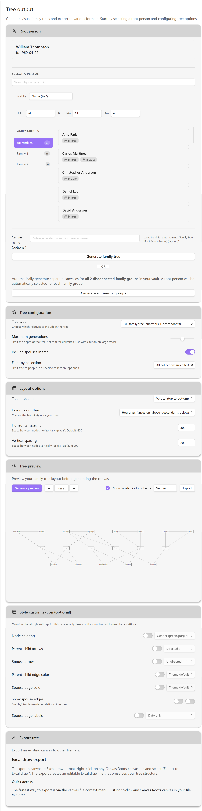

# Canvas Roots: Genealogical Family Tree Plugin for Obsidian

> **⚠️ Alpha Status (v0.1.0):** Canvas Roots is in early alpha release. Core features are stable and well-tested (GEDCOM import, tree generation, canvas styling), but some advanced features are not yet implemented. See [Known Limitations](docs/known-limitations.md) for details.

**Canvas Roots** is an Obsidian plugin that automatically generates complex family trees directly onto the Canvas using specialized genealogical layout algorithms for non-overlapping, relationship-aware positioning.

This Obsidian plugin is designed for genealogists, historians, and world-builders. It transforms structured data in your Markdown notes (relationships, dates, locations) into perfectly laid-out family trees directly on the Obsidian Canvas.

The core approach is hybrid: the plugin uses specialized family tree layout algorithms (powered by the [family-chart](https://github.com/donatso/family-chart) library) for advanced positioning that understands spouse relationships, multiple marriages, and complex genealogical structures, but generates the output using native Obsidian Canvas nodes and edges. This creates a beautiful, structured chart that is fully editable and linkable within the Canvas environment.


## ✨ Key Features

### Available in Alpha (v0.1.1)

- **GEDCOM Import:** Import family trees from standard GEDCOM (.ged) files with robust error handling. Handles malformed data gracefully with sensible defaults, preserving special characters and relationships. Supports files from popular genealogy software (Gramps, Ancestry, FamilySearch, etc.).

- **Automated Layout:** Generate precise, non-overlapping pedigree (ancestor) and descendant charts using specialized genealogical layout algorithms from the [family-chart](https://github.com/donatso/family-chart) library, designed specifically for complex family relationships.

- **Native Canvas Nodes:** Trees are built from Obsidian file nodes, making every person immediately linkable to research notes, images, and documents on the Canvas.

- **Multiple Tree Types:** Generate ancestor trees (pedigree charts), descendant trees, or full family trees. Configure generation limits, spouse inclusion, and layout direction (vertical or horizontal).

- **Multi-Family Detection:** Automatically detects disconnected family groups in your vault. Generate all family trees at once with the "Generate all trees" command, or work with individual families.

- **Regenerate Canvas:** Update existing canvases with current relationship data and settings. Recalculate layout, apply new styling options, and preserve tree metadata—all with a single command or right-click menu.

- **Canvas Styling:** Comprehensive styling options within the JSON Canvas spec: node coloring (gender-based, generation-based, or monochrome), arrow styles (directed, bidirectional, undirected), and edge colors. Configure parent-child and spouse relationships independently for clean, professional genealogical visualizations.

- **Multiple Spouse Support:** Track complex marital histories with flat indexed YAML properties (`spouse1`, `spouse2`, etc.) including marriage dates, locations, and status. Optionally display spouse edges with marriage metadata labels on the canvas (toggle in Canvas Settings).

- **Obsidian Bases Compatible:** Designed to work seamlessly with [Obsidian Bases](https://help.obsidian.md/bases) for efficient bulk data entry and management. Edit multiple family members while Canvas Roots handles visualization. Includes ready-to-use Base template.

- **Dual Storage System:** Combines human-friendly wikilinks with persistent `cr_id` references for robust relationship tracking that survives file renames and moves.

- **YAML-First Data:** Uses native YAML frontmatter for maximum compatibility with Dataview, Bases, and other Obsidian tools.

### Planned Features

See [Known Limitations](docs/known-limitations.md) for full details on planned features.

- **Collections Management:** Folder-based auto-discovery and organization of multiple family trees within one vault.

- **GEDCOM Export:** Round-trip export back to .ged format for sharing with other genealogy software.

- **Reference Numbering:** Support for Ahnentafel and Dollarhide-Cole genealogical numbering systems.

- **Person Detail Panel:** Rich inline person information display with relationship visualization and quick editing.

- **D3 Tree Preview:** Interactive tree preview with real-time layout configuration before canvas export.

- **Privacy & Obfuscation:** Optional data obfuscation for exports and canvas display. Protect PII when sharing family trees publicly.

- **World-Building Features:** Track fantasy dynasties, corporate succession, and historical kingdoms with visual grouping by house/faction, dual relationship trees (biological vs. political), and complex succession rules.


## 📸 Screenshots

| Tree Generation Interface | Generated Family Tree |
|:-------------------------:|:---------------------:|
|  |  |
| **Streamlined tree generation** with inline person browser, birth/death year display, and family group detection | **Automated genealogical layout** showing 4 generations with spouse relationships and parent-child connections |


## 📥 Installation

### Using BRAT (Recommended for Alpha Testing)

The easiest way to install Canvas Roots for alpha testing is using the [BRAT](https://github.com/TfTHacker/obsidian42-brat) plugin:

1. Install BRAT from Obsidian's Community Plugins (if not already installed)
2. Open Command Palette (Ctrl/Cmd + P)
3. Run command: `BRAT: Add a beta plugin for testing`
4. Enter this repository URL: `https://github.com/banisterious/obsidian-canvas-roots`
5. Enable Canvas Roots in Settings → Community Plugins

BRAT will automatically check for updates and notify you when new versions are available.

### Manual Installation from Release

1. Download the latest release from the [Releases page](https://github.com/banisterious/obsidian-canvas-roots/releases)
2. Extract the ZIP file
3. Copy the `canvas-roots` folder to your vault's plugins folder: `<vault>/.obsidian/plugins/`
4. Reload Obsidian (Ctrl/Cmd + R)
5. Go to Settings → Community Plugins and enable "Canvas Roots"

### From Source (For Developers)

1. Clone this repository or download the source code
2. Run `npm install` to install dependencies
3. Run `npm run build` to compile the plugin
4. Copy `main.js`, `styles.css`, and `manifest.json` to your vault's plugins folder: `<vault>/.obsidian/plugins/canvas-roots/`
5. Reload Obsidian
6. Enable the plugin in Settings → Community Plugins

### From Obsidian Community Plugins (Coming Soon)

Once approved for the Obsidian Community Plugins directory, you'll be able to install directly from Obsidian:
1. Open Settings → Community Plugins
2. Click "Browse" and search for "Canvas Roots"
3. Click "Install" then "Enable"


## 🛠️ Workflow

### 1. Enter Your Data

**Option A: Individual Notes**

Create individual Markdown notes with YAML frontmatter. The `cr_id` field is essential for persistence and mapping.

```yaml
---
cr_id: abc-123-def-456
name: John Robert Smith
father: "[[John Smith Sr]]"
father_id: xyz-789-uvw-012
mother: "[[Jane Doe]]"
mother_id: pqr-345-stu-678
spouse: ["[[Mary Jones]]"]
spouse_id: ["mno-901-jkl-234"]
children: ["[[Bob Smith]]", "[[Alice Smith]]"]
children_id: ["def-456-ghi-789", "abc-123-xyz-456"]
born: 1888-05-15
died: 1952-08-20
---

# Research Notes

[Your biographical research, sources, and notes here...]
```

**Note:** The plugin supports both `born`/`died` (standard) and `birth_date`/`death_date` (Gramps style) field names for compatibility with different genealogy tools.

**Option B: Obsidian Bases (Recommended for Bulk Entry)**

Use [Obsidian Bases](https://help.obsidian.md/bases) to manage multiple family members in a table view. Edit relationships, dates, and properties in a spreadsheet-like interface. See the [Bases Integration Guide](docs/bases-integration.md) for details and templates.

### 2. Generate the Tree

1. Open the Command Palette (`Ctrl/Cmd + P`)
2. Run: `Canvas Roots: Open Control Center`
3. Navigate to the **Tree Generation** tab
4. **Select a root person:**
   - Use the inline person browser to search, sort, and filter
   - Click any person to select them as the tree's root
   - Or use the family group sidebar if you have disconnected family groups
5. **Configure tree options:**
   - Choose tree type (ancestors, descendants, or full family tree)
   - Set generation limits or include all generations
   - Enable/disable spouse inclusion
   - Adjust layout direction and spacing
6. **Generate:**
   - Enter an optional canvas name
   - Click **Generate family tree** for the selected person
   - Or click **Generate all trees** to automatically create separate trees for each disconnected family group

The plugin populates the Canvas with the calculated family tree layout using specialized genealogical positioning algorithms.

### 3. Maintain the Layout

After editing relationships in person notes or changing layout/styling settings, refresh your canvas:

**Method 1: Right-Click Menu (Recommended)**
- Right-click on the canvas tab, file, or three-dot menu (⋮)
- Select **"Regenerate canvas"**

**Method 2: Command Palette**
- Open the canvas you want to regenerate
- Run: `Canvas Roots: Regenerate canvas`

**Method 3: Keyboard Shortcut**
- Assign a custom hotkey in Settings → Hotkeys → "Regenerate canvas"

The regenerate canvas command:
- ✅ Reads current relationship data from your person notes
- ✅ Preserves original tree settings (tree type, generations, spouses) using embedded canvas metadata
- ✅ Allows changing layout direction (vertical ↔ horizontal) while preserving other settings
- ✅ Applies your current spacing, sizing, and styling settings
- ✅ Updates the canvas in-place (non-destructive)
- ✅ Uses the latest family-chart layout algorithm

**Common Regeneration Scenarios:**
- Added new spouses, children, or parents to person notes
- Corrected relationship errors (wrong parents, etc.)
- Changed spacing or styling settings and want to apply to existing trees
- Updated from an older layout algorithm version
- Imported/edited data via GEDCOM or Bases
- Testing different layout or color scheme configurations


## 💾 GEDCOM Integration

Canvas Roots integrates with industry-standard genealogy tools via the GEDCOM format.

### GEDCOM Import

Import `.ged` files to automatically generate Markdown notes for every individual in your family tree. The import process:

1. **Creates Person Notes:** Generates a note for each individual with structured YAML frontmatter
2. **Preserves Relationships:** Maintains parent-child and spousal relationships using both wikilinks and `cr_id` references
3. **UUID Handling:** Preserves `_UUID` tags from GEDCOM when present, or generates new `cr_id` values
4. **Duplicate Detection:** Identifies and handles duplicate individuals across multiple imports

This creates a rich, queryable genealogical database in your vault that works seamlessly with Dataview, Obsidian Bases, and other plugins.

### Round-Trip Data Integrity (Planned)

Future versions will support exporting your research back to GEDCOM format, ensuring portability and compatibility with dedicated genealogy software.


## 🎨 Advanced Styling with Advanced Canvas

Canvas Roots is designed to be fully compliant with the [JSON Canvas 1.0 specification](https://jsoncanvas.org/), ensuring maximum portability and compatibility across Canvas viewers and editors. All styling features provided by Canvas Roots work within the standard specification.

For users who want additional styling capabilities beyond the spec (such as border styles, advanced path rendering, or custom shapes), Canvas Roots works seamlessly alongside the [Advanced Canvas](https://github.com/Developer-Mike/obsidian-advanced-canvas) plugin.

### Canvas Roots Built-in Styling

Canvas Roots provides comprehensive styling options that work within the JSON Canvas standard:

**Node Coloring:**
- **Gender-based**: Green for male, purple for female (genealogy convention)
- **Generation-based**: Different colors for each generation level (creates visual layers)
- **Monochrome**: No coloring (neutral theme)

**Edge Styling:**
- **Arrow styles**: Directed (→), bidirectional (↔), or undirected (—)
- **Separate controls**: Configure parent-child and spouse relationships independently
- **Edge colors**: Choose from Obsidian's 6 preset colors or theme default

All these settings are accessible in Settings → Canvas Roots → Canvas styling, and can be applied to existing trees using the "Regenerate canvas" feature (right-click any canvas file).

### Using Advanced Canvas Plugin

The [Advanced Canvas](https://github.com/Developer-Mike/obsidian-advanced-canvas) plugin adds styling features beyond the JSON Canvas spec, such as:

- **Border styles**: Solid, dashed, dotted borders for cards
- **Advanced path rendering**: Additional edge styling options
- **Custom shapes**: Circle nodes, hexagons, and more
- **Enhanced visual effects**: Shadows, gradients, and other CSS-based styling

**Installation:**

1. Install Advanced Canvas from Obsidian Community Plugins
2. Both plugins work independently and complement each other
3. Canvas Roots handles layout and genealogical relationships
4. Advanced Canvas provides additional visual styling options

**Important Notes:**

- Advanced Canvas features may not be portable to other Canvas viewers
- Canvas files styled with Advanced Canvas will still open in any Canvas viewer, but advanced styling may not appear
- Canvas Roots features (node colors, arrow styles, edge colors) remain fully portable as they use the standard spec

**Recommended Workflow:**

1. Generate family trees using Canvas Roots (handles layout, relationships, standard styling)
2. Apply Advanced Canvas styling if desired (borders, custom shapes, enhanced visuals)
3. Use "Regenerate canvas" to update tree structure and relationships while preserving manually applied Advanced Canvas styling

This approach gives you the best of both worlds: standards-compliant genealogical layouts from Canvas Roots, plus optional enhanced styling from Advanced Canvas.

## 📚 Documentation

### Project Specifications

- **[Technical Specification](docs/specification.md)** - Complete technical specification including data models, features, GEDCOM integration, and enhanced relationship modeling

### For Contributors

- **[Contributing Guide](CONTRIBUTING.md)** - How to contribute to Canvas Roots, including development setup, coding standards, and pull request process
- **[Development Guide](docs/development.md)** - Complete development workflow, build commands, and testing procedures
- **[Coding Standards](docs/developer/coding-standards.md)** - TypeScript and CSS coding standards, naming conventions, and linting requirements
- **[CSS System](docs/css-system.md)** - CSS component architecture, build pipeline, and styling conventions
- **[ESLint Setup](docs/eslint-setup.md)** - ESLint configuration details and compatibility notes

### For Users

- **[Bases Integration Guide](docs/bases-integration.md)** - How to use Obsidian Bases for efficient family tree data management
- **[Security Policy](SECURITY.md)** - Important information about PII handling, data privacy, and security best practices

## 🧑‍💻 Development Status

Canvas Roots is in active development with core functionality in place:

**Working Features:**
- TypeScript-based plugin foundation with Obsidian API integration
- Re-layout command with context menu integration
- Build system with esbuild and automated CSS compilation
- Settings interface for layout customization and logging control
- Control Center modal UI for plugin management
- GEDCOM import with person note generation
- Dual storage relationship system (wikilinks + `cr_id` references)
- Bidirectional relationship linking
- Structured logging system with export capability

**Recently Completed:**
- Canvas regeneration command for updating existing trees with current data, layout, and styling settings
- Context menu integration for canvas files (right-click on file, tab, or three-dot menu)
- Genealogical layout engine using family-chart library for automated tree positioning
- Canvas generation from person notes with proper handling of complex relationships
- Streamlined Tree Generation tab with inline person browser (search, sort, filters, family groups)
- Integrated generation workflow with single-card interface
- Full tree generation with spacing optimization and multi-family support
- Comprehensive canvas styling options: node coloring (gender/generation/monochrome), arrow styles, edge colors
- Obsidian Bases template with one-click creation (6 pre-configured views for family data management)

**In Progress:**
- Collection management (folder-based auto-discovery)

The plugin reads the vault's file structure and applies specialized family tree layout algorithms to safely write positional data into Canvas JSON files. The `cr_id` field ensures stable identity mapping between notes and canvas nodes.
