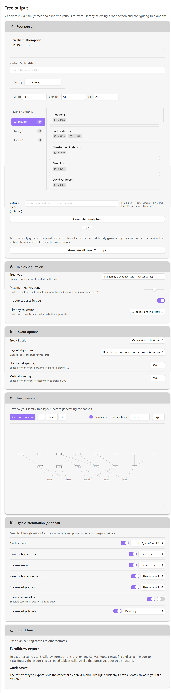

# Canvas Roots: Genealogical Family Tree Plugin for Obsidian

> **Status (v0.4.0):** Canvas Roots is feature-complete for core genealogical workflows and submitted for Obsidian community plugin review. All essential features are stable and production-ready (GEDCOM import/export, CSV import/export, bidirectional sync, alternative layout algorithms, tree generation, canvas styling, collections, relationship calculator, reference numbering, lineage tracking, relationship history, interactive family chart view with PDF export, selective branch export, smart duplicate detection, staging workflow, and merge tools). Advanced features are planned for future releases. See [Roadmap](docs/roadmap.md) for details.

**Canvas Roots** is an Obsidian plugin that automatically generates complex family trees directly onto the Canvas using specialized genealogical layout algorithms for non-overlapping, relationship-aware positioning.

This plugin is designed for genealogists, historians, and world-builders. It transforms structured data in your Markdown notes (relationships, dates, locations) into perfectly laid-out family trees directly on the Obsidian Canvas, powered by the [family-chart](https://github.com/donatso/family-chart) library.


## 🎥 Demo Video

[](https://youtu.be/oiEjFsNI7pI)

**Watch the complete workflow:** Import GEDCOM → Create Base → Generate tree with interactive preview → Export to Excalidraw


## ✨ Key Features

### Available Now (v0.4.0)

- **Interactive Family Chart View:** A persistent, interactive visualization panel for exploring and editing family trees in real-time. Pan, zoom, and navigate large trees with smooth animations. Click any person to center the view or open their note. Edit relationships directly in the chart with full undo/redo support. Full bidirectional sync: chart edits update frontmatter and rename files, file renames update frontmatter and refresh the chart. Choose from multiple color schemes (Gender, Generation, Collection, Monochrome) and adjustable spacing. Export as high-quality PNG, SVG, or PDF. Customizable export filenames with `{name}` and `{date}` placeholders. Toggle kinship labels on relationship links. Open multiple chart views simultaneously. Access via "Open family chart" command or "Open current note in family chart" for the active person note.

- **GEDCOM Import/Export:** Full round-trip support for GEDCOM 5.5.1 format with pre-import validation and comprehensive import results modal. Import family trees from popular genealogy software (Gramps, Ancestry, FamilySearch) with birth/death places, occupation, and gender data. Export back to .ged format with UUID preservation, collection codes, marriage metadata, and optional privacy protection for living persons. Selective branch export: export only ancestors or descendants of a specific person.

- **CSV Import/Export:** Import and export family data in CSV/TSV format for spreadsheet workflows. Auto-detected column mapping supports common field names. Export with configurable columns and privacy protection. Selective branch export available for both formats.

- **Interactive Tree Preview:** Real-time visual preview of family trees before canvas generation. Pan, zoom, and explore layouts with interactive controls. Switch between color schemes (Gender, Generation, Monochrome) to visualize different data aspects. Hover over nodes to view person details (name, birth/death dates, generation). Export previews as high-resolution PNG, vector SVG, or PDF for external use. Particularly useful for large trees (50+ people) to verify layout before generating the final canvas.

- **Alternative Layout Algorithms:** Choose from four layout algorithms to visualize your family tree in different ways:
  - **Standard:** Traditional family-chart layout with proper spouse handling
  - **Compact:** 50% tighter spacing for large trees (50+ people)
  - **Timeline:** Chronological positioning by birth year (shows who lived when)
  - **Hourglass:** Focus on one person's lineage (ancestors above, descendants below)

- **Automated Layout:** Generate precise, non-overlapping pedigree (ancestor) and descendant charts using specialized genealogical layout algorithms designed for complex family relationships.

- **Native Canvas Nodes:** Trees are built from Obsidian file nodes, making every person immediately linkable to research notes, images, and documents.

- **Multiple Tree Types:** Generate ancestor trees (pedigree charts), descendant trees, or full family trees. Configure generation limits, spouse inclusion, and layout direction.

- **Multi-Family Detection:** Automatically detects disconnected family groups. Generate all family trees at once or work with individual families.

- **Regenerate Canvas:** Update existing canvases with current relationship data and settings. Recalculate layout, apply new styling, and preserve tree metadata—all with a right-click.

- **Canvas Styling:** Comprehensive styling options: node coloring (gender-based, generation-based, or monochrome), arrow styles (directed, bidirectional, undirected), and edge colors. Configure parent-child and spouse relationships independently.

- **Multiple Spouse Support:** Track complex marital histories with flat indexed YAML properties (`spouse1`, `spouse2`, etc.) including marriage dates, locations, and status. Optionally display spouse edges with marriage metadata labels on the canvas (toggle in Canvas Settings).

- **Obsidian Bases Compatible:** Designed to work seamlessly with [Obsidian Bases](https://help.obsidian.md/bases) for efficient bulk data entry and management. Includes ready-to-use Base template with 22 pre-configured views including relationship queries, lineage tracking, and reference numbering views.

- **Bidirectional Relationship Sync:** Automatically maintains reciprocal relationships across your family tree. When you set someone as a parent in one note, Canvas Roots automatically adds the child relationship in the parent's note. When you delete a relationship, the reciprocal link is automatically removed. Works seamlessly with Bases table edits, direct frontmatter modifications, and external editors.

- **Dual Storage System:** Combines human-friendly wikilinks with persistent `cr_id` references for robust relationship tracking that survives file renames and moves.

- **YAML-First Data:** Uses native YAML frontmatter for maximum compatibility with Dataview, Bases, and other Obsidian tools.

- **Context Menu Actions:** Right-click person notes to add relationships, validate data integrity, find canvases, or bulk-add essential properties. Generate trees quickly via "Generate tree" submenu (Canvas with full options, or Excalidraw with instant defaults). Right-click folders to scan for relationship issues, import GEDCOM files, or export folder contents to GEDCOM. Right-click canvas files to regenerate, view statistics, or export as image (PNG, SVG, PDF). Multi-file selection support for batch operations. Full desktop and mobile support.

- **Collections & Groups:** Organize and browse people using auto-detected family groups (with customizable group names) or user-defined collections. Filter tree generation by collection and view cross-collection connections to identify bridge people connecting different parts of your family network.

- **Root Person Marking:** Mark specific people as "root persons" to track key lineage anchor points. Use the crown-icon context menu action to designate research starting points, track multiple lineages simultaneously, and filter root persons in Obsidian Bases views.

- **Excalidraw Export:** Export family tree canvases to Excalidraw format for manual annotation, drawing, and customization. Preserves node positioning and colors while enabling hand-drawn styling and freeform annotations.

- **Relationship Calculator:** Calculate the relationship between any two people in your family tree. Uses BFS pathfinding to find the shortest connection path and provides proper genealogical terms (cousin, uncle, 2nd cousin once removed, etc.). Supports in-law relationships, displays common ancestors, and shows the full relationship path. Access via command palette or right-click context menu on person notes.

- **Smart Duplicate Detection:** Find and manage potential duplicate person records in your vault. Uses fuzzy name matching (Levenshtein distance) and date proximity analysis to identify likely duplicates. Configurable confidence thresholds and match criteria. Review matches in a dedicated modal, dismiss false positives, and maintain data quality. Access via "Find duplicate people" command.

- **Staging & Import Cleanup:** Safe import workflow for processing messy GEDCOM files. Configure a staging folder that's automatically isolated from your main tree. Import data to staging, review cross-import duplicates, and promote clean data to main. Staging tab in Control Center provides subfolder management, batch promote/delete actions, and quick statistics.

- **Merge Wizard:** Combine duplicate records with field-level conflict resolution. Side-by-side comparison shows values from both records with dropdowns to choose which to keep. Support for combining array fields (spouses, children) from both sources. Automatic relationship reconciliation updates all references pointing to the merged record. Available from both duplicate detection and cross-import review modals.

- **Reference Numbering Systems:** Assign standard genealogical reference numbers to your family members. Supports four numbering systems: Ahnentafel (ancestor numbering where father=2N, mother=2N+1), d'Aboville (descendant numbering with dot notation like 1.2.3), Henry System (compact descendant numbering without dots), and Generation numbering (relative generation depth from a reference person). Numbers are stored in frontmatter and automatically available in Bases views.

- **Lineage Tracking:** Compute and track multi-generational lineages from root persons. Mark people as belonging to specific ancestral lines (e.g., "Smith Line", "Tudor Dynasty") with support for patrilineal (father's line), matrilineal (mother's line), or all descendants tracking. Enables filtering and analysis of descendant lines in Bases views.

- **Relationship History & Undo:** Track all relationship changes made through Canvas Roots with timestamps. View recent changes in the Relationship History modal, see statistics on changes by type, and undo any change with a single click. Configurable retention period for automatic cleanup of old history entries.

- **Folder Statistics:** View comprehensive statistics about person notes in any folder. See data completeness metrics, relationship health reports, and family structure analysis including gender distribution, relationship types, and generation depth.

- **Privacy Protection:** Optional privacy controls for living persons in GEDCOM exports. Configure birth year threshold to automatically exclude or anonymize personal details for people who may still be living.

### Planned Features

See [Roadmap](docs/roadmap.md) for detailed feature descriptions and development priorities.
- **Import/Export Enhancements:** GEDCOM X, Gramps XML, CSV import/export, selective branch export
- **World-Building Features:** Track fantasy dynasties, corporate succession, and historical kingdoms


## 📸 Screenshots

| Tree Output Interface | Generated Family Tree |
|:---------------------:|:---------------------:|
|  |  |
| **Complete Tree Output workflow** with person browser, layout algorithm selection, interactive SVG preview, and export options | **Automated genealogical layout** showing 3 generations with spouse relationships and parent-child connections |


## 📥 Installation

### Using BRAT (Recommended for Alpha Testing)

The easiest way to install Canvas Roots for alpha testing is using the [BRAT](https://github.com/TfTHacker/obsidian42-brat) plugin:

1. Install BRAT from Obsidian's Community Plugins (if not already installed)
2. Open Command Palette (Ctrl/Cmd + P)
3. Run command: `BRAT: Add a beta plugin for testing`
4. Enter this repository URL: `https://github.com/banisterious/obsidian-canvas-roots`
5. Enable Canvas Roots in Settings → Community Plugins

BRAT will automatically check for updates and notify you when new versions are available.

### Manual Installation from Release

1. Download the latest release from the [Releases page](https://github.com/banisterious/obsidian-canvas-roots/releases)
2. Extract the ZIP file
3. Copy the `canvas-roots` folder to your vault's plugins folder: `<vault>/.obsidian/plugins/`
4. Reload Obsidian (Ctrl/Cmd + R)
5. Go to Settings → Community Plugins and enable "Canvas Roots"

### From Source (For Developers)

1. Clone this repository or download the source code
2. Run `npm install` to install dependencies
3. Run `npm run build` to compile the plugin
4. Copy `main.js`, `styles.css`, and `manifest.json` to your vault's plugins folder
5. Reload Obsidian and enable the plugin

### From Obsidian Community Plugins (Coming Soon)

Once approved for the Community Plugins directory:
1. Open Settings → Community Plugins
2. Click "Browse" and search for "Canvas Roots"
3. Click "Install" then "Enable"


## 🚀 Quick Start

### 1. Enter Your Data

**Option A: Import GEDCOM**
1. Open Control Center (`Ctrl/Cmd + P` → "Canvas Roots: Open Control Center")
2. Go to GEDCOM tab → Import section
3. Select your `.ged` file and configure import options

**Option B: Create Individual Notes**

```yaml
---
cr_id: abc-123-def-456
name: John Robert Smith
father: "[[John Smith Sr]]"
father_id: xyz-789-uvw-012
mother: "[[Jane Doe]]"
mother_id: pqr-345-stu-678
spouse: ["[[Mary Jones]]"]
spouse_id: ["mno-901-jkl-234"]
born: 1888-05-15
died: 1952-08-20
---

# Research Notes
[Your biographical research, sources, and notes here...]
```

**Option C: Use Obsidian Bases (Recommended for Bulk Entry)**
- Control Center → Quick Actions → "Create Bases template"
- Edit family data in spreadsheet-like table views
- See [Bases Integration Guide](docs/bases-integration.md) for details

### 2. Generate Tree

1. Open Control Center → Tree Generation tab
2. Select root person using the inline person browser
3. Configure tree type, generations, and layout
4. Click "Generate family tree"

### 3. Maintain Tree

After editing relationships or changing settings:
- **Right-click** the canvas tab/file → "Regenerate canvas"
- Or use Command Palette: "Canvas Roots: Regenerate canvas"

For complete workflow details, see the [User Guide](docs/user-guide.md).

---

## Support My Work

If you find this plugin useful, please consider supporting its development!

<a href="https://www.buymeacoffee.com/banisterious" target="_blank"></a>


## 📚 Documentation

### For Users
- **[User Guide](docs/user-guide.md)** - Complete workflow, tree generation, and styling guide
- **[Changelog](CHANGELOG.md)** - Version history and release notes
- **[Bases Integration](docs/bases-integration.md)** - Bulk data management with Obsidian Bases
- **[Roadmap](docs/roadmap.md)** - Current status and planned features
- **[Security Policy](SECURITY.md)** - PII handling and data privacy best practices

### For Developers
- **[Contributing Guide](CONTRIBUTING.md)** - Development setup and contribution process
- **[Development Guide](docs/development.md)** - Build commands, testing, and architecture
- **[Coding Standards](docs/developer/coding-standards.md)** - TypeScript and CSS standards


## 🤝 Contributing

Contributions are welcome! Please see [CONTRIBUTING.md](CONTRIBUTING.md) for:
- Development environment setup
- Code style guidelines
- Pull request process
- Testing requirements


## 📄 License

This project is licensed under the MIT License - see the [LICENSE](LICENSE) file for details.


## 🐛 Issues & Support

- **Bug Reports:** [GitHub Issues](https://github.com/banisterious/obsidian-canvas-roots/issues)
- **Feature Requests:** [GitHub Discussions](https://github.com/banisterious/obsidian-canvas-roots/discussions)
- **Security Issues:** See [SECURITY.md](SECURITY.md) for responsible disclosure


## 🙏 Acknowledgments

- Built with the [Obsidian Plugin API](https://docs.obsidian.md/Plugins)
- Layout powered by [family-chart](https://github.com/donatso/family-chart) library
- Follows the [JSON Canvas 1.0 specification](https://jsoncanvas.org/)
- Compatible with [Obsidian Bases](https://help.obsidian.md/bases) and [Advanced Canvas](https://github.com/Developer-Mike/obsidian-advanced-canvas)
