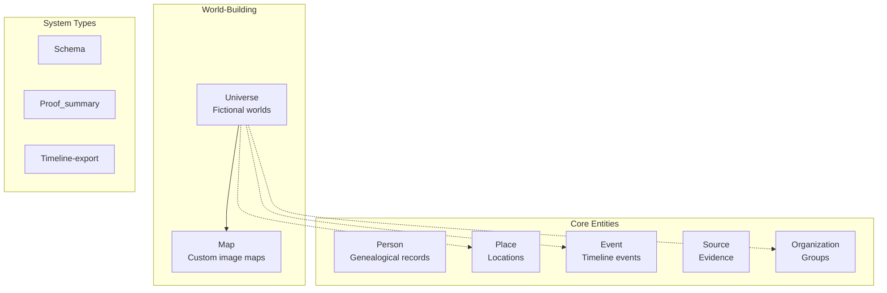
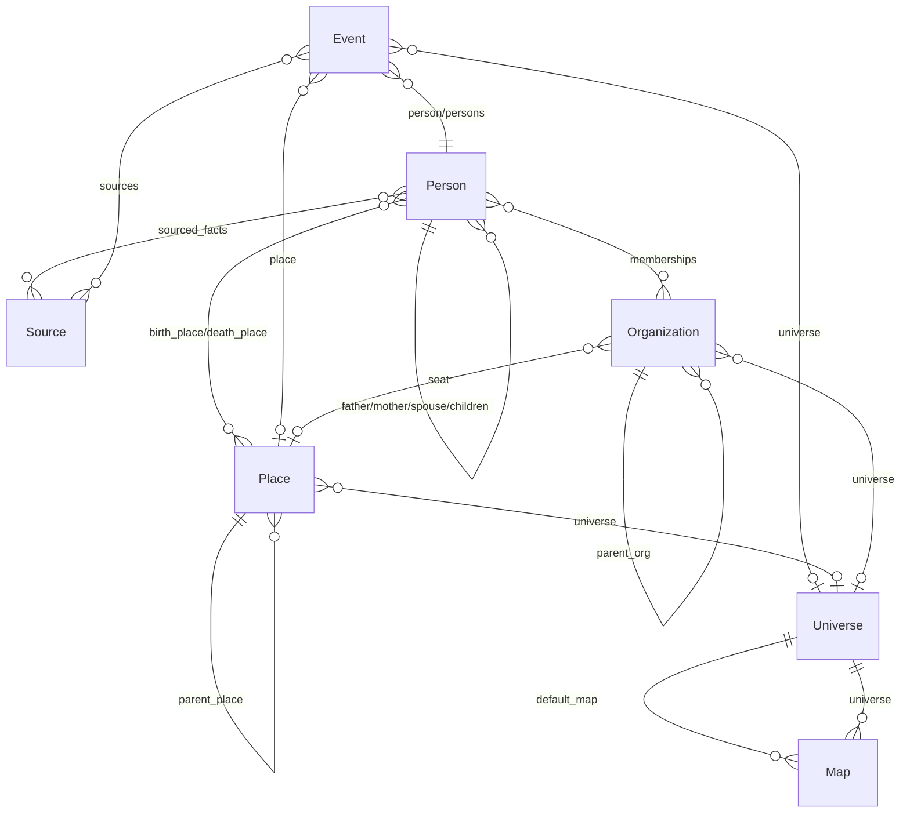
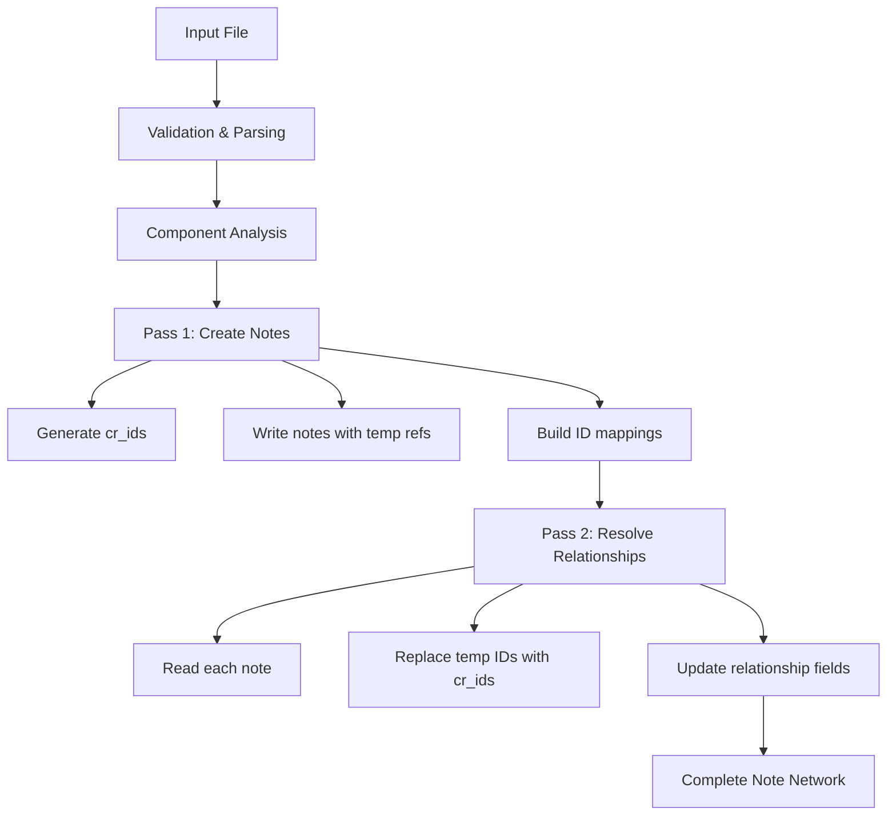
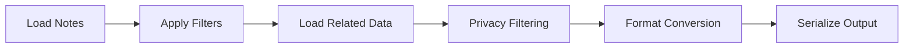
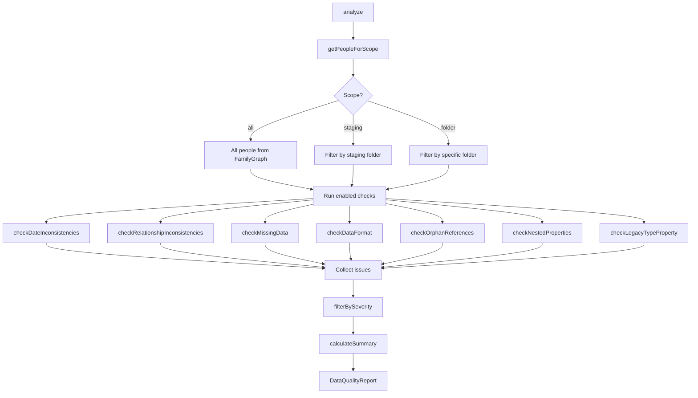
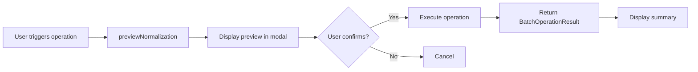
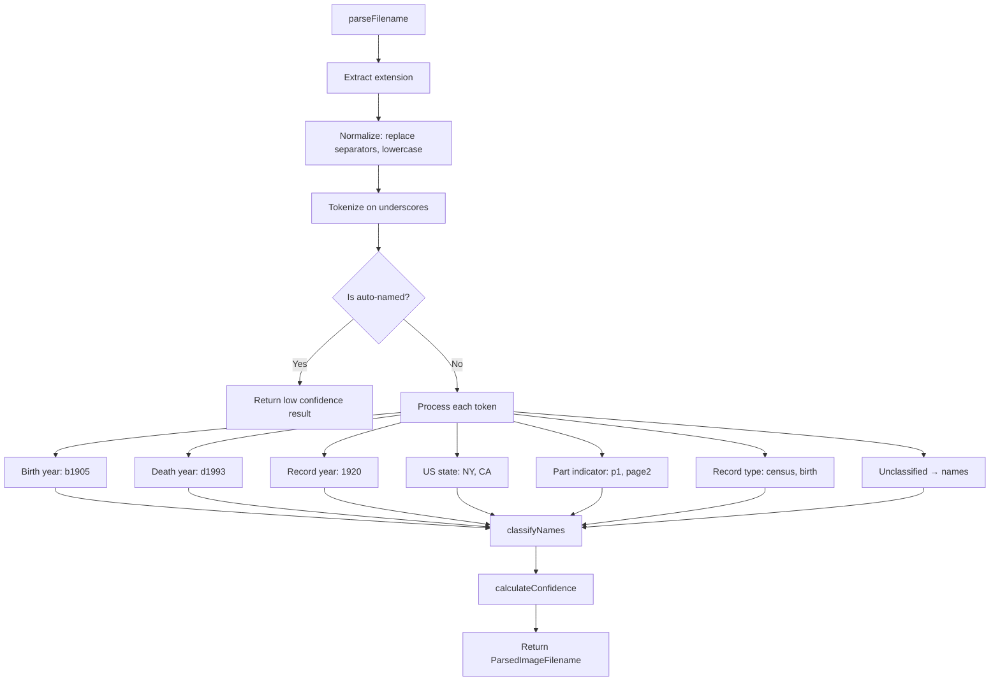
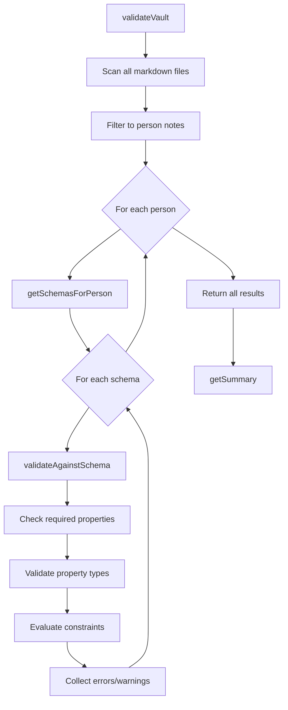

# Implementation Details

This document covers technical implementation specifics for Canvas Roots features.

## Table of Contents

- [Note Types and Entity System](#note-types-and-entity-system)
  - [Core Entity Types](#core-entity-types)
  - [Type Detection](#type-detection)
  - [Cross-References Between Types](#cross-references-between-types)
- [Context Menu Implementation](#context-menu-implementation)
- [Canvas Generation Implementation](#canvas-generation-implementation)
- [Family Chart Layout System](#family-chart-layout-system)
  - [Layout Engines](#layout-engines)
  - [Layout Selection](#layout-selection)
  - [Tree Generation Flow](#tree-generation-flow)
- [Dual Storage System](#dual-storage-system)
- [Maps System](#maps-system)
  - [Coordinate Systems](#coordinate-systems)
  - [Data Flow](#data-flow)
  - [Custom Image Maps](#custom-image-maps)
  - [Geocoding](#geocoding)
- [Obsidian Bases Integration](#obsidian-bases-integration)
  - [Base Templates](#base-templates)
  - [Property Aliases](#property-aliases)
  - [Base Creation Flow](#base-creation-flow)
- [Property and Value Alias System](#property-and-value-alias-system)
  - [Property Aliases](#property-aliases-1)
  - [Value Aliases](#value-aliases)
  - [Built-in Synonyms](#built-in-synonyms)
  - [Integration Points](#integration-points)
- [Statistics and Reports System](#statistics-and-reports-system)
  - [Statistics Architecture](#statistics-architecture)
  - [Metrics Computed](#metrics-computed)
  - [Report Types](#report-types)
  - [UI Integration](#ui-integration)
- [Import/Export System](#importexport-system)
  - [Supported Formats](#supported-formats)
  - [Two-Pass Import Architecture](#two-pass-import-architecture)
  - [Export Pipeline](#export-pipeline)
  - [Data Transformations](#data-transformations)
- [Dynamic Note Content](#dynamic-note-content)
  - [Code Block Processors](#code-block-processors)
  - [Block Types](#block-types)
  - [Freeze to Markdown](#freeze-to-markdown)
  - [Insertion Methods](#insertion-methods)
- [Templater Integration](#templater-integration)
  - [Template Snippets Modal](#template-snippets-modal)
  - [Property Alias Support](#property-alias-support)
  - [Template Types](#template-types)
- [Data Quality and Batch Operations](#data-quality-and-batch-operations)
  - [DataQualityService Architecture](#dataqualityservice-architecture)
  - [Issue Types and Categories](#issue-types-and-categories)
  - [Batch Operation Pattern](#batch-operation-pattern)
  - [Bidirectional Relationship Sync](#bidirectional-relationship-sync)
  - [Schema-Aware Normalization](#schema-aware-normalization)
  - [Place Batch Operations](#place-batch-operations)
- [Control Center Architecture](#control-center-architecture)
  - [Modal Structure](#modal-structure)
  - [Tab System](#tab-system)
  - [Navigation and Routing](#navigation-and-routing)
  - [Public API](#public-api)
  - [Mobile Adaptations](#mobile-adaptations-1)
- [Settings and Configuration](#settings-and-configuration)
  - [Settings Interface](#settings-interface)
  - [Type Definitions](#type-definitions)
  - [Settings Tab vs Preferences Tab](#settings-tab-vs-preferences-tab)
  - [Default Values](#default-values)
- [Source Image Management](#source-image-management)
  - [Image Filename Parser](#image-filename-parser)
  - [Source Image Import Wizard](#source-image-import-wizard)
  - [Source Media Linker Wizard](#source-media-linker-wizard)
- [Schema Validation](#schema-validation)
  - [Schema Note Format](#schema-note-format)
  - [SchemaService](#schemaservice)
  - [ValidationService](#validationservice)
  - [Property Types and Validation](#property-types-and-validation)
- [Custom Relationship Types](#custom-relationship-types)
  - [Relationship Type Definition](#relationship-type-definition)
  - [Built-in Types and Categories](#built-in-types-and-categories)
  - [RelationshipService](#relationshipservice)
  - [Frontmatter Storage](#frontmatter-storage)
- [Collections and Family Groups](#collections-and-family-groups)
  - [Two Organization Systems](#two-organization-systems)
  - [PersonNode Collection Properties](#personnode-collection-properties)
  - [FamilyGraphService Methods](#familygraphservice-methods)
  - [Collection Analytics](#collection-analytics)
  - [Control Center Collections Tab](#control-center-collections-tab)
  - [Collection-Filtered Tree Generation](#collection-filtered-tree-generation)
  - [Collection Overview Canvas Generation](#collection-overview-canvas-generation)
- [Privacy and Gender Identity Protection](#privacy-and-gender-identity-protection)
  - [Sex vs Gender Data Model](#sex-vs-gender-data-model)
  - [Living Person Privacy](#living-person-privacy)
  - [Log Export Obfuscation](#log-export-obfuscation)
  - [Planned Features](#planned-features-not-yet-implemented)

---

## Note Types and Entity System

Canvas Roots uses a structured entity system with typed notes identified by frontmatter properties.

### Core Entity Types

Seven primary entity types plus three system types:

| Type | Purpose | Key Properties |
|------|---------|----------------|
| **Person** | Individual genealogical records | `name`, `born`, `died`, `father`, `mother`, `spouse`, `children`, `sex` |
| **Place** | Geographic locations (real, historical, fictional) | `name`, `place_type`, `place_category`, `parent_place`, `coordinates_lat/long` |
| **Event** | Timeline events (vital, life, narrative) | `title`, `event_type`, `date`, `person`, `place` |
| **Source** | Evidence and documentation | `title`, `source_type`, `source_quality`, `source_repository` |
| **Organization** | Groups and hierarchies | `name`, `org_type`, `parent_org`, `seat`, `founded`, `dissolved` |
| **Universe** | Fictional world containers | `name`, `description`, `default_calendar`, `default_map`, `status` |
| **Map** | Custom image maps for fictional worlds | `name`, `universe`, `image_path`, `coordinate_system`, bounds |

**System types:** Schema (validation), Proof_summary (research), Timeline-export



### Type Detection

Notes are identified by frontmatter properties with configurable priority:

```typescript
// Detection priority (from src/utils/note-type-detection.ts)
1. cr_type property (recommended, namespaced to avoid conflicts)
2. type property (legacy support)
3. Tags (#person, #place, etc.) if tag detection enabled
```

**Identification properties:**
- `cr_id` - Unique identifier (UUID recommended), survives file renames
- `cr_type` - Type identifier: `person`, `place`, `event`, `source`, `organization`, `universe`, `map`

**Dual storage for relationships** (see [Dual Storage System](#dual-storage-system)):
```yaml
father: "[[John Smith]]"      # Wikilink for Obsidian features
father_id: abc-123-def-456    # cr_id for reliable resolution
```

### Person Note Structure

```yaml
cr_id: [string]
cr_type: person
name: [string]

# Biological parents
father: [wikilink]
father_id: [string]
mother: [wikilink]
mother_id: [string]

# Extended family (can be arrays)
stepfather: [wikilink | wikilink[]]
stepmother: [wikilink | wikilink[]]
adoptive_father: [wikilink]
adoptive_mother: [wikilink]

# Spouses and children
spouse: [wikilink | wikilink[]]
spouse_id: [string]
children: [wikilink[]]

# Demographics
sex: M | F | X | U           # GEDCOM-compatible
gender_identity: [string]     # Free-form identity

# Key dates and places
born: [date string]
died: [date string]
birth_place: [wikilink to Place]
death_place: [wikilink to Place]

# Research tracking
sourced_facts:
  birth_date:
    sources: [wikilink[]]
  # ... other facts
```

### Place Note Structure

```yaml
cr_id: [string]
cr_type: place
name: [string]

# Classification
place_type: planet | continent | country | state | city | town | village | ...
place_category: real | historical | disputed | legendary | mythological | fictional

# Hierarchy
parent_place: [wikilink to Place]
parent_place_id: [string]

# Coordinates
coordinates_lat: [number]      # Real-world
coordinates_long: [number]
custom_coordinates_x: [number] # Custom map
custom_coordinates_y: [number]
custom_coordinates_map: [string]

# World-building
universe: [wikilink to Universe]
```

### Event Note Structure

```yaml
cr_id: [string]
cr_type: event
title: [string]
event_type: [string]           # See event types below

# Temporal
date: [date string]
date_end: [date string]
date_precision: exact | month | year | decade | estimated | range | unknown

# Participants and location
person: [wikilink to Person]
persons: [wikilink[]]
place: [wikilink to Place]

# Documentation
sources: [wikilink[]]
confidence: high | medium | low | unknown

# Fictional
universe: [wikilink to Universe]
date_system: [calendar id]
is_canonical: [boolean]
```

**Event types (23 built-in):**
- **Vital:** birth, death, marriage, divorce
- **Life:** residence, occupation, military, immigration, education, burial, baptism, confirmation, ordination
- **Narrative:** anecdote, lore_event, plot_point, flashback, foreshadowing, backstory, climax, resolution

### Source Note Structure

```yaml
cr_id: [string]
cr_type: source
title: [string]
source_type: [string]          # See source types below
source_quality: primary | secondary | derivative

# Repository
source_repository: [string]
source_repository_url: [string]
source_collection: [string]

# Dates
source_date: [date string]
source_date_accessed: [date string]

# Media
media: [wikilink | wikilink[]]
confidence: high | medium | low | unknown
```

**Source types (15 built-in):** vital_record, obituary, census, church_record, court_record, land_deed, probate, military, immigration, photo, correspondence, newspaper, oral_history, custom

### Organization Note Structure

```yaml
cr_id: [string]
cr_type: organization
name: [string]
org_type: noble_house | guild | corporation | military | religious | political | educational | custom

# Hierarchy
parent_org: [wikilink to Organization]
seat: [wikilink to Place]

# Timeline
founded: [date string]
dissolved: [date string]

# World-building
universe: [wikilink to Universe]
```

**Membership tracking** (in Person notes):
```yaml
memberships:
  - org: "[[House Stark]]"
    org_id: [string]
    role: [string]
    from: [date]
    to: [date]
```

### Cross-References Between Types

The entity system uses wikilinks for Obsidian integration plus `_id` fields for reliable resolution:



| From | To | Properties |
|------|-----|------------|
| Person | Person | `father`, `mother`, `spouse`, `children`, stepparents, adoptive parents |
| Person | Place | `birth_place`, `death_place` |
| Person | Source | `sourced_facts.*.sources` |
| Person | Organization | `memberships[].org` |
| Event | Person | `person`, `persons` |
| Event | Place | `place` |
| Event | Source | `sources` |
| Event | Universe | `universe` |
| Place | Place | `parent_place` (hierarchy: Country → State → City) |
| Place | Universe | `universe` (for fictional places) |
| Organization | Organization | `parent_org` |
| Organization | Place | `seat` |
| Organization | Universe | `universe` |
| Map | Universe | `universe` |
| Universe | Map | `default_map` |

**Type definitions:** `src/types/frontmatter.ts`, `src/*/types/*-types.ts`

---

## Context Menu Implementation

### File Menu Integration

The plugin adds context menu items when right-clicking on files. The implementation uses nested submenus on desktop and flat menus on mobile for better UX.

**Basic Pattern in main.ts:**

```typescript
this.registerEvent(
  this.app.workspace.on('file-menu', (menu, file) => {
    // Desktop: use nested submenus; Mobile: use flat menu with prefixes
    const useSubmenu = Platform.isDesktop && !Platform.isMobile;

    if (file instanceof TFile && file.extension === 'md') {
      const cache = this.app.metadataCache.getFileCache(file);
      const hasCrId = !!cache?.frontmatter?.cr_id;

      if (hasCrId) {
        menu.addSeparator();

        if (useSubmenu) {
          menu.addItem((item) => {
            const submenu: Menu = item
              .setTitle('Canvas Roots')
              .setIcon('git-fork')
              .setSubmenu();

            // Add submenu items...
            submenu.addItem((subItem) => {
              subItem
                .setTitle('Generate Canvas tree')
                .setIcon('layout')
                .onClick(() => {
                  const modal = new ControlCenterModal(this.app, this);
                  modal.openWithPerson(file);
                });
            });
          });
        } else {
          // Mobile: flat menu with prefix
          menu.addItem((item) => {
            item
              .setTitle('Canvas Roots: Generate family tree')
              .setIcon('git-fork')
              .onClick(() => {
                const modal = new ControlCenterModal(this.app, this);
                modal.openWithPerson(file);
              });
          });
        }
      }
    }
  })
);
```

**ControlCenterModal.openWithPerson() in control-center.ts:**

```typescript
public openWithPerson(file: TFile): void {
  const cache = this.app.metadataCache.getFileCache(file);
  if (!cache?.frontmatter?.cr_id) {
    new Notice('This note does not have a cr_id field');
    return;
  }

  const crId = cache.frontmatter.cr_id;
  const name = cache.frontmatter.name || file.basename;

  // Store person info for the tab to use when it renders
  this.pendingRootPerson = {
    name,
    crId,
    birthDate: cache.frontmatter.born,
    deathDate: cache.frontmatter.died,
    file
  };

  // Open to Tree Output tab (combines open + tab switch)
  this.openToTab('tree-generation');
}
```

**Note:** The actual implementation in main.ts is more comprehensive, with separate handling for:
- Canvas files (regenerate, export, statistics)
- Person notes (generate tree, add relationships, reference numbers)
- Place notes (geocode, view on map)
- Source/Event/Organization notes
- Schema notes
- Folders (import/export, statistics)

### Mobile Adaptations

On mobile devices, the plugin adapts its UI patterns for touch interaction:

**Context Menus:**
- Desktop: Nested submenus under a "Canvas Roots" parent item
- Mobile: Flat menu with prefixed items (e.g., "Canvas Roots: Generate family tree")

**Control Center Modal:**
- Desktop: Fixed sidebar with navigation drawer always visible
- Mobile: Full-screen modal with slide-in drawer navigation

```typescript
// Mobile detection in control-center.ts
private isMobileMode(): boolean {
  return Platform.isMobile || document.body.classList.contains('is-mobile');
}

// Apply mobile classes for CSS targeting
if (this.isMobileMode()) {
  this.drawer.addClass('crc-drawer--mobile');
  this.modalEl.addClass('crc-mobile-mode');
}
```

**Mobile-specific behaviors:**
- Navigation drawer slides in from left, with backdrop overlay
- Drawer auto-closes after tab selection
- Mobile menu toggle button in header
- Touch-friendly tap targets (44px minimum)
- Form inputs use 16px font to prevent iOS zoom

See [Mobile Styling](styling.md#mobile-styling) for CSS implementation details.

---

## Canvas Generation Implementation

### Canvas Node ID Format

Canvas nodes require alphanumeric IDs without special characters (dashes, underscores, etc.). The plugin generates these using `Math.random().toString(36)`:

```typescript
// Good: alphanumeric only
"6qi8mqi3quaufgk0imt33f"

// Bad: contains dashes (not movable in Obsidian)
"qjk-453-lms-042"
```

**Implementation:** The canvas generator maintains a mapping from `cr_id` (person identifier) to `canvasId` (canvas node identifier) to ensure edges connect correctly while using Obsidian-compatible IDs.

### Canvas JSON Format

Obsidian Canvas requires a specific JSON format:

1. **Tab indentation** (`\t`) for structure
2. **Compact objects** - each node/edge on a single line with no spaces after colons/commas
3. **Required metadata** - version and frontmatter fields

Example:
```json
{
	"nodes":[
		{"id":"abc123","type":"file","file":"Person.md","x":0,"y":0,"width":250,"height":120}
	],
	"edges":[],
	"metadata":{
		"version":"1.0-1.0",
		"frontmatter":{}
	}
}
```

**Implementation:** Custom `formatCanvasJson()` method in `control-center.ts` ensures exact format match.

### Known Issues & Solutions

#### Issue: Canvas nodes not movable/resizable
**Cause:** Canvas node IDs contained dashes (e.g., `qjk-453-lms-042`)
**Solution:** Generate alphanumeric-only IDs matching Obsidian's format
**Fixed in:** `canvas-generator.ts` - `generateNodeId()` method

#### Issue: Canvas cleared on close/reopen
**Cause:** JSON formatting didn't match Obsidian's exact requirements
**Solution:** Implement custom JSON formatter with tabs and compact objects
**Fixed in:** `control-center.ts` - `formatCanvasJson()` method

#### Issue: Race condition when opening canvas
**Cause:** Canvas opened before file system write completed
**Solution:** Add 100ms delay before opening canvas file
**Fixed in:** `control-center.ts` and `main.ts` - canvas opening logic

#### Issue: GEDCOM import only shows root person in tree
**Cause:** GEDCOM importer's second pass replaced IDs in wrong fields (father/mother/spouse instead of father_id/mother_id/spouse_id)
**Solution:** Update regex patterns to target correct _id fields with dual storage
**Fixed in:** `gedcom-importer.ts` - Phase 2 ID replacement logic

---

## Family Chart Layout System

The family chart generation system transforms person notes into interactive family tree visualizations through multiple layout engines.

### Architecture Overview

```
Person Notes (YAML frontmatter)
         ↓
FamilyGraphService (build graph from notes)
         ↓
FamilyTree (graph structure: nodes + edges)
         ↓
Layout Engine Selection (based on layoutType)
         ↓
LayoutResult (positioned nodes)
         ↓
TreePreviewRenderer (SVG) OR CanvasGenerator (Canvas JSON)
```

### Layout Engines

Canvas Roots implements four distinct layout algorithms:

#### Family-Chart Layout (`src/core/family-chart-layout.ts`)

The default layout for standard and compact trees. Uses the external `family-chart` library's D3-based algorithm.

**Key features:**
- Handles spouse relationships correctly (unlike standard D3 hierarchical trees)
- Positions root person as topmost ancestor using intelligent ancestor scoring
- Handles missing people (siblings-in-law, etc.) not positioned by family-chart

**Ancestor selection logic** (`findTopAncestor()`):
- Scores ancestors by descendant count
- Huge bonus (10,000 points) if root person is a descendant
- Connection bonuses for different family lines

**Missing spouse handling:**
1. Check if spouse is positioned in layout
2. If not, position next to their partner at same Y level
3. Use 1.5x spacing multiplier for consistent placement

**Spacing configuration:**
```typescript
const DEFAULT_LAYOUT = {
    nodeSpacingX: 1200,  // Large due to Canvas name labels above nodes
    nodeSpacingY: 250,
    nodeWidth: 250,
    nodeHeight: 120
};
```

#### Timeline Layout (`src/core/timeline-layout.ts`)

Creates chronological timelines showing family members by birth year.

- X-axis: Birth year (horizontal timeline)
- Y-axis: Generation level (for collision avoidance)
- Scales years: `pixelsPerYear = spacing / 10` (10 years = one spacing unit)
- Estimates positions for people without birth dates based on parents/children
- Falls back to generation-based layout if no dates available

#### Hourglass Layout (`src/core/hourglass-layout.ts`)

Focuses on a single person with ancestors above and descendants below.

- Root person at center (Y = 0)
- Ancestors above (negative Y coordinates)
- Descendants below (positive Y coordinates)
- Each generation centered horizontally

**Centering formula:**
```typescript
totalWidth = (numPeople - 1) * horizontalSpacing;
startX = -totalWidth / 2;
x = startX + (index * spacing);
```

#### Standard D3 Layout (`src/core/layout-engine.ts`)

Fallback hierarchical layout for large trees (>200 people).

- Uses D3-hierarchy's `tree()` function
- Simpler algorithm, faster for very large trees
- Separation ratio: 1x for same parents, 1.5x for different parents

### Layout Selection

```typescript
// In CanvasGenerator.generateCanvas()
const layoutType = options.layoutType ?? 'standard';
const isLargeTree = familyTree.nodes.size > 200;

if (layoutType === 'timeline') {
    → TimelineLayoutEngine
} else if (layoutType === 'hourglass') {
    → HourglassLayoutEngine
} else if (useFamilyChartLayout && !isLargeTree) {
    → FamilyChartLayoutEngine (standard/compact)
} else {
    → D3 LayoutEngine (large trees or fallback)
}
```

**Compact layout** is not a separate engine but a 50% spacing multiplier applied to the standard layout:
```typescript
if (layoutType === 'compact') {
    layoutOptions.nodeSpacingX *= 0.5;
    layoutOptions.nodeSpacingY *= 0.5;
}
```

### Tree Generation Flow

1. **User selects root person** → PersonPickerModal returns cr_id
2. **FamilyGraphService builds tree** from person notes:
   ```typescript
   const familyTree = familyGraphService.generateTree({
       rootCrId: selectedPersonId,
       treeType: 'descendants',  // or 'ancestors', 'full'
       maxGenerations: 5,
       includeSpouses: true
   });
   ```
3. **Layout engine calculates positions** → Returns `LayoutResult`
4. **Output generation:**
   - **Interactive preview** (`TreePreviewRenderer`): SVG with pan/zoom, tooltips, color schemes
   - **Canvas export** (`CanvasGenerator`): Obsidian Canvas JSON with metadata for smart re-layout

### Key Data Structures

```typescript
interface FamilyTree {
    root: PersonNode;
    nodes: Map<string, PersonNode>;  // crId → PersonNode
    edges: FamilyEdge[];
}

interface LayoutResult {
    positions: NodePosition[];
    options: Required<LayoutOptions>;
}

interface NodePosition {
    crId: string;
    person: PersonNode;
    x: number;
    y: number;
    generation?: number;
}
```

### Interactive Preview

`TreePreviewRenderer` (`src/ui/tree-preview.ts`) provides:
- **Zoom**: Mouse wheel (0.1x to 5x scale)
- **Pan**: Click + drag
- **Hover**: Tooltips with name, dates, generation
- **Color schemes**: sex (M=green, F=purple), generation (rainbow), monochrome
- **Export**: PNG, SVG, PDF
- **Node scaling**: Preview nodes are 40% of actual size for better overview

### Canvas Metadata

Generated canvases embed metadata for smart re-layout:
```typescript
interface CanvasRootsMetadata {
    plugin: 'canvas-roots',
    generation: {
        rootCrId, rootPersonName, treeType,
        maxGenerations, includeSpouses, direction, timestamp
    },
    layout: {
        nodeWidth, nodeHeight, nodeSpacingX, nodeSpacingY, layoutType
    }
}
```

---

## Dual Storage System

The plugin implements a **dual storage pattern** for relationships to balance Obsidian features with reliable resolution:

### Frontmatter Structure

```yaml
---
cr_id: abc-123-def-456
name: John Smith
father: "[[Dad Smith]]"      # Wikilink (enables Obsidian features)
father_id: xyz-789-uvw-012   # cr_id (enables reliable resolution)
mother: "[[Mom Smith]]"
mother_id: pqr-345-stu-678
spouse:
  - "[[Jane Doe]]"
spouse_id:
  - mno-901-jkl-234
children:
  - "[[Child 1]]"
  - "[[Child 2]]"
children_id:
  - def-456-ghi-789
  - abc-123-xyz-456
---
```

### Benefits

1. **Wikilinks** (father/mother/spouse/children): Enable Obsidian's link graph, backlinks, and hover previews
2. **ID fields** (_id suffix): Provide reliable resolution that survives file renames

### Implementation

- **bidirectional-linker.ts**: Creates/updates both wikilink and _id fields when syncing relationships
- **family-graph.ts**: Reads from _id fields first, falls back to wikilink resolution for legacy support
- **gedcom-importer.ts**: Two-pass import: creates wikilinks in first pass, replaces with cr_ids in _id fields in second pass

---

## Maps System

The maps module (`src/maps/`) provides interactive geographic visualization using Leaflet, supporting both real-world maps and custom fictional/historical image maps.

### Architecture

```
src/maps/
├── map-controller.ts          # Core Leaflet map management
├── map-view.ts                # ItemView UI for map rendering
├── map-data-service.ts        # Data preparation from notes
├── image-map-manager.ts       # Custom image map handling
├── types/
│   ├── map-types.ts          # Type definitions
│   └── leaflet-plugins.d.ts   # Plugin type declarations
├── services/
│   └── geocoding-service.ts   # OpenStreetMap Nominatim integration
└── ui/
    └── bulk-geocode-modal.ts  # Batch geocoding UI
```

### Coordinate Systems

The system supports two coordinate modes:

**Geographic mode** (default): Standard lat/lng coordinates for real-world maps
```yaml
coordinate_system: geographic
bounds_north: 50
bounds_south: -50
bounds_west: -100
bounds_east: 100
```

**Pixel mode**: Direct pixel coordinates with `L.CRS.Simple` for custom image maps
```yaml
coordinate_system: pixel
image_width: 2048
image_height: 3072
center_x: 1024
center_y: 1536
```

**CRS switching**: When changing between OpenStreetMap and pixel-based custom maps, the entire Leaflet map is destroyed and recreated (Leaflet doesn't support dynamic CRS changes).

### Data Flow

```
Place Notes (with coordinates)
         ↓
    Place Cache (by cr_id and name)
         ↓
Person Notes (with place references)
         ↓
    MapDataService.prepareMapData()
         ↓
    ┌────────────────┬─────────────────┐
    ↓                ↓                 ↓
 Markers      MigrationPaths     JourneyPaths
    ↓                ↓                 ↓
    └────────────────┴─────────────────┘
                     ↓
              MapController
                     ↓
           Leaflet Rendering
```

**Marker types:**
- Core life events: birth, death, marriage, burial
- Additional events: residence, occupation, education, military, immigration, religious events

**Path types:**
- **MigrationPath**: Birth → death location for a person
- **JourneyPath**: All life events chronologically ordered
- **AggregatedPath**: Grouped paths for visualization weight (shows travel flow intensity)

**Place resolution** (`MapDataService`):
1. Try cr_id lookup first (fastest)
2. Fall back to case-insensitive name lookup
3. Support partial matching ("Paris" finds "Paris, France")
4. Handle wikilink extraction from references

### Layer Management

`MapController` organizes markers into separate cluster groups:

```typescript
// Separate cluster groups by event type
birthMarkers: MarkerClusterGroup
deathMarkers: MarkerClusterGroup
marriageMarkers: MarkerClusterGroup
burialMarkers: MarkerClusterGroup
additionalMarkers: MarkerClusterGroup  // All other event types

// Path layers
pathLayer: LayerGroup      // Migration paths
journeyLayer: LayerGroup   // Full journey paths
heatLayer: HeatLayer       // Location density visualization
```

**Leaflet plugins used:**
- `leaflet.markercluster` - Clusters markers at various zoom levels
- `leaflet.heat` - Density heat maps
- `leaflet-polylinedecorator` - Arrow decorations on paths
- `leaflet-textpath` - Labels along paths
- `leaflet-fullscreen` - Fullscreen mode
- `leaflet-minimap` - Overview map
- `leaflet-search` - Place name search

### Custom Image Maps

`ImageMapManager` handles fictional worlds and historical maps.

**Map note frontmatter:**
```yaml
type: map
map_id: middle-earth
name: Middle-earth
universe: tolkien
image: path/to/image.jpg
coordinate_system: pixel  # or geographic
image_width: 2048
image_height: 3072
```

**Edit mode features:**
- Distortable image overlay (leaflet-distortableimage)
- Corner manipulation for alignment
- Corners saved to frontmatter (flat format for Obsidian Properties)
- Restore/reset functionality

**Property format support:**
- Flat format (preferred): `bounds_north`, `corner_nw_lat`
- Nested format (legacy): `bounds: {north: 50}`
- Automatic fallback between formats

### Geocoding

`GeocodingService` integrates with OpenStreetMap's Nominatim API.

**Features:**
- Single place lookup
- Bulk geocoding with rate limiting (1 request/second per Nominatim policy)
- Progress reporting and cancellation support
- Skips places that already have coordinates

**Implementation:**
```typescript
// User-Agent required by Nominatim
headers: { 'User-Agent': 'Canvas Roots Obsidian Plugin' }

// Updates place notes with flat property format
coordinates_lat: 48.8566
coordinates_long: 2.3522
```

### Time Slider

The map view includes a time slider for temporal filtering:

**Modes:**
- "Alive in year" (snapshot) - Shows people alive during selected year
- "Born by year" (cumulative) - Shows people born up to selected year

**Implementation:**
- Maintains original full dataset (`currentMapData`)
- Filters for display without changing source
- Animation loops through years with configurable speed
- Live count updates during filtering

---

## Obsidian Bases Integration

Canvas Roots generates `.base` files for Obsidian's database-like Bases feature (Obsidian 1.9.0+), providing pre-configured table views for genealogical data.

### Base Templates

Six base templates are available in `src/constants/`:

| Base | Template File | Key Properties | Views |
|------|--------------|----------------|-------|
| People | `base-template.ts` | name, cr_id, born, died, father, mother, spouse | 22 views |
| Places | `places-base-template.ts` | name, place_type, coordinates, parent_place | 11 views |
| Events | `events-base-template.ts` | title, event_type, date, person, place | 18 views |
| Sources | `sources-base-template.ts` | name, source_type, confidence, media | 15 views |
| Organizations | `organizations-base-template.ts` | name, org_type, parent_org, founded | 12 views |
| Universes | `universes-base-template.ts` | name, status, author, genre | 10 views |

**Template structure:**
```yaml
visibleProperties: [...]
summaries: {...}
filters: {...}
formulas: {...}
properties: {...}
views: [...]
```

**Data type identification:** Bases filter by `cr_type` property:
- People base: `cr_type == "person"`
- Places base: `cr_type == "place"`
- etc.

### Computed Formulas

Templates include computed properties using Obsidian's formula syntax:

**People base examples:**
```typescript
// Age calculation (respects livingPersonAgeThreshold)
age: 'if(${born}.isEmpty(), "Unknown",
      if(${died}.isEmpty() && (now() - ${born}).years.floor() < ${maxLivingAge},
         (now() - ${born}).years.floor() + " years",
         if(${born} && !${died}.isEmpty(),
            (${died} - ${born}).years.floor() + " years", "Unknown")))'

// Display name fallback
display_name: '${name} || file.name'
```

**Places base examples:**
```typescript
// Combine coordinates
coordinates: 'if(${coordinates_lat}, ${coordinates_lat} + ", " + ${coordinates_long}, "")'

// Map link generation
map_link: 'if(${coordinates_lat}, "[[Map View]]", "")'
```

### Property Aliases

Base templates respect user-defined property aliases, so custom property names work automatically.

**Implementation pattern:**
```typescript
function generatePeopleBaseTemplate(options?: {
    aliases?: Record<string, string>;
    maxLivingAge?: number;
}): string {
    const getPropertyName = (canonical: string) =>
        options?.aliases?.[canonical] || canonical;

    const name = getPropertyName('name');
    const born = getPropertyName('born');
    // Use in formulas: age: `if(\${${born}}.isEmpty(), ...)`
}
```

**Settings:** `settings.propertyAliases` maps custom names to canonical names.

**Current support:**
- People, Places, Events bases: Full alias support
- Organizations, Sources, Universes: Static templates (no alias support yet)

### Base Creation Flow

**Commands registered in `main.ts`:**
- `canvas-roots:create-base-template` - People base
- `canvas-roots:create-places-base-template` - Places base
- `canvas-roots:create-events-base-template` - Events base
- `canvas-roots:create-sources-base-template` - Sources base
- `canvas-roots:create-organizations-base-template` - Organizations base
- `canvas-roots:create-universes-base-template` - Universes base
- `canvas-roots:create-all-bases` - All bases at once

**Creation logic:**
1. **Check availability** (`isBasesAvailable()`): Looks for existing `.base` files or enabled Bases plugin
2. **User confirmation**: If Bases not detected, prompts user (file will work once enabled)
3. **Folder creation**: Creates `basesFolder` (default: `Canvas Roots/Bases`)
4. **File creation**: Creates `.base` file with generated template, opens in editor
5. **Template generation**: Applies property aliases and settings

**Auto-creation during import:**
When importing GEDCOM/CSV, bases are auto-created for imported note types (silently skips if already exist).

### Control Center Integration

The Preferences tab includes a "Base templates" card with:
- Individual buttons for each base type
- "Create all bases" button
- Icons and descriptions for each base

---

## Property and Value Alias System

The alias system normalizes data from various sources (GEDCOM imports, user input, existing notes) to canonical forms while respecting user preferences for property naming.

### Property Aliases

`PropertyAliasService` (`src/core/property-alias-service.ts`) maps custom frontmatter property names to canonical names used internally.

**Purpose:** Users may prefer `birthdate` instead of `born`, or `maiden_name` instead of `birth_surname`. The alias system allows custom naming while maintaining internal consistency.

**Configuration:** `settings.propertyAliases: Record<string, string>`

```typescript
// Example user configuration
{
  "birthdate": "born",      // User writes "birthdate:", plugin reads as "born"
  "deathdate": "died",
  "maiden_name": "birth_surname"
}
```

**Key methods:**

```typescript
// Resolve custom property name to canonical name
resolve(propertyName: string): string

// Get the property name to use when writing (user's preferred name)
getWriteProperty(canonicalName: string): string

// Get the property name to display in UI
getDisplayProperty(canonicalName: string): string
```

**Canonical properties by note type:**

| Note Type | Canonical Properties |
|-----------|---------------------|
| Person | `name`, `born`, `died`, `birth_surname`, `father`, `mother`, `spouse`, `children`, `sex`, `gender_identity`, `cr_id`, `cr_type` |
| Place | `name`, `place_type`, `coordinates_lat`, `coordinates_long`, `parent_place`, `cr_id`, `cr_type` |
| Event | `title`, `event_type`, `date`, `end_date`, `person`, `place`, `description`, `cr_id`, `cr_type` |
| Source | `name`, `source_type`, `author`, `publication_date`, `repository`, `cr_id`, `cr_type` |
| Organization | `name`, `org_type`, `founded`, `dissolved`, `parent_org`, `cr_id`, `cr_type` |

### Value Aliases

`ValueAliasService` (`src/core/value-alias-service.ts`) normalizes property values to canonical forms.

**Purpose:** Handle variations in how the same concept is expressed:
- "male" → "M" (GEDCOM standard)
- "Birth" → "birth" (case normalization)
- Custom value mappings for domain-specific needs

**Configuration:** `settings.valueAliases: ValueAliasSettings`

```typescript
interface ValueAliasSettings {
  eventType: Record<string, string>;      // "nameday" → "birth"
  sex: Record<string, string>;            // "male" → "M"
  gender_identity: Record<string, string>;
  placeCategory: Record<string, string>;
  noteType: Record<string, string>;
}
```

**Key methods:**

```typescript
// Resolve value to canonical form (checks user aliases, then built-in synonyms)
resolve(field: string, value: string): string

// Get the value to use when writing (user's preferred form)
getWriteValue(field: string, canonicalValue: string): string

// Check if a value is valid for a field
isValidValue(field: string, value: string): boolean
```

### Built-in Synonyms

The value alias service includes built-in synonyms for common variations, eliminating the need for explicit user configuration in most cases.

**Sex field synonyms:**

| Input | Canonical |
|-------|-----------|
| `male`, `m`, `boy`, `man` | `M` |
| `female`, `f`, `girl`, `woman` | `F` |
| `other`, `nonbinary`, `non-binary`, `nb`, `x` | `X` |
| `unknown`, `u`, `?` | `U` |

**Event type synonyms:**

| Input | Canonical |
|-------|-----------|
| `nameday`, `baptism`, `christening` | `birth` |
| `burial`, `cremation`, `interment` | `death` |
| `wedding`, `union`, `civil_union` | `marriage` |
| `separation`, `annulment` | `divorce` |
| `move`, `relocation`, `emigration`, `immigration` | `residence` |
| `job`, `career`, `employment`, `profession` | `occupation` |
| `schooling`, `degree`, `graduation` | `education` |
| `service`, `enlistment`, `discharge` | `military` |
| `bar_mitzvah`, `bat_mitzvah`, `confirmation`, `first_communion` | `religious` |

**Resolution order:**
1. User-defined aliases (highest priority)
2. Built-in synonyms
3. Original value (if no match)

### Integration Points

The alias system is used throughout the plugin:

**GEDCOM Import/Export** (`src/gedcom/`):
- Import: Maps GEDCOM property names to canonical, applies value normalization
- Export: Uses `getWriteProperty()` and `getWriteValue()` for output

**Data Quality** (`src/core/data-quality.ts`):
- Sex normalization uses value aliases
- Property standardization respects property aliases

**Obsidian Bases** (`src/constants/*-base-template.ts`):
- Base templates apply property aliases to formula references
- Ensures bases work with custom property names

**Family Graph** (`src/core/family-graph.ts`):
- Reads frontmatter using resolved property names
- Handles both canonical and aliased forms

**Settings UI** (`src/settings.ts`):
- Property alias editor with add/remove functionality
- Value alias configuration per field type

---

## Statistics and Reports System

The statistics and reports system provides vault-wide analytics and genealogical document generation.

### Statistics Architecture

```
src/statistics/
├── services/
│   └── statistics-service.ts    # Core computation (1,681 lines)
├── types/
│   └── statistics-types.ts      # Type definitions
├── constants/
│   └── statistics-constants.ts  # Section IDs, limits
└── ui/
    ├── statistics-tab.ts        # Control Center tab
    └── statistics-view.ts       # Workspace dashboard

src/reports/
├── services/
│   ├── report-generation-service.ts  # Orchestration
│   └── *-generator.ts               # 7 report generators
├── types/
│   └── report-types.ts
└── ui/
    └── report-generator-modal.ts
```

**StatisticsService** is the central computation point:
- Caching with 1-second debounced invalidation
- Lazy initialization of dependent services
- Drill-down methods for UI navigation

**Data sources:**
- `VaultStatsService` - Iterates markdown files, checks `cr_type` frontmatter
- `FamilyGraphService` - Family relationships, person cache, analytics
- Direct file iteration for statistics not in existing services

### Metrics Computed

**Entity Counts:**
```typescript
interface EntityCounts {
  people: number;
  events: number;
  places: number;
  sources: number;
  organizations: number;
  universes: number;
  canvases: number;
}
```

**Data Completeness (percentages):**
- Birth/death dates coverage
- Source attachment rate
- Father/mother/spouse link rates
- Parent type breakdown (biological, step, adoptive)

**Quality Metrics (issue counts):**
- Missing birth/death dates
- Orphaned people (no relationships)
- Living people (birth but no death)
- Incomplete parents (only one linked)
- Date inconsistencies (birth after death, age > 120)
- Blended families (mixed parent types)

**Top Lists (frequency analysis):**
- Surnames - extracted from last name
- Locations - birth/death places combined
- Occupations - from `occupation` field
- Sources - citation counts

**Distribution Analysis:**
- Gender/sex breakdown (M/F/X/U)
- Event types by count
- Source types and confidence levels
- Place categories

**Extended Statistics (Phase 3):**
- **Longevity** - Average/median/min/max lifespan, grouped by birth decade and location
- **Family size** - Children per family, distribution buckets (1-2, 3-4, 5-6, 7+)
- **Marriage patterns** - Marriage age by sex, remarriage rates
- **Migration** - Top routes, destinations, origins, migration rate
- **Source coverage** - Overall and by generation
- **Timeline density** - Events by decade, gap detection

**Drill-down methods** for navigating to specific people:
```typescript
getPeopleBySurname(surname: string): PersonRef[]
getPeopleByLocation(location: string): PersonRef[]
getPeopleWithMissingBirthDate(): PersonRef[]
getOrphanedPeople(): PersonRef[]
getPeopleWithDateInconsistencies(): PersonRef[]
```

### Report Types

Seven report generators output Markdown files:

| Report | Description | Key Options |
|--------|-------------|-------------|
| Family Group Sheet | Couple + spouses + children with vitals | `includeChildren`, `includeSpouseDetails`, `includeSources` |
| Individual Summary | One person's complete profile | `personCrId` |
| Ahnentafel | Numbered ancestor list (Sosa-Stradonitz) | `maxGenerations`, `includeDetails` |
| Gaps Report | Missing data and research opportunities | `scope`, `fieldsToCheck`, `maxItemsPerCategory` |
| Register Report | Descendant list with NGSQ numbering | `includeSpouses` |
| Pedigree Chart | Ancestor tree (markdown formatted) | `maxGenerations` |
| Descendant Chart | Descendant tree (markdown formatted) | `maxGenerations` |

**Report output structure:**
```typescript
interface ReportResult {
  success: boolean;
  content: string;              // Markdown content
  suggestedFilename: string;    // e.g., "Family-Smith-1850-1920.md"
  stats: {
    peopleCount: number;
    eventsCount: number;
    sourcesCount: number;
    generationsCount?: number;
  };
  warnings: string[];           // Data quality warnings
}
```

**Output methods:**
- `vault` - Save to configured reports folder
- `download` - Browser download

### UI Integration

**Control Center Statistics Tab:**
- Actions card with report generation shortcuts
- Overview card with entity counts and date range
- Data completeness with progress bars
- Quality alerts highlighting problematic data
- Top lists with expandable drill-downs

**Statistics Workspace View** (`VIEW_TYPE_STATISTICS`):
- Auto-refresh on vault changes
- Expandable/collapsible sections with state persistence
- Direct links to notes from drill-down lists
- Mobile-responsive layout

**Section organization:**
```typescript
// Managed via SECTION_IDS constants
OVERVIEW, COMPLETENESS, QUALITY,
TOP_SURNAMES, TOP_LOCATIONS, TOP_OCCUPATIONS, TOP_SOURCES,
EVENTS_BY_TYPE, SOURCES_BY_TYPE, SOURCES_BY_CONFIDENCE,
PLACES_BY_CATEGORY, GENDER_DISTRIBUTION, UNIVERSES,
LONGEVITY, FAMILY_SIZE, MARRIAGE_PATTERNS, MIGRATION,
SOURCE_COVERAGE_GEN, TIMELINE_DENSITY, REPORTS
```

**Additional statistics UI:**
- Folder statistics modal (context menu on folders)
- Tree statistics modal (context menu on canvas files)
- Export statistics service (pre-export counts with privacy adjustment)

---

## Import/Export System

Canvas Roots supports multiple genealogical data formats for interoperability with other genealogy software.

### Supported Formats

| Format | Import | Export | Description |
|--------|--------|--------|-------------|
| **GEDCOM 5.5.1** | ✅ | ✅ | Standard genealogy interchange format |
| **GEDCOM X** | ✅ | ✅ | Modern JSON-based FamilySearch format |
| **Gramps XML** | ✅ | ✅ | Gramps genealogy software format |
| **CSV** | ✅ | ✅ | Spreadsheet-compatible tabular data |

**File organization:**

| Format | Module | Key Classes |
|--------|--------|-------------|
| GEDCOM 5.5.1 | `src/gedcom/` | `GedcomImporter`, `GedcomParser`, `GedcomExporter`, `GedcomQualityAnalyzer` |
| GEDCOM X | `src/gedcomx/` | `GedcomxImporter`, `GedcomxParser`, `GedcomxExporter` |
| Gramps XML | `src/gramps/` | `GrampsImporter`, `GrampsParser`, `GrampsExporter` |
| CSV | `src/csv/` | `CsvImporter`, `CsvExporter` |

### Two-Pass Import Architecture

All importers use a consistent two-pass approach to handle relationship resolution:



**Pass 1: Note Creation**
1. Parse source file and validate structure
2. Generate unique `cr_id` for each person
3. Create person notes with temporary references (GEDCOM IDs, Gramps handles, CSV row IDs)
4. Build mapping: temporary ID → cr_id
5. Disable bidirectional linking (deferred to Pass 2)

**Pass 2: Relationship Resolution**
1. Iterate through all created notes
2. Read each note's frontmatter
3. Replace temporary IDs with actual cr_ids in relationship fields
4. Update: `father_id`, `mother_id`, `spouse_id`, `children_id`, step/adoptive parents
5. Write updated frontmatter

**Why two passes?** When importing, parent notes may not exist yet when a child is created. The two-pass approach ensures all notes exist before resolving cross-references.

### Export Pipeline



**Key services:**
- `FamilyGraphService` - Loads all person notes, builds relationship graph
- `EventService` - Loads linked event notes
- `SourceService` - Loads linked source notes
- `PlaceGraphService` - Loads place hierarchies with coordinates
- `PrivacyService` - Filters/obfuscates data for living persons

**Export options:**
- **Collection filter** - Export only people from a specific collection
- **Branch filter** - Export ancestors or descendants of a selected person
- **Privacy filter** - Exclude or obfuscate living persons
- **Field selection** - Include/exclude specific data types

**Format-specific features:**

| Format | Special Features |
|--------|-----------------|
| GEDCOM | Custom `_UID` tag for cr_id, `ASSO` records for custom relationships, `PEDI` for non-biological parents |
| GEDCOM X | Type URIs for relationships, fact types mapped to standard URIs, place descriptions with coordinates |
| Gramps | Full event/source/place integration, XML structure matching Gramps schema |
| CSV | Configurable columns, flattened structure for spreadsheets |

### Data Transformations

**Date conversion:**
```
GEDCOM Format          → ISO Format
15 MAR 1950           → 1950-03-15
MAR 1950              → 1950-03-01
1950                  → 1950-01-01
ABT 15 MAR 1950       → 1950-03-15 (precision: estimated)
```

**Event type mappings:**

| GEDCOM | Canvas Roots |
|--------|--------------|
| BIRT | birth |
| DEAT | death |
| MARR | marriage |
| BAPM, CHR | baptism |
| BURI | burial |
| CENS | census |
| RESI | residence |
| OCCU | occupation |

**Relationship types:**
- **GEDCOM PEDI tag:** `birth`, `adop`, `step`, `foster`
- **GEDCOM X:** ParentChild, StepParent, AdoptiveParent relationship types
- **Gramps rel attribute:** biological, stepchild, adopted, foster

**Staging area workflow:**
1. Import to staging folder first
2. Review imported data
3. Cross-import duplicate detection
4. Promote to main tree or delete

---

## Dynamic Note Content

Canvas Roots renders live, computed content within person notes using custom code block processors. These blocks display data from the vault and update when the note is viewed.

### Code Block Processors

The dynamic content system uses Obsidian's `registerMarkdownCodeBlockProcessor` API to render live content:

```
src/dynamic-content/
├── services/
│   └── dynamic-content-service.ts    # Config parsing, data resolution, registration
├── processors/
│   ├── timeline-processor.ts         # Timeline block rendering
│   └── relationships-processor.ts    # Relationships block rendering
└── renderers/
    ├── timeline-renderer.ts          # Timeline HTML generation
    └── relationships-renderer.ts     # Relationships HTML generation
```

**DynamicContentService** handles:
- Registration of code block processors during plugin load
- Shared config parsing (YAML-like key: value pairs)
- Person resolution from current note's `cr_id`
- Toolbar rendering (freeze button, copy button)

**Processing flow:**
1. Obsidian detects `canvas-roots-timeline` or `canvas-roots-relationships` code block
2. Processor parses configuration from block content
3. Service resolves person from note's frontmatter `cr_id`
4. Renderer generates HTML with live data from vault
5. Content displayed in reading view with toolbar buttons

### Block Types

**Timeline Block** (`canvas-roots-timeline`):

```markdown
```canvas-roots-timeline
sort: chronological
exclude: residence, occupation
limit: 10
title: Key Life Events
```​
```

| Option | Values | Description |
|--------|--------|-------------|
| `sort` | `chronological`, `reverse` | Event order (default: chronological) |
| `include` | comma-separated types | Only show these event types |
| `exclude` | comma-separated types | Hide these event types |
| `limit` | number | Maximum events to display |
| `title` | string | Custom header text (default: "Timeline") |

**Data sources:**
- Birth/death dates from person's frontmatter
- Event notes linked via `person` or `persons` fields
- Places resolved from event `place` field

**Relationships Block** (`canvas-roots-relationships`):

```markdown
```canvas-roots-relationships
type: extended
title: Family Tree
```​
```

| Option | Values | Description |
|--------|--------|-------------|
| `type` | `immediate`, `extended`, `all` | Relationship scope (default: immediate) |
| `include` | comma-separated types | Only show these relationship types |
| `exclude` | comma-separated types | Hide these relationship types |
| `title` | string | Custom header text (default: "Family") |

**Relationship scopes:**
- `immediate`: Parents, spouse(s), children
- `extended`: Adds siblings
- `all`: All relationships including extended family

**Data sources:**
- Parent fields: `father`, `mother`, stepparents, adoptive parents
- `spouse` field (single or array)
- `children` field
- Siblings computed from shared parents

### Freeze to Markdown

The freeze feature converts live blocks to static markdown for editing or export:

```typescript
// Toolbar button handler in timeline-renderer.ts
freezeButton.addEventListener('click', () => {
  const markdown = this.generateMarkdown(events, config);
  this.replaceBlockWithMarkdown(markdown);
});
```

**Before freeze:**
~~~markdown
```canvas-roots-timeline
sort: chronological
```
~~~

**After freeze:**
```markdown
## Timeline

- **1845** — Born in [[Dublin, Ireland]]
- **1867** — [[Marriage of John and Jane|Married]] in [[Boston, MA]]
- **1912** — Died in [[Boston, MA]]
```

**Use cases:**
- Manual editing and reordering
- Export compatibility (static markdown works everywhere)
- Performance in large vaults (avoid computation on note open)

### Insertion Methods

| Method | Location | Description |
|--------|----------|-------------|
| **Create Person modal** | Toggle in modal | "Include dynamic blocks" adds both blocks to new notes |
| **Import wizards** | Toggle in GEDCOM/Gramps/CSV import | Adds blocks during batch import |
| **Context menu** | Right-click person note | "Insert dynamic blocks" command |
| **Command palette** | `Ctrl/Cmd + P` | "Canvas Roots: Insert dynamic blocks" |
| **Bulk insert** | Right-click folder | "Insert dynamic blocks in folder" for all person notes |

**Implementation notes:**
- Blocks inserted after frontmatter delimiter (`---`)
- Existing blocks detected to avoid duplicates
- Bulk insert shows progress modal with count

---

## Templater Integration

Canvas Roots provides copyable Templater-compatible templates for all note types, accessible via a modal in the Control Center. This complements the built-in "Create Person/Place/Event" modals with templates for users who prefer Templater workflows.

### Template Snippets Modal

The `TemplateSnippetsModal` (`src/ui/template-snippets-modal.ts`) displays copyable templates organized by note type:

```typescript
export type TemplateType = 'person' | 'place' | 'source' | 'organization' | 'proof' | 'event';
```

**Access points:**
- Control Center → each tab's header has a "Templater templates" button
- Opens modal pre-selected to the relevant tab (e.g., People tab → Person templates)

**Modal features:**
- Tab-based navigation between template types
- Multiple template variants per type (basic, full, with prompts)
- One-click copy to clipboard with visual feedback
- Templater variable reference table
- Links to frontmatter schema and wiki documentation

### Property Alias Support

Templates dynamically use the user's configured property aliases:

```typescript
// Get the property name to use in templates
function getPropertyName(canonical: string, aliases: PropertyAliases): string {
  for (const [userProp, canonicalProp] of Object.entries(aliases)) {
    if (canonicalProp === canonical) {
      return userProp;  // Return user's custom name
    }
  }
  return canonical;  // Fall back to canonical name
}

// Usage in template generation
const p = (canonical: string) => getPropertyName(canonical, this.propertyAliases);

// Template output respects aliases
template: `---
${p('cr_type')}: person
${p('cr_id')}: <% tp.date.now("YYYYMMDDHHmmss") %>
${p('name')}: "<% tp.file.title %>"
${p('born')}:
---`
```

If the user has configured `birthdate` as an alias for `born`, the template will use `birthdate:` instead.

### Template Types

**Person templates (3 variants):**
- Basic: Essential fields only
- Full: All relationship and place fields
- With prompts: Interactive Templater prompts for key data

**Place templates (5 variants):**
- Basic: Minimal real-world location
- With coordinates: Includes lat/long fields
- Historical: For places that no longer exist
- Fictional: For world-building with custom coordinates
- Full: All available fields

**Source templates (4 variants):**
- Basic: Minimal source documentation
- Census: Pre-structured for census records
- Vital record: For birth/death/marriage certificates
- Full: Complete source metadata

**Organization templates (4 variants):**
- Basic: Any organization type
- Noble house: For feudal houses and dynasties
- Military unit: For armies and regiments
- Full: All organization fields

**Event templates (7 variants):**
- Basic: Minimal life event
- Birth/Marriage/Death: Pre-configured vital events
- Narrative: For world-builders (anecdote, plot point, etc.)
- Relative-ordered: Events without dates, using before/after links
- Full: All event fields

**Proof summary templates (3 variants):**
- Basic: Minimal genealogical conclusion
- With evidence: Pre-structured evidence entries
- Conflict resolution: For documenting conflicting evidence

**Templater syntax used:**

| Syntax | Purpose |
|--------|---------|
| `<% tp.date.now("YYYYMMDDHHmmss") %>` | Timestamp-based cr_id |
| `<% tp.file.title %>` | Note filename for name field |
| `<% tp.date.now("YYYY-MM-DD") %>` | Today's date |
| `<% tp.file.cursor() %>` | Cursor placement after insertion |
| `<% tp.system.prompt("?") %>` | User input prompt |
| `<% tp.system.suggester([labels], [values]) %>` | Selection dialog |

---

## Data Quality and Batch Operations

The data quality system detects issues in genealogical data and provides batch operations to fix them. This complements the wiki documentation with implementation details for developers.

### DataQualityService Architecture

`DataQualityService` (`src/core/data-quality.ts`) is the central service for analyzing and fixing data quality issues.

```
src/core/
├── data-quality.ts           # Main service (2,100+ lines)
├── bidirectional-linker.ts   # Relationship sync service
├── value-alias-service.ts    # Sex/gender normalization support
└── family-graph.ts           # Person data for analysis

src/ui/
├── data-quality-tab.ts       # Control Center tab
├── bulk-geocode-modal.ts     # Place geocoding modal
├── standardize-places-modal.ts
├── standardize-place-variants-modal.ts
├── standardize-place-types-modal.ts
├── merge-duplicate-places-modal.ts
└── create-missing-places-modal.ts
```

**Service initialization:**

```typescript
constructor(
  private app: App,
  private settings: CanvasRootsSettings,
  private familyGraph: FamilyGraphService,
  private folderFilter: FolderFilterService,
  private plugin?: CanvasRootsPlugin
) {
  // Schema service for schema-aware normalization
  if (plugin) {
    this.schemaService = new SchemaService(plugin);
  }
}
```

**Analysis flow:**



**Key data structures:**

```typescript
interface DataQualityReport {
  generatedAt: Date;
  scope: 'all' | 'staging' | 'folder';
  folderPath?: string;
  summary: DataQualitySummary;
  issues: DataQualityIssue[];
}

interface DataQualitySummary {
  totalPeople: number;
  totalIssues: number;
  bySeverity: { error: number; warning: number; info: number };
  byCategory: Record<IssueCategory, number>;
  completeness: { /* birth/death/parent coverage */ };
  qualityScore: number;  // 0-100
}

interface DataQualityIssue {
  code: string;           // e.g., 'DEATH_BEFORE_BIRTH'
  message: string;
  severity: 'error' | 'warning' | 'info';
  category: IssueCategory;
  person: PersonNode;
  relatedPerson?: PersonNode;
  details?: Record<string, string | number | boolean>;
}
```

### Issue Types and Categories

**Issue categories** (`IssueCategory` type):

| Category | Description | Severity Range |
|----------|-------------|----------------|
| `date_inconsistency` | Impossible dates, chronological errors | Error–Warning |
| `relationship_inconsistency` | Circular refs, gender mismatches | Error–Warning |
| `missing_data` | No parents, no birth date, no gender | Info |
| `data_format` | Non-standard dates, invalid values | Info–Warning |
| `orphan_reference` | Links to non-existent cr_ids | Warning–Error |
| `nested_property` | Non-flat frontmatter | Warning |
| `legacy_type_property` | Uses `type` instead of `cr_type` | Info |

**Quality score calculation:**

```typescript
// Penalty-based scoring (lines 1023-1032)
const errorPenalty = bySeverity.error * 10;
const warningPenalty = bySeverity.warning * 3;
const infoPenalty = bySeverity.info * 1;
const totalPenalty = errorPenalty + warningPenalty + infoPenalty;

// Scale penalty relative to population size
const scaledPenalty = totalPeople > 0 ? (totalPenalty / totalPeople) * 10 : 0;
const qualityScore = Math.max(0, Math.min(100, Math.round(100 - scaledPenalty)));
```

**Date validation checks:**

| Check | Severity | Thresholds |
|-------|----------|------------|
| Death before birth | Error | — |
| Future birth/death | Error | Current year |
| Unreasonable age | Warning | > 120 years |
| Born before parent | Error | — |
| Parent too young | Warning | < 12 years at birth |
| Parent too old | Warning | Father > 80, Mother > 55 |
| Born after mother's death | Error | — |

### Batch Operation Pattern

All batch operations follow a consistent preview-then-execute pattern:



**BatchOperationResult structure:**

```typescript
interface BatchOperationResult {
  processed: number;   // Total items examined
  modified: number;    // Items actually changed
  errors: Array<{ file: string; error: string }>;
}
```

**NormalizationPreview structure:**

```typescript
interface NormalizationPreview {
  dateNormalization: NormalizationChange[];
  genderNormalization: NormalizationChange[];
  genderSkipped: SkippedGenderNote[];  // Schema-protected notes
  orphanClearing: NormalizationChange[];
  legacyTypeMigration: NormalizationChange[];
}

interface NormalizationChange {
  person: PersonNode;
  field: string;
  oldValue: string;
  newValue: string;
}
```

**Available batch operations:**

| Method | Purpose | Updates |
|--------|---------|---------|
| `normalizeDateFormats()` | Standardize to YYYY-MM-DD | `birth_date`, `death_date` |
| `normalizeGenderValues()` | Standardize to M/F/X/U | `sex` |
| `clearOrphanReferences()` | Remove invalid parent refs | `father_id`, `mother_id` |
| `migrateLegacyTypeProperty()` | `type` → `cr_type` | `cr_type`, removes `type` |
| `fixBidirectionalInconsistencies()` | Add missing reciprocal links | Parent/child/spouse fields |

**Date normalization formats recognized:**

```typescript
// normalizeDateString() handles:
"15 Mar 1920"      → "1920-03-15"  // DD MMM YYYY
"Mar 15, 1920"     → "1920-03-15"  // MMM DD, YYYY
"15/03/1920"       → "1920-03-15"  // DD/MM/YYYY
"about 1920"       → "1920"        // Year extraction
```

### Bidirectional Relationship Sync

`BidirectionalLinker` (`src/core/bidirectional-linker.ts`) maintains reciprocal relationships across person notes.

**Sync triggers:**
- File modification events (when `settings.syncOnFileModify` enabled)
- GEDCOM/Gramps/CSV imports (post-import pass)
- Manual "Fix bidirectional relationships" command

**Inconsistency types detected:**

```typescript
type BidirectionalInconsistencyType =
  | 'missing-child-in-parent'    // Child lists parent, parent missing child
  | 'missing-parent-in-child'    // Parent lists child, child missing parent
  | 'missing-spouse-in-spouse'   // Spouse not reciprocated
  | 'conflicting-parent-claim';  // Two people claim same child
```

**Conflict handling:**

When two people both claim the same child as their own (e.g., biological parent vs step-parent confusion), the system flags this for manual resolution rather than automatically overwriting:

```typescript
if (currentFatherClaimsChild && currentFather.crId !== person.crId) {
  // Both claim this child - record as conflict
  inconsistencies.push({
    type: 'conflicting-parent-claim',
    person: currentFather,
    relatedPerson: child,
    conflictingPerson: person,
    conflictType: 'father',
    description: `${child.name} has conflicting father claims...`
  });
}
```

**Step/adoptive parent awareness:**

The system checks for non-biological parent relationships before flagging conflicts:

```typescript
const isStepOrAdoptiveFather =
  child.stepfatherCrIds.includes(person.crId) ||
  child.adoptiveFatherCrId === person.crId;

if (!isStepOrAdoptiveFather) {
  // Proceed with conflict check
}
```

### Schema-Aware Normalization

Sex value normalization can skip notes protected by schemas with custom sex enum definitions.

**Normalization modes** (`settings.sexNormalizationMode`):

| Mode | Behavior |
|------|----------|
| `standard` | Normalize all values to GEDCOM M/F/X/U |
| `schema-aware` | Skip notes with schemas defining custom sex values |
| `disabled` | No normalization (preview still shows what would change) |

**Schema detection:**

```typescript
private hasCustomSexSchema(schemas: SchemaNote[]): boolean {
  for (const schema of schemas) {
    const sexProp = schema.definition?.properties?.['sex'];
    if (sexProp?.type === 'enum' && sexProp.values?.length > 0) {
      return true;  // Schema defines custom sex values
    }
  }
  return false;
}
```

**Use case:** World-builders may define custom sex values like "hermaphrodite" or "neuter" in a schema. Schema-aware mode preserves these values while still normalizing genealogy notes.

**Value alias integration:**

```typescript
// Built-in synonyms from value-alias-service.ts
const BUILTIN_SYNONYMS = {
  sex: {
    'male': 'M', 'm': 'M', 'boy': 'M', 'man': 'M',
    'female': 'F', 'f': 'F', 'girl': 'F', 'woman': 'F',
    'nonbinary': 'X', 'non-binary': 'X', 'nb': 'X', 'x': 'X',
    'unknown': 'U', 'u': 'U', '?': 'U'
  }
};

// Resolution order:
// 1. User-defined aliases (highest priority)
// 2. Built-in synonyms
// 3. Original value (if no match)
const normalizedValue = userAliases[normalizedKey] || BUILTIN_SYNONYMS.sex[normalizedKey];
```

### Place Batch Operations

Place data quality spans multiple modals in `src/ui/`:

**Bulk Geocode** (`bulk-geocode-modal.ts`):
- Uses `GeocodingService` with OpenStreetMap Nominatim API
- Rate-limited to 1 request/second (Nominatim policy)
- Skips places that already have coordinates
- Updates `coordinates_lat`, `coordinates_long` in flat format

**Standardize Place Variants** (`standardize-place-variants-modal.ts`):
- Normalizes common abbreviations (USA, UK, state abbreviations)
- Groups variants by canonical form
- User selects preferred form for each group

**Standardize Place Types** (`standardize-place-types-modal.ts`):
- Converts generic types ("locality") to specific types ("city", "town", "village")
- Uses geocoding API metadata when available

**Merge Duplicate Places** (`merge-duplicate-places-modal.ts`):
- Detection methods: case-insensitive name matching, title + parent combination
- Merges coordinates, properties, and updates all references

**Create Missing Places** (`create-missing-places-modal.ts`):
- Scans person notes for unresolved place references
- Creates place notes with proper hierarchy
- Supports batch creation with progress tracking

**Enrich Place Hierarchy** (in `places-tab.ts`):
- Uses geocoding API to fill `contained_by` relationships
- Builds chains: City → County → State → Country

**Common modal pattern:**

```typescript
// All place modals follow this structure:
class PlaceBatchModal extends Modal {
  private places: PlaceNote[];
  private preview: PreviewData[];

  async onOpen() {
    await this.loadPlaces();
    this.renderPreview();
  }

  private async execute() {
    const result: BatchOperationResult = { processed: 0, modified: 0, errors: [] };
    for (const item of this.preview) {
      try {
        await this.processItem(item);
        result.modified++;
      } catch (e) {
        result.errors.push({ file: item.file.path, error: e.message });
      }
      result.processed++;
      this.updateProgress(result.processed / this.preview.length);
    }
    this.showResults(result);
  }
}
```

---

## Control Center Architecture

The Control Center (`src/ui/control-center.ts`) is the primary user interface for Canvas Roots, providing a centralized modal with 17 tabs covering all plugin functionality. At 17,000+ lines, it's the largest file in the codebase.

### Modal Structure

```
┌─────────────────────────────────────────────────────────────┐
│  [≡]  Canvas Roots Control Center            [Tab Title]   │  ← Sticky Header
├─────────────────────────────────────────────────────────────┤
│  ┌──────────┐  ┌─────────────────────────────────────────┐  │
│  │ Status   │  │                                         │  │
│  │ Guide    │  │                                         │  │
│  │ Import   │  │         Content Area                    │  │
│  │ People   │  │                                         │  │
│  │ Events   │  │         (Tab-specific content)          │  │
│  │ Places   │  │                                         │  │
│  │ Maps     │  │                                         │  │
│  │ Sources  │  │                                         │  │
│  │ ...      │  │                                         │  │
│  └──────────┘  └─────────────────────────────────────────┘  │
│   Drawer              Content Container                      │
└─────────────────────────────────────────────────────────────┘
```

**Key DOM elements:**

```typescript
class ControlCenterModal extends Modal {
  private drawer: HTMLElement;           // Navigation sidebar
  private contentContainer: HTMLElement; // Tab content area
  private appBar: HTMLElement;           // Sticky header
  private drawerBackdrop: HTMLElement;   // Mobile overlay

  private activeTab: string = 'status';  // Current tab ID
}
```

**CSS class convention:** All Control Center classes use the `crc-` prefix (Canvas Roots Control center).

### Tab System

Tabs are defined in `src/ui/lucide-icons.ts`:

```typescript
interface TabConfig {
  id: string;         // URL-safe identifier
  name: string;       // Display name
  icon: LucideIconName;
  description: string;
}

export const TAB_CONFIGS: TabConfig[] = [
  { id: 'status', name: 'Status', icon: 'activity', description: '...' },
  { id: 'guide', name: 'Guide', icon: 'book-open', description: '...' },
  // ... 15 more tabs
];
```

**All 17 tabs:**

| Tab ID | Name | Purpose |
|--------|------|---------|
| `status` | Status | Vault overview, health checks, quick actions |
| `guide` | Guide | Getting started documentation |
| `import-export` | Import/Export | GEDCOM, Gramps, CSV import/export |
| `people` | People | Person notes list, batch operations |
| `events` | Events | Event notes, date systems, timelines |
| `places` | Places | Place notes, geocoding, hierarchy |
| `maps` | Maps | Map views, custom image maps |
| `sources` | Sources | Source notes, citations, media |
| `schemas` | Schemas | Validation schemas |
| `relationships` | Relationships | Custom relationship types |
| `organizations` | Organizations | Organization notes |
| `universes` | Universes | Fictional universe management |
| `collections` | Collections | Family groups, custom collections |
| `data-quality` | Data Quality | Issue detection, batch fixes |
| `statistics` | Statistics | Vault analytics, reports |
| `tree-generation` | Tree Output | Canvas/chart generation |
| `preferences` | Preferences | Aliases, folders, display settings |

### Navigation and Routing

**Tab switching:**

```typescript
private showTab(tabId: string): void {
  this.contentContainer.empty();

  switch (tabId) {
    case 'status':
      void this.showStatusTab();
      break;
    case 'people':
      void this.showPeopleTab();
      break;
    // ... 15 more cases
    default:
      this.showPlaceholderTab(tabId);
  }
}
```

**Drawer navigation:**

```typescript
private createNavigationDrawer(container: HTMLElement): void {
  this.drawer = container.createDiv({ cls: 'crc-drawer' });

  for (const tab of TAB_CONFIGS) {
    const navItem = this.drawer.createDiv({ cls: 'crc-nav-item' });
    setLucideIcon(navItem.createSpan(), tab.icon);
    navItem.createSpan({ text: tab.name });

    navItem.addEventListener('click', () => {
      this.activeTab = tab.id;
      this.updateActiveNavItem();
      this.showTab(tab.id);
    });
  }
}
```

**Active state management:**

```typescript
private updateActiveNavItem(): void {
  const navItems = this.drawer.querySelectorAll('.crc-nav-item');
  navItems.forEach((item, index) => {
    item.toggleClass('crc-nav-item--active', TAB_CONFIGS[index].id === this.activeTab);
  });
}
```

### Public API

The Control Center exposes methods for programmatic access:

```typescript
// Open to a specific tab
public openToTab(tabId: string): void {
  this.activeTab = tabId;
  this.open();
}

// Open with a person pre-selected for tree generation
public openWithPerson(file: TFile): void {
  const cache = this.app.metadataCache.getFileCache(file);
  const crId = cache?.frontmatter?.cr_id;

  this.pendingRootPerson = {
    name: cache.frontmatter.name || file.basename,
    crId,
    birthDate: cache.frontmatter.born,
    deathDate: cache.frontmatter.died,
    file
  };

  this.openToTab('tree-generation');
}

// Generate trees for all disconnected family components
public async openAndGenerateAllTrees(): Promise<void> {
  const components = graphService.findAllFamilyComponents();
  // Creates separate canvases for each family group
}
```

**Usage from main.ts:**

```typescript
// Context menu integration
menu.addItem((item) => {
  item.setTitle('Generate Canvas tree')
      .onClick(() => {
        const modal = new ControlCenterModal(this.app, this);
        modal.openWithPerson(file);
      });
});

// Command palette
this.addCommand({
  id: 'open-control-center',
  name: 'Open Control Center',
  callback: () => new ControlCenterModal(this.app, this).open()
});
```

### Mobile Adaptations

The Control Center adapts its layout for mobile devices:

```typescript
private isMobileMode(): boolean {
  return Platform.isMobile || document.body.classList.contains('is-mobile');
}

// Applied during modal creation
if (this.isMobileMode()) {
  this.drawer.addClass('crc-drawer--mobile');
  this.modalEl.addClass('crc-mobile-mode');
}
```

**Mobile-specific behaviors:**

| Feature | Desktop | Mobile |
|---------|---------|--------|
| Drawer | Always visible sidebar | Slide-in overlay with backdrop |
| Modal size | 90vw × 85vh | Full screen (100vw × 100vh) |
| Tab selection | Click shows content | Click shows content + auto-closes drawer |
| Menu toggle | Hidden | Visible hamburger button |

**Drawer toggle:**

```typescript
private openMobileDrawer(): void {
  this.drawer.addClass('crc-drawer--open');
  this.drawerBackdrop.addClass('crc-backdrop--visible');
}

private closeMobileDrawer(): void {
  this.drawer.removeClass('crc-drawer--open');
  this.drawerBackdrop.removeClass('crc-backdrop--visible');
}

// Auto-close after tab selection on mobile
if (Platform.isMobile) {
  this.closeMobileDrawer();
}
```

---

## Settings and Configuration

Plugin settings are managed through `src/settings.ts`, which defines the settings interface, type definitions, and the Obsidian Settings tab.

### Settings Interface

`CanvasRootsSettings` contains 150+ properties organized by category:

```typescript
export interface CanvasRootsSettings {
  // === Layout & Sizing ===
  defaultNodeWidth: number;
  defaultNodeHeight: number;
  horizontalSpacing: number;
  verticalSpacing: number;

  // === Folder Locations ===
  peopleFolder: string;
  placesFolder: string;
  eventsFolder: string;
  sourcesFolder: string;
  organizationsFolder: string;
  universesFolder: string;
  mapsFolder: string;
  schemasFolder: string;
  canvasesFolder: string;
  reportsFolder: string;
  timelinesFolder: string;
  basesFolder: string;
  stagingFolder: string;

  // === Canvas Styling ===
  parentChildArrowStyle: ArrowStyle;
  spouseArrowStyle: ArrowStyle;
  nodeColorScheme: ColorScheme;
  parentChildEdgeColor: CanvasColor;
  spouseEdgeColor: CanvasColor;
  showSpouseEdges: boolean;
  spouseEdgeLabelFormat: SpouseEdgeLabelFormat;
  defaultLayoutType: LayoutType;

  // === Data Sync ===
  enableBidirectionalSync: boolean;
  syncOnFileModify: boolean;
  autoGenerateCrId: boolean;

  // === Privacy ===
  enablePrivacyProtection: boolean;
  livingPersonAgeThreshold: number;
  privacyDisplayFormat: 'living' | 'private' | 'initials' | 'hidden';
  hideDetailsForLiving: boolean;

  // === Import/Export ===
  exportFilenamePattern: string;
  preferredGedcomVersion: '5.5.1' | '7.0';
  lastGedcomExport?: LastExportInfo;
  // ... more export tracking

  // === Folder Filtering ===
  folderFilterMode: FolderFilterMode;
  excludedFolders: string[];
  includedFolders: string[];
  enableStagingIsolation: boolean;

  // === Type Management ===
  customRelationshipTypes: RelationshipTypeDefinition[];
  customEventTypes: EventTypeDefinition[];
  customSourceTypes: SourceTypeDefinition[];
  customOrganizationTypes: OrganizationTypeDefinition[];
  customPlaceTypes: PlaceTypeDefinition[];
  // ... show/hide built-ins, customizations, hidden items

  // === Aliases ===
  propertyAliases: Record<string, string>;
  valueAliases: ValueAliasSettings;

  // === Logging ===
  logLevel: LogLevel;
  logExportPath: string;
  obfuscateLogExports: boolean;

  // === Feature Flags ===
  enableFictionalDates: boolean;
  enableRelationshipHistory: boolean;
  trackFactSourcing: boolean;
  showResearchGapsInStatus: boolean;

  // === Note Detection ===
  noteTypeDetection: NoteTypeDetectionSettings;

  // === Data Quality ===
  sexNormalizationMode: SexNormalizationMode;
  dateFormatStandard: 'iso8601' | 'gedcom' | 'flexible';
  allowPartialDates: boolean;
  allowCircaDates: boolean;
  allowDateRanges: boolean;

  // === History ===
  recentTrees: RecentTreeInfo[];
  recentImports: RecentImportInfo[];
  historyRetentionDays: number;
}
```

### Type Definitions

Settings use TypeScript union types for constrained options:

```typescript
// Arrow styling
export type ArrowStyle = 'directed' | 'bidirectional' | 'undirected';

// Node coloring schemes
export type ColorScheme = 'sex' | 'generation' | 'collection' | 'monochrome';

// Obsidian's 6 canvas colors
export type CanvasColor = '1' | '2' | '3' | '4' | '5' | '6' | 'none';

// Layout algorithms
export type LayoutType = 'standard' | 'compact' | 'timeline' | 'hourglass';

// Folder scanning modes
export type FolderFilterMode = 'disabled' | 'exclude' | 'include';

// Sex value normalization
export type SexNormalizationMode = 'standard' | 'schema-aware' | 'disabled';

// Spouse edge labels
export type SpouseEdgeLabelFormat = 'none' | 'date-only' | 'date-location' | 'full';
```

**Tracking interfaces:**

```typescript
interface RecentTreeInfo {
  canvasPath: string;
  canvasName: string;
  peopleCount: number;
  edgeCount: number;
  rootPerson: string;
  timestamp: number;
}

interface LastExportInfo {
  timestamp: number;
  peopleCount: number;
  destination: 'download' | 'vault';
  filePath?: string;
  privacyExcluded?: number;
}
```

### Settings Tab vs Preferences Tab

Canvas Roots has two places for configuration:

**Obsidian Settings Tab** (`CanvasRootsSettingTab`):
- Accessed via Settings → Community Plugins → Canvas Roots
- Contains: Logging level, log export path, log obfuscation toggle
- Minimal surface area—most settings moved to Preferences tab

```typescript
export class CanvasRootsSettingTab extends PluginSettingTab {
  display(): void {
    const { containerEl } = this;
    containerEl.empty();

    containerEl.createEl('h2', { text: 'Canvas Roots Settings' });

    // Logging settings only
    new Setting(containerEl)
      .setName('Log level')
      .addDropdown(dropdown => {
        dropdown.addOption('debug', 'Debug');
        dropdown.addOption('info', 'Info');
        // ...
      });
  }
}
```

**Control Center Preferences Tab** (`preferences-tab.ts`):
- Accessed via Control Center → Preferences
- Contains: All other settings organized in cards
- Provides richer UI with previews, inline help, and grouped controls

```typescript
export function renderPreferencesTab(
  container: HTMLElement,
  plugin: CanvasRootsPlugin,
  showTab: (tabId: string) => void
): void {
  // Cards for: Folders, Property Aliases, Value Aliases,
  // Canvas Styling, Privacy, Date Validation, Type Management, etc.
}
```

**Rationale:** The Obsidian Settings tab is limited to simple controls. Complex settings like type customization, alias editing, and folder configuration work better in the Control Center's card-based UI.

### Default Values

`DEFAULT_SETTINGS` provides initial values for all settings:

```typescript
export const DEFAULT_SETTINGS: CanvasRootsSettings = {
  // Layout
  defaultNodeWidth: 250,
  defaultNodeHeight: 120,
  horizontalSpacing: 300,
  verticalSpacing: 200,

  // Folders
  peopleFolder: 'People',
  placesFolder: 'Places',
  eventsFolder: 'Events',
  sourcesFolder: 'Sources',
  organizationsFolder: 'Organizations',
  universesFolder: 'Universes',
  mapsFolder: 'Maps',
  schemasFolder: 'Schemas',
  canvasesFolder: 'Canvas Roots',
  reportsFolder: 'Reports',
  timelinesFolder: 'Timelines',
  basesFolder: 'Canvas Roots/Bases',
  stagingFolder: 'Staging',

  // Styling
  parentChildArrowStyle: 'directed',
  spouseArrowStyle: 'undirected',
  nodeColorScheme: 'sex',
  defaultLayoutType: 'standard',

  // Sync
  enableBidirectionalSync: true,
  syncOnFileModify: true,
  autoGenerateCrId: true,

  // Privacy
  enablePrivacyProtection: true,
  livingPersonAgeThreshold: 100,
  privacyDisplayFormat: 'living',
  hideDetailsForLiving: true,

  // Logging
  logLevel: 'info',
  obfuscateLogExports: true,

  // Type management
  customRelationshipTypes: [],
  customEventTypes: [],
  showBuiltInRelationshipTypes: true,
  showBuiltInEventTypes: true,
  // ... all empty/true defaults for type management
};
```

**Settings persistence:**

```typescript
// In main.ts
async loadSettings() {
  this.settings = Object.assign({}, DEFAULT_SETTINGS, await this.loadData());
}

async saveSettings() {
  await this.saveData(this.settings);
}
```

---

## Source Image Management

Two wizard tools for managing source images: importing new images as source notes, and linking existing images to existing source notes. These tools help genealogists process large collections of source images with intelligent metadata extraction.

### Image Filename Parser

`ImageFilenameParser` (`src/sources/services/image-filename-parser.ts`) extracts genealogy metadata from image filenames.

**Parsed metadata structure:**

```typescript
interface ParsedImageFilename {
  originalFilename: string;
  extension: string;
  surnames: string[];
  givenNames: string[];
  birthYear?: number;
  recordYear?: number;
  recordType?: string;
  location?: {
    country?: string;
    state?: string;
  };
  partIndicator?: string;
  isMultiPart: boolean;
  uncertaintyMarker?: string;
  confidence: 'high' | 'medium' | 'low';
}
```

**Record type mappings:**

The parser recognizes common genealogy record types from filename tokens:

| Token | Mapped Type | Token | Mapped Type |
|-------|-------------|-------|-------------|
| `census`, `cens` | `census` | `obit`, `obituary` | `obituary` |
| `birth`, `birth_cert` | `vital_record` | `military`, `draft` | `military` |
| `death`, `death_cert` | `vital_record` | `passenger`, `ellis_island` | `immigration` |
| `marriage`, `wedding` | `vital_record` | `cemetery`, `gravestone` | `cemetery` |
| `divorce` | `court_record` | `photo`, `portrait` | `photo` |

**Parsing flow:**



**Confidence scoring:**

```typescript
function calculateConfidence(result: ParsedImageFilename): 'high' | 'medium' | 'low' {
  let score = 0;
  if (result.surnames.length > 0) score += 2;    // Surname most important
  if (result.recordType) score += 2;              // Record type helps
  if (result.recordYear || result.birthYear) score += 1;
  if (result.location?.state) score += 1;
  if (result.givenNames.length > 0) score += 1;

  if (score >= 4) return 'high';   // 🟢
  if (score >= 2) return 'medium'; // 🟡
  return 'low';                    // 🟠/⚪
}
```

**Example parsing:**

| Filename | Extracted Data |
|----------|----------------|
| `smith_census_1900.jpg` | Surname: Smith, Type: census, Year: 1900 |
| `henderson_john_b1845_death_1920_NY.png` | Surname: Henderson, Given: John, Birth: 1845, Type: vital_record, Year: 1920, State: NY |
| `obrien_passenger_1892.jpeg` | Surname: O'Brien, Type: immigration, Year: 1892 |
| `scan001.jpg` | Low confidence (auto-named file) |

**Multi-part detection:**

The parser detects multi-page documents and groups them:

```typescript
function detectMultiPartGroups(filenames: string[]): Map<string, string[]> {
  // Groups files like:
  // "smith_census_1900_p1.jpg" and "smith_census_1900_p2.jpg"
  // Returns: Map { "smith_census_1900" => ["..._p1.jpg", "..._p2.jpg"] }
}
```

Part indicator patterns recognized: `p1`, `page1`, `partA`, `a`, `01`, `1`

### Source Image Import Wizard

`SourceImageWizardModal` (`src/sources/ui/source-image-wizard.ts`) imports images and creates source notes.

**Wizard steps:**

| Step | Name | Purpose |
|------|------|---------|
| 1 | Select | Choose folder, filter options |
| 2 | Rename | Optional: review/edit standardized names |
| 3 | Review | Edit parsed metadata before import |
| 4 | Configure | Set destination folder |
| 5 | Execute | Create source notes with progress |

**Per-file state:**

```typescript
interface ImageFileInfo {
  file: TFile;
  parsed: ParsedImageFilename;
  proposedName: string;
  includeInRename: boolean;
  isFiltered: boolean;
  groupId?: string;
  // User edits
  editedSurnames?: string;
  editedYear?: string;
  editedType?: string;
  editedLocation?: string;
}
```

**Import process:**

1. **Scan folder** for image files (jpg, png, gif, webp, tiff, etc.)
2. **Filter** thumbnails, hidden files, non-images
3. **Parse filenames** using `ImageFilenameParser`
4. **Detect multi-part groups** for census pages, etc.
5. **User review** with editable fields and confidence indicators
6. **Create source notes** with media wikilinks in frontmatter

**Created source note structure:**

```yaml
---
cr_type: source
cr_id: abc-123-def-456
title: Census 1900 - Smith
source_type: census
media: "[[Attachments/smith_census_1900.jpg]]"
media_2: "[[Attachments/smith_census_1900_p2.jpg]]"  # if multi-part
---

## Notes

Source imported from image file.
```

### Source Media Linker Wizard

`SourceMediaLinkerModal` (`src/sources/ui/source-media-linker.ts`) attaches media to existing source notes.

**Problem solved:** Source notes created from GEDCOM/Gramps imports don't have media attached. Users need to link images to the corresponding sources.

**Wizard steps:**

| Step | Name | Purpose |
|------|------|---------|
| 1 | Select | Choose media folder |
| 2 | Link | Match images to sources with suggestions |
| 3 | Review | Confirm selections |
| 4 | Execute | Update source notes with media links |

**Smart suggestion scoring:**

```typescript
interface ScoredSource {
  source: SourceNote;
  score: number;
  matchReasons: string[];
}
```

The linker scores potential matches based on:

| Factor | Weight | Example |
|--------|--------|---------|
| Surname match | +30 | "smith" in filename matches source title |
| Year match | +25 | "1900" matches source date |
| Record type match | +20 | "census" in filename, source_type: census |
| Location match | +15 | "NY" matches source repository location |
| Partial matches | +5-10 | Substring matches, fuzzy matches |

**Visual indicators:**

| Score Range | Confidence | Display |
|-------------|------------|---------|
| ≥50 | High | 🟢 Green dot, auto-selected |
| 30-49 | Medium | 🟡 Yellow dot |
| 1-29 | Low | 🟠 Orange dot |
| 0 | None | ⚪ Gray dot, yellow row highlight |

**"+N more" badge:** When multiple sources score above threshold, shows alternatives.

**Media storage:**

Media links stored in source frontmatter as wikilinks:

```yaml
media: "[[Attachments/smith_census_1900.jpg]]"
media_2: "[[Attachments/smith_census_1900_p2.jpg]]"
media_3: "[[Attachments/smith_census_1900_p3.jpg]]"
```

The linker only shows sources without existing media (`getSourcesWithoutMedia()`).

---

## Schema Validation

Schema validation allows defining data consistency rules for person notes. Schemas ensure properties exist, have correct types, and satisfy custom constraints.

### Schema Note Format

Schemas are stored as markdown notes with `cr_type: schema` frontmatter and a JSON definition in a code block.

**File structure:**

```
src/schemas/
├── index.ts                    # Public exports
├── types/
│   └── schema-types.ts         # Type definitions
└── services/
    ├── schema-service.ts       # Schema loading and management
    └── validation-service.ts   # Validation logic
```

**Schema note structure:**

````markdown
---
cr_type: schema
cr_id: schema-example-001
name: Example Schema
applies_to_type: collection
applies_to_value: "House Stark"
---

# Example Schema

```json schema
{
  "requiredProperties": ["name", "born"],
  "properties": {
    "sex": {
      "type": "enum",
      "values": ["M", "F", "X", "U"]
    }
  },
  "constraints": [
    {
      "rule": "!died || !born || died >= born",
      "message": "Death date must be after birth date"
    }
  ]
}
```
````

**Frontmatter properties:**

| Property | Type | Description |
|----------|------|-------------|
| `cr_type` | `"schema"` | Note type identifier |
| `cr_id` | `string` | Unique identifier |
| `name` | `string` | Display name |
| `description` | `string?` | Optional description |
| `applies_to_type` | `SchemaAppliesTo` | Scope: `collection`, `folder`, `universe`, `all` |
| `applies_to_value` | `string?` | Target for scoped schemas |

**SchemaDefinition structure:**

```typescript
interface SchemaDefinition {
  requiredProperties: string[];           // Properties that must exist
  properties: Record<string, PropertyDefinition>;
  constraints: SchemaConstraint[];        // Cross-property rules
}
```

### SchemaService

`SchemaService` (`src/schemas/services/schema-service.ts`) loads and manages schema notes.

**Key methods:**

```typescript
class SchemaService {
  // Get all schemas (with caching)
  async getAllSchemas(forceRefresh?: boolean): Promise<SchemaNote[]>;

  // Get schema by cr_id
  async getSchemaById(crId: string): Promise<SchemaNote | undefined>;

  // Find schemas that apply to a person note
  async getSchemasForPerson(file: TFile): Promise<SchemaNote[]>;

  // Scoped queries
  async getSchemasForCollection(name: string): Promise<SchemaNote[]>;
  async getSchemasForFolder(path: string): Promise<SchemaNote[]>;
  async getSchemasForUniverse(name: string): Promise<SchemaNote[]>;
  async getGlobalSchemas(): Promise<SchemaNote[]>;

  // CRUD operations
  async createSchema(schema: Omit<SchemaNote, 'filePath'>): Promise<TFile>;
  async getStats(): Promise<SchemaStats>;
}
```

**Schema resolution for a person:**

```typescript
async getSchemasForPerson(file: TFile): Promise<SchemaNote[]> {
  const fm = cache.frontmatter;
  const collection = fm.collection;
  const universe = fm.universe;
  const folderPath = file.parent?.path || '';

  return schemas.filter(schema => this.schemaAppliesToPerson(schema, {
    collection,
    universe,
    folderPath
  }));
}

// A schema applies if:
// - appliesToType === 'all', OR
// - appliesToType === 'collection' && appliesToValue === person.collection, OR
// - appliesToType === 'folder' && folderPath.startsWith(appliesToValue), OR
// - appliesToType === 'universe' && appliesToValue === person.universe
```

**JSON code block parsing:**

```typescript
const JSON_CODE_BLOCK_REGEX = /```(?:json(?:\s+schema)?)\s*\n([\s\S]*?)\n```/;

// Matches both:
// ```json
// ```json schema
```

### ValidationService

`ValidationService` (`src/schemas/services/validation-service.ts`) validates person notes against schemas.

**Key methods:**

```typescript
class ValidationService {
  // Validate one person against all applicable schemas
  async validatePerson(file: TFile): Promise<ValidationResult[]>;

  // Validate entire vault with progress callback
  async validateVault(
    onProgress?: (progress: ValidationProgress) => void
  ): Promise<ValidationResult[]>;

  // Summarize results
  getSummary(results: ValidationResult[]): ValidationSummary;
}
```

**ValidationResult structure:**

```typescript
interface ValidationResult {
  filePath: string;
  personName: string;
  schemaCrId: string;
  schemaName: string;
  isValid: boolean;
  errors: ValidationError[];
  warnings: ValidationWarning[];
}

interface ValidationError {
  type: ValidationErrorType;
  property?: string;
  message: string;
  expectedType?: PropertyType;
  expectedValues?: string[];
}
```

**Error types:**

| Type | Description |
|------|-------------|
| `missing_required` | Required property not present |
| `invalid_type` | Value doesn't match expected type |
| `invalid_enum` | Value not in allowed enum values |
| `out_of_range` | Number outside min/max bounds |
| `constraint_failed` | Custom constraint rule failed |
| `conditional_required` | Conditionally required property missing |
| `invalid_wikilink_target` | Linked note doesn't exist or wrong type |

**Vault-wide validation flow:**



**Progress reporting:**

```typescript
interface ValidationProgress {
  phase: 'scanning' | 'validating' | 'complete';
  current: number;
  total: number;
  currentFile?: string;
}

// Used by SchemaValidationProgressModal for UI feedback
```

### Property Types and Validation

**Supported property types:**

| Type | Description | Validation |
|------|-------------|------------|
| `string` | Plain text | Non-empty string |
| `number` | Numeric | Valid number, optional min/max |
| `date` | Date string | Parseable date format |
| `wikilink` | Note link | `[[Target]]` format, optional target type check |
| `array` | Array of values | Is array |
| `enum` | Predefined values | Value in `values` array |
| `boolean` | true/false | Boolean type |
| `sourced_facts` | Fact-level sourcing | Validates `SourcedFacts` structure |

**PropertyDefinition structure:**

```typescript
interface PropertyDefinition {
  type: PropertyType;
  values?: string[];           // For enum type
  default?: unknown;           // Default if missing
  requiredIf?: ConditionalRequirement;
  min?: number;                // For number type
  max?: number;                // For number type
  targetType?: string;         // For wikilink (place, person, etc.)
  description?: string;        // UI help text
}
```

**Conditional requirements:**

```typescript
interface ConditionalRequirement {
  property: string;
  equals?: unknown;      // Required if property === value
  notEquals?: unknown;   // Required if property !== value
  exists?: boolean;      // Required if property exists
}

// Example: birth_place required if born exists
{
  "birth_place": {
    "type": "wikilink",
    "targetType": "place",
    "requiredIf": { "property": "born", "exists": true }
  }
}
```

**Constraint evaluation:**

Constraints use JavaScript expressions evaluated against frontmatter:

```typescript
interface SchemaConstraint {
  rule: string;     // JavaScript expression
  message: string;  // Error message if false
}

// Example constraints:
{ "rule": "!died || !born || died >= born", "message": "Death after birth" }
{ "rule": "!age_at_death || age_at_death <= 150", "message": "Unrealistic age" }
```

The expression has access to all frontmatter properties as variables.

---

## Custom Relationship Types

Custom relationship types allow defining non-familial relationships (mentor, guardian, godparent, liege, etc.) between person notes. The system supports both built-in types and user-defined types with inverse relationships and visual styling.

### Relationship Type Definition

**File structure:**

```
src/relationships/
├── index.ts                              # Public exports
├── types/
│   └── relationship-types.ts             # Type definitions
├── constants/
│   └── default-relationship-types.ts     # Built-in types
├── services/
│   └── relationship-service.ts           # CRUD and parsing
└── ui/
    ├── relationships-tab.ts              # Control Center tab
    ├── relationship-type-editor-modal.ts # Create/edit modal
    └── relationship-type-manager-card.ts # Type list UI
```

**RelationshipTypeDefinition structure:**

```typescript
interface RelationshipTypeDefinition {
  id: string;                    // Unique identifier (lowercase, no spaces)
  name: string;                  // Display name
  description?: string;          // Brief description
  category: RelationshipCategory;
  color: string;                 // Hex color for canvas edges
  lineStyle: RelationshipLineStyle;  // 'solid' | 'dashed' | 'dotted'
  inverse?: string;              // ID of inverse type (e.g., mentor → mentee)
  symmetric: boolean;            // Same in both directions (e.g., spouse)
  builtIn: boolean;              // Cannot be deleted if true
}
```

**Categories:**

```typescript
type RelationshipCategory =
  | 'family'       // Spouse, parent, child, sibling
  | 'legal'        // Guardian, adoptive parent, foster parent
  | 'religious'    // Godparent, mentor, disciple
  | 'professional' // Master, apprentice, employer
  | 'social'       // Witness, neighbor, companion, ally, rival
  | 'feudal';      // Liege, vassal (world-building)
```

### Built-in Types and Categories

The plugin ships with 20+ built-in relationship types organized by category:

| Category | Types | Color |
|----------|-------|-------|
| Family | spouse, parent, child, sibling | Purple, Green, Lime |
| Legal | guardian/ward, adoptive_parent/adoptee, foster_parent/foster_child | Teal, Cyan, Sky |
| Religious | godparent/godchild, mentor/mentee | Blue, Violet |
| Professional | master/apprentice, employer/employee | Orange |
| Social | witness, neighbor, companion, ally, rival, betrothed | Gray, Pink, Emerald, Red |
| Feudal | liege/vassal | Gold |

**Inverse relationships:**

Non-symmetric relationships define their inverse:

```typescript
{
  id: 'mentor',
  name: 'Mentor',
  inverse: 'mentee',  // When A is mentor to B, B is mentee to A
  symmetric: false,
  // ...
}

{
  id: 'mentee',
  name: 'Mentee',
  inverse: 'mentor',
  symmetric: false,
  // ...
}
```

Symmetric relationships (like `spouse`, `sibling`) apply equally in both directions.

**Color palette:**

Built-in types use Tailwind CSS colors for consistency:
- Green (`#22c55e`) — Parent/child
- Purple (`#a855f7`) — Spouse
- Lime (`#84cc16`) — Sibling
- Teal (`#14b8a6`) — Guardian
- Blue (`#3b82f6`) — Godparent
- Orange (`#f97316`) — Professional
- Gold (`#eab308`) — Feudal

### RelationshipService

`RelationshipService` (`src/relationships/services/relationship-service.ts`) manages relationship types and parses relationships from person notes.

**Key methods:**

```typescript
class RelationshipService {
  // Type management
  getAllRelationshipTypes(): RelationshipTypeDefinition[];
  getRelationshipType(id: string): RelationshipTypeDefinition | undefined;
  getRelationshipTypesByCategory(category: RelationshipCategory): RelationshipTypeDefinition[];

  // CRUD for custom types
  async addRelationshipType(type: Omit<RelationshipTypeDefinition, 'builtIn'>): Promise<void>;
  async updateRelationshipType(id: string, updates: Partial<...>): Promise<void>;
  async deleteRelationshipType(id: string): Promise<void>;

  // Parsing relationships from vault
  getAllRelationships(forceRefresh?: boolean): ParsedRelationship[];
  getRelationshipsForPerson(crId: string): ParsedRelationship[];
  getStats(): RelationshipStats;
}
```

**Type resolution (built-in + custom):**

```typescript
getAllRelationshipTypes(): RelationshipTypeDefinition[] {
  const builtIn = this.plugin.settings.showBuiltInRelationshipTypes
    ? DEFAULT_RELATIONSHIP_TYPES
    : [];
  const custom = this.plugin.settings.customRelationshipTypes || [];

  // Custom types can override built-in types by ID
  const typeMap = new Map<string, RelationshipTypeDefinition>();
  for (const type of builtIn) typeMap.set(type.id, type);
  for (const type of custom) typeMap.set(type.id, type);

  return Array.from(typeMap.values());
}
```

**ParsedRelationship structure:**

```typescript
interface ParsedRelationship {
  type: RelationshipTypeDefinition;
  sourceCrId: string;
  sourceName: string;
  sourceFilePath: string;
  targetCrId?: string;
  targetName: string;
  targetFilePath?: string;
  from?: string;       // Start date
  to?: string;         // End date
  notes?: string;
  isInferred: boolean; // True if derived from inverse
}
```

### Frontmatter Storage

Relationships are stored in person note frontmatter as an array:

```yaml
---
cr_id: abc-123-def-456
name: John Smith
relationships:
  - type: mentor
    target: "[[Jane Doe]]"
    target_id: xyz-789-uvw-012
    from: "1920"
    to: "1925"
    notes: "Taught blacksmithing"
  - type: godparent
    target: "[[Mary Johnson]]"
---
```

**RawRelationship structure (as stored):**

```typescript
interface RawRelationship {
  type: string;          // Type ID
  target: string;        // Wikilink to target person
  target_id?: string;    // Target's cr_id for reliable resolution
  from?: string;         // Start date
  to?: string;           // End date
  notes?: string;        // Optional notes
}
```

**Wikilink parsing utilities:**

```typescript
// Extract display name from wikilink
extractWikilinkName('[[People/John Smith|John]]') // → 'John'
extractWikilinkName('[[John Smith]]')             // → 'John Smith'

// Extract file path from wikilink
extractWikilinkPath('[[People/John Smith|John]]') // → 'People/John Smith'

// Validate wikilink format
isWikilink('[[John Smith]]')  // → true
isWikilink('John Smith')      // → false
```

**Inferred relationships:**

When person A has a relationship to B with an inverse type defined, the service infers the reverse relationship for B:

```
A.relationships = [{ type: 'mentor', target: '[[B]]' }]
// Service infers: B has { type: 'mentee', target: '[[A]]', isInferred: true }
```

This allows querying all relationships for a person without requiring both sides to be explicitly defined.

---

## Collections and Family Groups

Collections and family groups provide organizational structures for people in the vault, enabling filtering, browsing, and canvas generation based on user-defined groupings.

### Two Organization Systems

Canvas Roots provides complementary organization systems (defined in `src/core/family-graph.ts`):

**Detected Families (Automatic)**
- Auto-discovered through relationship graph traversal (BFS)
- Based on biological/marital relationships (father, mother, spouse, children)
- Always up-to-date (computed on demand)
- Optional custom naming via `group_name` frontmatter property

**User Collections (Manual)**
- Explicitly assigned via `collection` frontmatter property
- Independent of biological relationships
- Use cases: lineages, generations, world-building factions, research categories

### PersonNode Collection Properties

```typescript
// From src/core/family-graph.ts
export interface PersonNode {
  // ... other properties ...

  // Collection naming (for detected families)
  collectionName?: string;

  // User-defined collection
  collection?: string;

  // Fictional universe (optional)
  universe?: string;
}
```

Frontmatter properties:

```yaml
---
collection: "Paternal Line"    # User-defined collection
group_name: "Smith Family"     # Custom name for detected family group
universe: "Middle-earth"       # Fictional universe for world-building
---
```

### FamilyGraphService Methods

**`findAllFamilyComponents()`** - Detects disconnected family groups:

```typescript
findAllFamilyComponents(): Array<{
  representative: PersonNode;  // Oldest person by birth date
  size: number;
  people: PersonNode[];
  collectionName?: string;     // From group_name or most common in group
}>
```

Algorithm:
1. BFS traversal starting from each unvisited person
2. Follows relationships: fatherCrId, motherCrId, spouseCrIds, childrenCrIds
3. Groups all connected people into a single component
4. Selects representative (oldest by birth date, or first alphabetically)
5. Resolves collection name using `getCollectionName()` (most common `group_name` wins)

**`getUserCollections()`** - Returns user-defined collections:

```typescript
getUserCollections(): Array<{
  name: string;
  people: PersonNode[];
  size: number;
}>
```

Groups people by their `collection` property, sorted by size (largest first).

**`detectCollectionConnections()`** - Finds cross-collection relationships:

```typescript
interface CollectionConnection {
  fromCollection: string;
  toCollection: string;
  bridgePeople: PersonNode[];  // People connecting the collections
  relationshipCount: number;
}

detectCollectionConnections(): CollectionConnection[]
```

Detects "bridge people" who have family relationships with people in other collections.

### Collection Analytics

The `calculateCollectionAnalytics()` method provides comprehensive statistics:

```typescript
interface CollectionAnalytics {
  totalPeople: number;
  totalFamilies: number;
  totalUserCollections: number;
  totalCollections: number;
  averageCollectionSize: number;
  largestCollection: { name: string; size: number } | null;
  smallestCollection: { name: string; size: number } | null;
  dataCompleteness: {
    birthDatePercent: number;
    deathDatePercent: number;
    sexPercent: number;
  };
  relationshipMetrics: {
    peopleWithParents: number;
    peopleWithSpouses: number;
    peopleWithChildren: number;
    orphanedPeople: number;
  };
  crossCollectionMetrics: {
    totalConnections: number;
    totalBridgePeople: number;
    topConnections: Array<{ from: string; to: string; bridgeCount: number }>;
  };
  dateRange: { earliest?: number; latest?: number };
}
```

### Control Center Collections Tab

The Collections tab (`showCollectionsTab()` in `control-center.ts`) provides:

**Browse Modes** (dropdown selector):
- "All people" - Complete vault listing
- "Detected families" - Auto-detected family groups with paginated table
- "My collections" - User-defined collections with connection detection

**Analytics Card**:
- Total people count
- Collection counts (families + user collections)
- Average collection size
- Bridge people count
- Data completeness percentages (birth dates, death dates, sex)
- Collection highlights (largest/smallest)

**Collection Overview Canvas**:
- Generates master canvas showing all collections
- Grid layout (3 columns) with text nodes
- Edges connecting related collections
- Color-coded by collection name (hash-based)

### Collection-Filtered Tree Generation

Trees can be filtered by collection (in `TreeOptions`):

```typescript
interface TreeOptions {
  // ... other options ...
  collectionFilter?: string;  // Only include people in this collection
  placeFilter?: { placeName: string; types: string[] };
}
```

The `shouldIncludePerson()` method checks collection membership during tree generation.

### Collection Overview Canvas Generation

The `CanvasGenerator.generateCollectionOverviewCanvas()` method creates a visual representation:

```typescript
generateCollectionOverviewCanvas(
  collections: Array<{ name: string; size: number; representative?: PersonNode }>,
  connections?: CollectionConnection[],
  options: { nodeWidth?: number; nodeHeight?: number }
): CanvasData
```

Features:
- Legend node explaining the canvas
- Text nodes for each collection with size and representative
- Edges connecting collections that share relationships
- Hash-based color assignment for consistent collection colors
- Grid layout (3 columns) with automatic row wrapping

---

## Privacy and Gender Identity Protection

The plugin supports inclusive gender identity modeling and privacy protection for sensitive data.

### Sex vs Gender Data Model

The frontmatter supports three distinct fields (defined in `src/types/frontmatter.ts`):

```yaml
sex: M                          # GEDCOM-compatible biological sex (M/F/X/U)
gender: male                    # Legacy field, falls back to sex when reading
gender_identity: Non-binary     # Free-form gender identity field
```

**Field usage:**

| Field | Purpose | Used By |
|-------|---------|---------|
| `sex` | Biological sex for GEDCOM compatibility | Import/export, Data Quality normalization, Canvas coloring |
| `gender` | Backwards compatibility | Falls back to `sex` when reading |
| `gender_identity` | Personal identity (free-form) | Display only (not used in data interchange) |

**Canvas node coloring** (`src/core/canvas-generator.ts` - `getPersonColor()`):
- Reads `sex` field from frontmatter
- M/MALE → Green (color 4)
- F/FEMALE → Purple (color 6)
- NONBINARY → Yellow (color 3)
- Unknown → Orange (color 2)
- Falls back to name prefix detection (Mr., Mrs., etc.) for legacy support

**Data Quality sex normalization** (`src/core/data-quality.ts` - `normalizeGenderValues()`):
- Standardizes values to GEDCOM M/F/X/U format
- Uses built-in synonyms (male→M, female→F, etc.)
- Supports user-defined value aliases via settings
- Three modes controlled by `settings.sexNormalizationMode`:
  - `standard` - Normalize all values to GEDCOM M/F/X/U
  - `schema-aware` - Skip notes with schemas defining custom sex values
  - `disabled` - No normalization

### Living Person Privacy

The `PrivacyService` (`src/core/privacy-service.ts`) protects living individuals in exports:

**Detection logic:**
- Person is "likely living" if: no death date AND birth year within age threshold
- Default threshold: 100 years (configurable via `settings.livingPersonAgeThreshold`)
- Supports approximate dates: "about 1920", "between 1920-1930", "before 1920"

**Protection display options** (`settings.privacyDisplayFormat`):

| Option | Display | Behavior |
|--------|---------|----------|
| `living` | "Living" | Show placeholder name |
| `private` | "Private" | Show placeholder name |
| `initials` | "J.S." | Show initials only |
| `hidden` | (excluded) | Remove from output entirely |

**What gets protected in exports:**
- **Name**: Replaced with chosen display format
- **Birth/death dates**: Hidden when `hideDetailsForLiving` is enabled
- **Relationships**: Preserved (allows tree structure to remain intact)
- **Original notes**: Unchanged (protection applies to outputs only)

**Applied in exports:**
- GEDCOM export (`src/gedcom/gedcom-exporter.ts`)
- GEDCOM X export (`src/gedcomx/gedcomx-exporter.ts`)
- Gramps XML export (`src/gramps/gramps-exporter.ts`)
- CSV export (`src/csv/csv-exporter.ts`)

**Not yet applied to:**
- Canvas display (shows full data)
- Interactive family chart view
- Reports (markdown output)

For user-facing documentation, see [Privacy & Security](../../wiki-content/Privacy-And-Security.md).

### Log Export Obfuscation

The logging system (`src/core/logging.ts`) includes built-in PII obfuscation for log exports, protecting personal data when sharing logs for debugging.

**Setting:** `settings.obfuscateLogExports` (default: `true` - secure by default)

**What gets obfuscated:**

| Pattern | Replacement | Example |
|---------|-------------|---------|
| Names (capitalized multi-word) | `[NAME-1]`, `[NAME-2]`, etc. | "John Smith" → `[NAME-1]` |
| ISO dates | `[DATE]` | "1985-03-15" → `[DATE]` |
| Years (1000-2029) | `[YEAR]` | "born in 1952" → "born in `[YEAR]`" |
| File paths (`.md`) | `/[FILE].md` | "/People/John Smith.md" → `/[FILE].md` |
| UUIDs/cr_ids | `[ID]` | "abc12345-..." → `[ID]` |

**Implementation functions:**
- `obfuscateString(str)` - Replaces PII patterns in a string
- `obfuscateData(data)` - Recursively obfuscates objects/arrays
- `obfuscateLogEntry(entry)` - Obfuscates a single log entry (preserves technical fields like component, category, level)
- `obfuscateLogs(logs)` - Obfuscates an array of log entries

**Usage in settings UI** (`src/settings.ts`):
```typescript
const logsToExport = this.plugin.settings.obfuscateLogExports
  ? obfuscateLogs(logs)
  : logs;
```

**Design notes:**
- Names are replaced with consistent numbered tokens (`[NAME-1]`, `[NAME-2]`) within each log entry to preserve reference relationships
- Numbers and booleans pass through unchanged (safe technical data)
- Component and category names are preserved (technical identifiers, not PII)

### Planned Features (Not Yet Implemented)

The following are documented for future implementation:

- **`cr_living` manual override** - Frontmatter property to explicitly mark someone as living (`cr_living: true`) or deceased (`cr_living: false`), overriding automatic detection
- **Pronouns field** - `pronouns: she/her` for respectful communication
- **Underscore-prefix privacy convention** - Fields like `_previous_names` excluded from search/display
- **Deadname protection** - Automatic suppression of historical names
- **Export warnings** - Confirmation when exporting private fields
- **Canvas privacy obfuscation** - Apply privacy protection to canvas display, not just exports

### Design Rationale

- Separates GEDCOM biological data from personal identity
- Supports inclusive gender identity while maintaining data interchange compatibility
- Protects living persons from inadvertent disclosure in exports
- Respects user-defined schemas that may have custom sex/gender values
