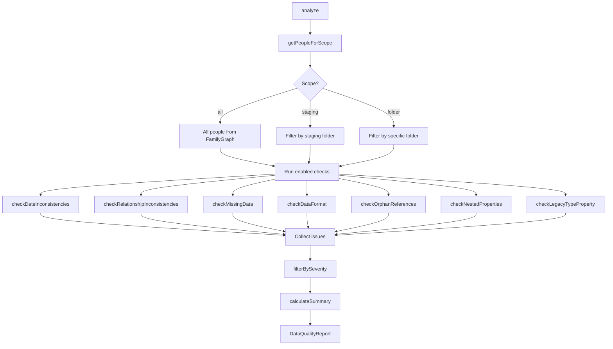
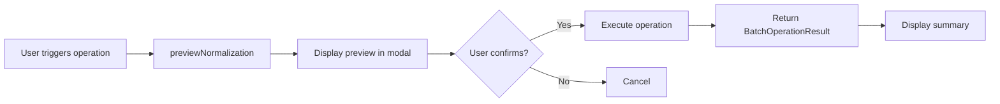

# Data Services

This document covers data normalization, quality checking, and organizational services.

## Property and Value Alias System

The alias system normalizes data from various sources (GEDCOM imports, user input, existing notes) to canonical forms while respecting user preferences for property naming.

### Property Aliases

`PropertyAliasService` (`src/core/property-alias-service.ts`) maps custom frontmatter property names to canonical names used internally.

**Purpose:** Users may prefer `birthdate` instead of `born`, or `maiden_name` instead of `birth_surname`. The alias system allows custom naming while maintaining internal consistency.

**Configuration:** `settings.propertyAliases: Record<string, string>`

```typescript
// Example user configuration
{
  "birthdate": "born",      // User writes "birthdate:", plugin reads as "born"
  "deathdate": "died",
  "maiden_name": "birth_surname"
}
```

**Key methods:**

```typescript
// Resolve custom property name to canonical name
resolve(propertyName: string): string

// Get the property name to use when writing (user's preferred name)
getWriteProperty(canonicalName: string): string

// Get the property name to display in UI
getDisplayProperty(canonicalName: string): string
```

**Canonical properties by note type:**

| Note Type | Canonical Properties |
|-----------|---------------------|
| Person | `name`, `born`, `died`, `birth_surname`, `father`, `mother`, `spouse`, `children`, `sex`, `gender_identity`, `cr_id`, `cr_type` |
| Place | `name`, `place_type`, `coordinates_lat`, `coordinates_long`, `parent_place`, `cr_id`, `cr_type` |
| Event | `title`, `event_type`, `date`, `end_date`, `person`, `place`, `description`, `cr_id`, `cr_type` |
| Source | `name`, `source_type`, `author`, `publication_date`, `repository`, `cr_id`, `cr_type` |
| Organization | `name`, `org_type`, `founded`, `dissolved`, `parent_org`, `cr_id`, `cr_type` |

### Value Aliases

`ValueAliasService` (`src/core/value-alias-service.ts`) normalizes property values to canonical forms.

**Purpose:** Handle variations in how the same concept is expressed:
- "male" → "M" (GEDCOM standard)
- "Birth" → "birth" (case normalization)
- Custom value mappings for domain-specific needs

**Configuration:** `settings.valueAliases: ValueAliasSettings`

```typescript
interface ValueAliasSettings {
  eventType: Record<string, string>;      // "nameday" → "birth"
  sex: Record<string, string>;            // "male" → "M"
  gender_identity: Record<string, string>;
  placeCategory: Record<string, string>;
  noteType: Record<string, string>;
}
```

**Key methods:**

```typescript
// Resolve value to canonical form (checks user aliases, then built-in synonyms)
resolve(field: string, value: string): string

// Get the value to use when writing (user's preferred form)
getWriteValue(field: string, canonicalValue: string): string

// Check if a value is valid for a field
isValidValue(field: string, value: string): boolean
```

### Built-in Synonyms

The value alias service includes built-in synonyms for common variations, eliminating the need for explicit user configuration in most cases.

**Sex field synonyms:**

| Input | Canonical |
|-------|-----------|
| `male`, `m`, `boy`, `man` | `M` |
| `female`, `f`, `girl`, `woman` | `F` |
| `other`, `nonbinary`, `non-binary`, `nb`, `x` | `X` |
| `unknown`, `u`, `?` | `U` |

**Event type synonyms:**

| Input | Canonical |
|-------|-----------|
| `nameday`, `baptism`, `christening` | `birth` |
| `burial`, `cremation`, `interment` | `death` |
| `wedding`, `union`, `civil_union` | `marriage` |
| `separation`, `annulment` | `divorce` |
| `move`, `relocation`, `emigration`, `immigration` | `residence` |
| `job`, `career`, `employment`, `profession` | `occupation` |
| `schooling`, `degree`, `graduation` | `education` |
| `service`, `enlistment`, `discharge` | `military` |
| `bar_mitzvah`, `bat_mitzvah`, `confirmation`, `first_communion` | `religious` |

**Resolution order:**
1. User-defined aliases (highest priority)
2. Built-in synonyms
3. Original value (if no match)

### Integration Points

The alias system is used throughout the plugin:

**GEDCOM Import/Export** (`src/gedcom/`):
- Import: Maps GEDCOM property names to canonical, applies value normalization
- Export: Uses `getWriteProperty()` and `getWriteValue()` for output

**Data Quality** (`src/core/data-quality.ts`):
- Sex normalization uses value aliases
- Property standardization respects property aliases

**Obsidian Bases** (`src/constants/*-base-template.ts`):
- Base templates apply property aliases to formula references
- Ensures bases work with custom property names

**Family Graph** (`src/core/family-graph.ts`):
- Reads frontmatter using resolved property names
- Handles both canonical and aliased forms

**Settings UI** (`src/settings.ts`):
- Property alias editor with add/remove functionality
- Value alias configuration per field type

---

## Data Quality and Batch Operations

The data quality system detects issues in genealogical data and provides batch operations to fix them. This complements the wiki documentation with implementation details for developers.

### DataQualityService Architecture

`DataQualityService` (`src/core/data-quality.ts`) is the central service for analyzing and fixing data quality issues.

```
src/core/
├── data-quality.ts           # Main service (2,100+ lines)
├── bidirectional-linker.ts   # Relationship sync service
├── value-alias-service.ts    # Sex/gender normalization support
└── family-graph.ts           # Person data for analysis

src/ui/
├── data-quality-tab.ts       # Control Center tab
├── bulk-geocode-modal.ts     # Place geocoding modal
├── standardize-places-modal.ts
├── standardize-place-variants-modal.ts
├── standardize-place-types-modal.ts
├── merge-duplicate-places-modal.ts
└── create-missing-places-modal.ts
```

**Service initialization:**

```typescript
constructor(
  private app: App,
  private settings: CanvasRootsSettings,
  private familyGraph: FamilyGraphService,
  private folderFilter: FolderFilterService,
  private plugin?: CanvasRootsPlugin
) {
  // Schema service for schema-aware normalization
  if (plugin) {
    this.schemaService = new SchemaService(plugin);
  }
}
```

**Analysis flow:**



**Key data structures:**

```typescript
interface DataQualityReport {
  generatedAt: Date;
  scope: 'all' | 'staging' | 'folder';
  folderPath?: string;
  summary: DataQualitySummary;
  issues: DataQualityIssue[];
}

interface DataQualitySummary {
  totalPeople: number;
  totalIssues: number;
  bySeverity: { error: number; warning: number; info: number };
  byCategory: Record<IssueCategory, number>;
  completeness: { /* birth/death/parent coverage */ };
  qualityScore: number;  // 0-100
}

interface DataQualityIssue {
  code: string;           // e.g., 'DEATH_BEFORE_BIRTH'
  message: string;
  severity: 'error' | 'warning' | 'info';
  category: IssueCategory;
  person: PersonNode;
  relatedPerson?: PersonNode;
  details?: Record<string, string | number | boolean>;
}
```

### Issue Types and Categories

**Issue categories** (`IssueCategory` type):

| Category | Description | Severity Range |
|----------|-------------|----------------|
| `date_inconsistency` | Impossible dates, chronological errors | Error–Warning |
| `relationship_inconsistency` | Circular refs, gender mismatches | Error–Warning |
| `missing_data` | No parents, no birth date, no gender | Info |
| `data_format` | Non-standard dates, invalid values | Info–Warning |
| `orphan_reference` | Links to non-existent cr_ids | Warning–Error |
| `nested_property` | Non-flat frontmatter | Warning |
| `legacy_type_property` | Uses `type` instead of `cr_type` | Info |

**Quality score calculation:**

```typescript
// Penalty-based scoring (lines 1023-1032)
const errorPenalty = bySeverity.error * 10;
const warningPenalty = bySeverity.warning * 3;
const infoPenalty = bySeverity.info * 1;
const totalPenalty = errorPenalty + warningPenalty + infoPenalty;

// Scale penalty relative to population size
const scaledPenalty = totalPeople > 0 ? (totalPenalty / totalPeople) * 10 : 0;
const qualityScore = Math.max(0, Math.min(100, Math.round(100 - scaledPenalty)));
```

**Date validation checks:**

| Check | Severity | Thresholds |
|-------|----------|------------|
| Death before birth | Error | — |
| Future birth/death | Error | Current year |
| Unreasonable age | Warning | > 120 years |
| Born before parent | Error | — |
| Parent too young | Warning | < 12 years at birth |
| Parent too old | Warning | Father > 80, Mother > 55 |
| Born after mother's death | Error | — |

### Batch Operation Pattern

All batch operations follow a consistent preview-then-execute pattern:



**BatchOperationResult structure:**

```typescript
interface BatchOperationResult {
  processed: number;   // Total items examined
  modified: number;    // Items actually changed
  errors: Array<{ file: string; error: string }>;
}
```

**NormalizationPreview structure:**

```typescript
interface NormalizationPreview {
  dateNormalization: NormalizationChange[];
  genderNormalization: NormalizationChange[];
  genderSkipped: SkippedGenderNote[];  // Schema-protected notes
  orphanClearing: NormalizationChange[];
  legacyTypeMigration: NormalizationChange[];
}

interface NormalizationChange {
  person: PersonNode;
  field: string;
  oldValue: string;
  newValue: string;
}
```

**Available batch operations:**

| Method | Purpose | Updates |
|--------|---------|---------|
| `normalizeDateFormats()` | Standardize to YYYY-MM-DD | `birth_date`, `death_date` |
| `normalizeGenderValues()` | Standardize to M/F/X/U | `sex` |
| `clearOrphanReferences()` | Remove invalid parent refs | `father_id`, `mother_id` |
| `migrateLegacyTypeProperty()` | `type` → `cr_type` | `cr_type`, removes `type` |
| `fixBidirectionalInconsistencies()` | Add missing reciprocal links | Parent/child/spouse fields |

**Date normalization formats recognized:**

```typescript
// normalizeDateString() handles:
"15 Mar 1920"      → "1920-03-15"  // DD MMM YYYY
"Mar 15, 1920"     → "1920-03-15"  // MMM DD, YYYY
"15/03/1920"       → "1920-03-15"  // DD/MM/YYYY
"about 1920"       → "1920"        // Year extraction
```

### Bidirectional Relationship Sync

`BidirectionalLinker` (`src/core/bidirectional-linker.ts`) maintains reciprocal relationships across person notes.

**Sync triggers:**
- File modification events (when `settings.syncOnFileModify` enabled)
- GEDCOM/Gramps/CSV imports (post-import pass)
- Manual "Fix bidirectional relationships" command

**Inconsistency types detected:**

```typescript
type BidirectionalInconsistencyType =
  | 'missing-child-in-parent'    // Child lists parent, parent missing child
  | 'missing-parent-in-child'    // Parent lists child, child missing parent
  | 'missing-spouse-in-spouse'   // Spouse not reciprocated
  | 'conflicting-parent-claim';  // Two people claim same child
```

**Conflict handling:**

When two people both claim the same child as their own (e.g., biological parent vs step-parent confusion), the system flags this for manual resolution rather than automatically overwriting:

```typescript
if (currentFatherClaimsChild && currentFather.crId !== person.crId) {
  // Both claim this child - record as conflict
  inconsistencies.push({
    type: 'conflicting-parent-claim',
    person: currentFather,
    relatedPerson: child,
    conflictingPerson: person,
    conflictType: 'father',
    description: `${child.name} has conflicting father claims...`
  });
}
```

**Step/adoptive parent awareness:**

The system checks for non-biological parent relationships before flagging conflicts:

```typescript
const isStepOrAdoptiveFather =
  child.stepfatherCrIds.includes(person.crId) ||
  child.adoptiveFatherCrId === person.crId;

if (!isStepOrAdoptiveFather) {
  // Proceed with conflict check
}
```

### Schema-Aware Normalization

Sex value normalization can skip notes protected by schemas with custom sex enum definitions.

**Normalization modes** (`settings.sexNormalizationMode`):

| Mode | Behavior |
|------|----------|
| `standard` | Normalize all values to GEDCOM M/F/X/U |
| `schema-aware` | Skip notes with schemas defining custom sex values |
| `disabled` | No normalization (preview still shows what would change) |

**Schema detection:**

```typescript
private hasCustomSexSchema(schemas: SchemaNote[]): boolean {
  for (const schema of schemas) {
    const sexProp = schema.definition?.properties?.['sex'];
    if (sexProp?.type === 'enum' && sexProp.values?.length > 0) {
      return true;  // Schema defines custom sex values
    }
  }
  return false;
}
```

**Use case:** World-builders may define custom sex values like "hermaphrodite" or "neuter" in a schema. Schema-aware mode preserves these values while still normalizing genealogy notes.

**Value alias integration:**

```typescript
// Built-in synonyms from value-alias-service.ts
const BUILTIN_SYNONYMS = {
  sex: {
    'male': 'M', 'm': 'M', 'boy': 'M', 'man': 'M',
    'female': 'F', 'f': 'F', 'girl': 'F', 'woman': 'F',
    'nonbinary': 'X', 'non-binary': 'X', 'nb': 'X', 'x': 'X',
    'unknown': 'U', 'u': 'U', '?': 'U'
  }
};

// Resolution order:
// 1. User-defined aliases (highest priority)
// 2. Built-in synonyms
// 3. Original value (if no match)
const normalizedValue = userAliases[normalizedKey] || BUILTIN_SYNONYMS.sex[normalizedKey];
```

### Place Batch Operations

Place data quality spans multiple modals in `src/ui/`:

**Bulk Geocode** (`bulk-geocode-modal.ts`):
- Uses `GeocodingService` with OpenStreetMap Nominatim API
- Rate-limited to 1 request/second (Nominatim policy)
- Skips places that already have coordinates
- Updates `coordinates_lat`, `coordinates_long` in flat format

**Standardize Place Variants** (`standardize-place-variants-modal.ts`):
- Normalizes common abbreviations (USA, UK, state abbreviations)
- Groups variants by canonical form
- User selects preferred form for each group

**Standardize Place Types** (`standardize-place-types-modal.ts`):
- Converts generic types ("locality") to specific types ("city", "town", "village")
- Uses geocoding API metadata when available

**Merge Duplicate Places** (`merge-duplicate-places-modal.ts`):
- Detection methods: case-insensitive name matching, title + parent combination
- Merges coordinates, properties, and updates all references

**Create Missing Places** (`create-missing-places-modal.ts`):
- Scans person notes for unresolved place references
- Creates place notes with proper hierarchy
- Supports batch creation with progress tracking

**Enrich Place Hierarchy** (in `places-tab.ts`):
- Uses geocoding API to fill `contained_by` relationships
- Builds chains: City → County → State → Country

**Common modal pattern:**

```typescript
// All place modals follow this structure:
class PlaceBatchModal extends Modal {
  private places: PlaceNote[];
  private preview: PreviewData[];

  async onOpen() {
    await this.loadPlaces();
    this.renderPreview();
  }

  private async execute() {
    const result: BatchOperationResult = { processed: 0, modified: 0, errors: [] };
    for (const item of this.preview) {
      try {
        await this.processItem(item);
        result.modified++;
      } catch (e) {
        result.errors.push({ file: item.file.path, error: e.message });
      }
      result.processed++;
      this.updateProgress(result.processed / this.preview.length);
    }
    this.showResults(result);
  }
}
```

---

## Collections and Family Groups

Collections and family groups provide organizational structures for people in the vault, enabling filtering, browsing, and canvas generation based on user-defined groupings.

### Two Organization Systems

Canvas Roots provides complementary organization systems (defined in `src/core/family-graph.ts`):

**Detected Families (Automatic)**
- Auto-discovered through relationship graph traversal (BFS)
- Based on biological/marital relationships (father, mother, spouse, children)
- Always up-to-date (computed on demand)
- Optional custom naming via `group_name` frontmatter property

**User Collections (Manual)**
- Explicitly assigned via `collection` frontmatter property
- Independent of biological relationships
- Use cases: lineages, generations, world-building factions, research categories

### PersonNode Collection Properties

```typescript
// From src/core/family-graph.ts
export interface PersonNode {
  // ... other properties ...

  // Collection naming (for detected families)
  collectionName?: string;

  // User-defined collection
  collection?: string;

  // Fictional universe (optional)
  universe?: string;
}
```

Frontmatter properties:

```yaml
---
collection: "Paternal Line"    # User-defined collection
group_name: "Smith Family"     # Custom name for detected family group
universe: "Middle-earth"       # Fictional universe for world-building
---
```

### FamilyGraphService Methods

**`findAllFamilyComponents()`** - Detects disconnected family groups:

```typescript
findAllFamilyComponents(): Array<{
  representative: PersonNode;  // Oldest person by birth date
  size: number;
  people: PersonNode[];
  collectionName?: string;     // From group_name or most common in group
}>
```

Algorithm:
1. BFS traversal starting from each unvisited person
2. Follows relationships: fatherCrId, motherCrId, spouseCrIds, childrenCrIds
3. Groups all connected people into a single component
4. Selects representative (oldest by birth date, or first alphabetically)
5. Resolves collection name using `getCollectionName()` (most common `group_name` wins)

**`getUserCollections()`** - Returns user-defined collections:

```typescript
getUserCollections(): Array<{
  name: string;
  people: PersonNode[];
  size: number;
}>
```

Groups people by their `collection` property, sorted by size (largest first).

**`detectCollectionConnections()`** - Finds cross-collection relationships:

```typescript
interface CollectionConnection {
  fromCollection: string;
  toCollection: string;
  bridgePeople: PersonNode[];  // People connecting the collections
  relationshipCount: number;
}

detectCollectionConnections(): CollectionConnection[]
```

Detects "bridge people" who have family relationships with people in other collections.

### Collection Analytics

The `calculateCollectionAnalytics()` method provides comprehensive statistics:

```typescript
interface CollectionAnalytics {
  totalPeople: number;
  totalFamilies: number;
  totalUserCollections: number;
  totalCollections: number;
  averageCollectionSize: number;
  largestCollection: { name: string; size: number } | null;
  smallestCollection: { name: string; size: number } | null;
  dataCompleteness: {
    birthDatePercent: number;
    deathDatePercent: number;
    sexPercent: number;
  };
  relationshipMetrics: {
    peopleWithParents: number;
    peopleWithSpouses: number;
    peopleWithChildren: number;
    orphanedPeople: number;
  };
  crossCollectionMetrics: {
    totalConnections: number;
    totalBridgePeople: number;
    topConnections: Array<{ from: string; to: string; bridgeCount: number }>;
  };
  dateRange: { earliest?: number; latest?: number };
}
```

### Control Center Collections Tab

The Collections tab (`showCollectionsTab()` in `control-center.ts`) provides:

**Browse Modes** (dropdown selector):
- "All people" - Complete vault listing
- "Detected families" - Auto-detected family groups with paginated table
- "My collections" - User-defined collections with connection detection

**Analytics Card**:
- Total people count
- Collection counts (families + user collections)
- Average collection size
- Bridge people count
- Data completeness percentages (birth dates, death dates, sex)
- Collection highlights (largest/smallest)

**Collection Overview Canvas**:
- Generates master canvas showing all collections
- Grid layout (3 columns) with text nodes
- Edges connecting related collections
- Color-coded by collection name (hash-based)

### Collection-Filtered Tree Generation

Trees can be filtered by collection (in `TreeOptions`):

```typescript
interface TreeOptions {
  // ... other options ...
  collectionFilter?: string;  // Only include people in this collection
  placeFilter?: { placeName: string; types: string[] };
}
```

The `shouldIncludePerson()` method checks collection membership during tree generation.

### Collection Overview Canvas Generation

The `CanvasGenerator.generateCollectionOverviewCanvas()` method creates a visual representation:

```typescript
generateCollectionOverviewCanvas(
  collections: Array<{ name: string; size: number; representative?: PersonNode }>,
  connections?: CollectionConnection[],
  options: { nodeWidth?: number; nodeHeight?: number }
): CanvasData
```

Features:
- Legend node explaining the canvas
- Text nodes for each collection with size and representative
- Edges connecting collections that share relationships
- Hash-based color assignment for consistent collection colors
- Grid layout (3 columns) with automatic row wrapping
