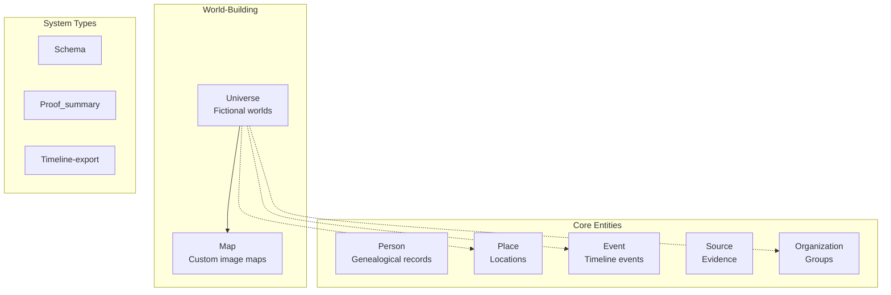
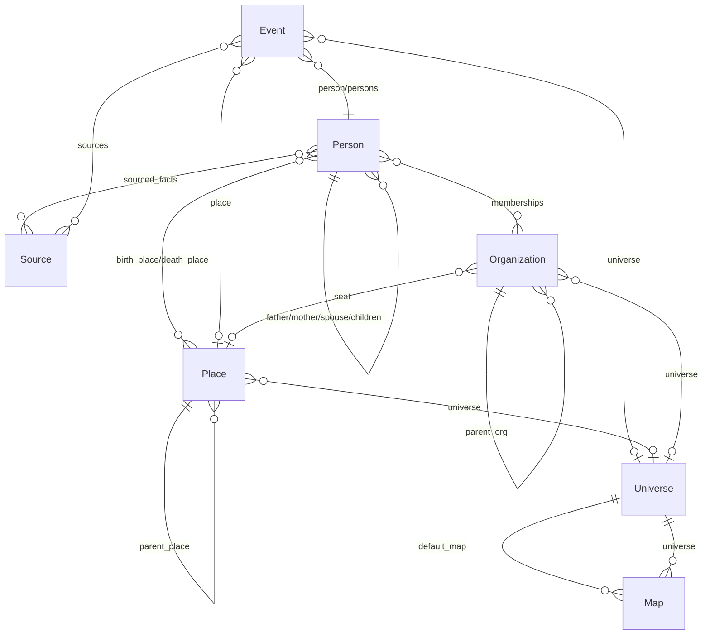
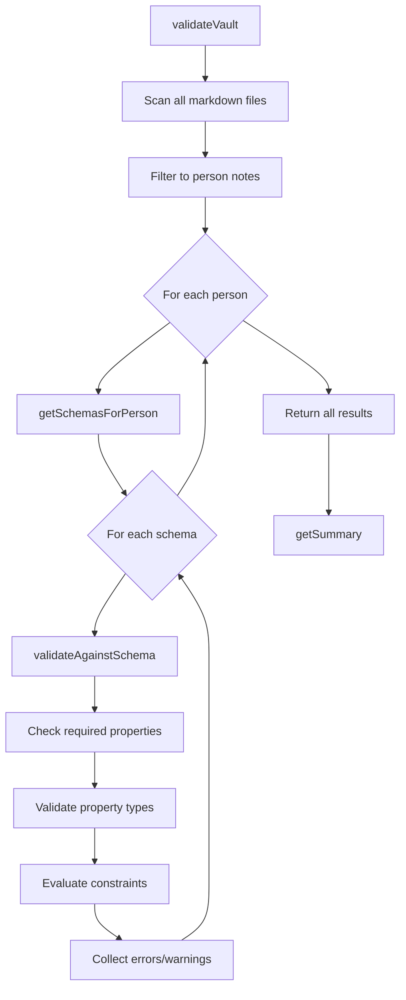

# Entity System

This document covers the core entity system including note types, dual storage, schema validation, and custom relationship types.

## Table of Contents

- [Note Types and Entity System](#note-types-and-entity-system)
  - [Core Entity Types](#core-entity-types)
  - [Type Detection](#type-detection)
  - [Person Note Structure](#person-note-structure)
  - [Place Note Structure](#place-note-structure)
  - [Event Note Structure](#event-note-structure)
  - [Source Note Structure](#source-note-structure)
  - [Organization Note Structure](#organization-note-structure)
  - [Cross-References Between Types](#cross-references-between-types)
- [Dual Storage System](#dual-storage-system)
- [Schema Validation](#schema-validation)
  - [Schema Note Format](#schema-note-format)
  - [SchemaService](#schemaservice)
  - [ValidationService](#validationservice)
  - [Property Types and Validation](#property-types-and-validation)
- [Custom Relationship Types](#custom-relationship-types)
  - [Relationship Type Definition](#relationship-type-definition)
  - [Built-in Types and Categories](#built-in-types-and-categories)
  - [RelationshipService](#relationshipservice)
  - [Frontmatter Storage](#frontmatter-storage)

---

## Note Types and Entity System

Charted Roots uses a structured entity system with typed notes identified by frontmatter properties.

### Core Entity Types

Seven primary entity types plus three system types:

| Type | Purpose | Key Properties |
|------|---------|----------------|
| **Person** | Individual genealogical records | `name`, `born`, `died`, `father`, `mother`, `spouse`, `children`, `sex` |
| **Place** | Geographic locations (real, historical, fictional) | `name`, `place_type`, `place_category`, `parent_place`, `coordinates_lat/long` |
| **Event** | Timeline events (vital, life, narrative) | `title`, `event_type`, `date`, `person`, `place` |
| **Source** | Evidence and documentation | `title`, `source_type`, `source_quality`, `source_repository` |
| **Organization** | Groups and hierarchies | `name`, `org_type`, `parent_org`, `seat`, `founded`, `dissolved` |
| **Universe** | Fictional world containers | `name`, `description`, `default_calendar`, `default_map`, `status` |
| **Map** | Custom image maps for fictional worlds | `name`, `universe`, `image_path`, `coordinate_system`, bounds |

**System types:** Schema (validation), Proof_summary (research), Timeline-export



### Type Detection

Notes are identified by frontmatter properties with configurable priority:

```typescript
// Detection priority (from src/utils/note-type-detection.ts)
1. cr_type property (recommended, namespaced to avoid conflicts)
2. type property (legacy support)
3. Tags (#person, #place, etc.) if tag detection enabled
```

**Identification properties:**
- `cr_id` - Unique identifier (UUID recommended), survives file renames
- `cr_type` - Type identifier: `person`, `place`, `event`, `source`, `organization`, `universe`, `map`

**Dual storage for relationships** (see [Dual Storage System](#dual-storage-system)):
```yaml
father: "[[John Smith]]"      # Wikilink for Obsidian features
father_id: abc-123-def-456    # cr_id for reliable resolution
```

### Person Note Structure

```yaml
cr_id: [string]
cr_type: person
name: [string]

# Biological parents
father: [wikilink]
father_id: [string]
mother: [wikilink]
mother_id: [string]

# Extended family (can be arrays)
stepfather: [wikilink | wikilink[]]
stepmother: [wikilink | wikilink[]]
adoptive_father: [wikilink]
adoptive_mother: [wikilink]

# Spouses and children
spouse: [wikilink | wikilink[]]
spouse_id: [string]
children: [wikilink[]]

# Demographics
sex: M | F | X | U           # GEDCOM-compatible
gender_identity: [string]     # Free-form identity

# Key dates and places
born: [date string]
died: [date string]
birth_place: [wikilink to Place]
death_place: [wikilink to Place]

# Research tracking
sourced_facts:
  birth_date:
    sources: [wikilink[]]
  # ... other facts
```

### Place Note Structure

```yaml
cr_id: [string]
cr_type: place
name: [string]

# Classification
place_type: planet | continent | country | state | city | town | village | ...
place_category: real | historical | disputed | legendary | mythological | fictional

# Hierarchy
parent_place: [wikilink to Place]
parent_place_id: [string]

# Coordinates
coordinates_lat: [number]      # Real-world
coordinates_long: [number]
custom_coordinates_x: [number] # Custom map
custom_coordinates_y: [number]
custom_coordinates_map: [string]

# World-building
universe: [wikilink to Universe]

# Per-map filtering (optional)
maps: [string[]]               # Map IDs to restrict this place to
```

**Per-map filtering:**
- If `maps` is undefined/empty: Place appears on all maps with matching universe (default)
- If `maps` is defined: Place only appears on the specified map(s)
- Example: `maps: [north-map, westeros-full-map]`

### Event Note Structure

```yaml
cr_id: [string]
cr_type: event
title: [string]
event_type: [string]           # See event types below

# Temporal
date: [date string]
date_end: [date string]
date_precision: exact | month | year | decade | estimated | range | unknown

# Participants and location
person: [wikilink to Person]
persons: [wikilink[]]
place: [wikilink to Place]

# Documentation
sources: [wikilink[]]
confidence: high | medium | low | unknown

# Fictional
universe: [wikilink to Universe]
date_system: [calendar id]
is_canonical: [boolean]
```

**Event types (23 built-in):**
- **Vital:** birth, death, marriage, divorce
- **Life:** residence, occupation, military, immigration, education, burial, baptism, confirmation, ordination
- **Narrative:** anecdote, lore_event, plot_point, flashback, foreshadowing, backstory, climax, resolution

### Source Note Structure

```yaml
cr_id: [string]
cr_type: source
title: [string]
source_type: [string]          # See source types below
source_quality: primary | secondary | derivative

# Repository
source_repository: [string]
source_repository_url: [string]
source_collection: [string]

# Dates
source_date: [date string]
source_date_accessed: [date string]

# Media
media: [wikilink | wikilink[]]
confidence: high | medium | low | unknown
```

**Source types (15 built-in):** vital_record, obituary, census, church_record, court_record, land_deed, probate, military, immigration, photo, correspondence, newspaper, oral_history, custom

### Organization Note Structure

```yaml
cr_id: [string]
cr_type: organization
name: [string]
org_type: noble_house | guild | corporation | military | religious | political | educational | custom

# Hierarchy
parent_org: [wikilink to Organization]
seat: [wikilink to Place]

# Timeline
founded: [date string]
dissolved: [date string]

# World-building
universe: [wikilink to Universe]
```

**Membership tracking** (in Person notes):
```yaml
memberships:
  - org: "[[House Stark]]"
    org_id: [string]
    role: [string]
    from: [date]
    to: [date]
```

### Cross-References Between Types

The entity system uses wikilinks for Obsidian integration plus `_id` fields for reliable resolution:



| From | To | Properties |
|------|-----|------------|
| Person | Person | `father`, `mother`, `spouse`, `children`, stepparents, adoptive parents |
| Person | Place | `birth_place`, `death_place` |
| Person | Source | `sourced_facts.*.sources` |
| Person | Organization | `memberships[].org` |
| Event | Person | `person`, `persons` |
| Event | Place | `place` |
| Event | Source | `sources` |
| Event | Universe | `universe` |
| Place | Place | `parent_place` (hierarchy: Country → State → City) |
| Place | Universe | `universe` (for fictional places) |
| Organization | Organization | `parent_org` |
| Organization | Place | `seat` |
| Organization | Universe | `universe` |
| Map | Universe | `universe` |
| Universe | Map | `default_map` |

**Type definitions:** `src/types/frontmatter.ts`, `src/*/types/*-types.ts`

---

## Dual Storage System

The plugin implements a **dual storage pattern** for relationships to balance Obsidian features with reliable resolution:

### Frontmatter Structure

```yaml
---
cr_id: abc-123-def-456
name: John Smith
father: "[[Dad Smith]]"      # Wikilink (enables Obsidian features)
father_id: xyz-789-uvw-012   # cr_id (enables reliable resolution)
mother: "[[Mom Smith]]"
mother_id: pqr-345-stu-678
spouse:
  - "[[Jane Doe]]"
spouse_id:
  - mno-901-jkl-234
children:
  - "[[Child 1]]"
  - "[[Child 2]]"
children_id:
  - def-456-ghi-789
  - abc-123-xyz-456
---
```

### Benefits

1. **Wikilinks** (father/mother/spouse/children): Enable Obsidian's link graph, backlinks, and hover previews
2. **ID fields** (_id suffix): Provide reliable resolution that survives file renames

### Wikilink Alias Format for Duplicate Names

When Obsidian has multiple files with the same name, it appends a number to the filename (e.g., "John Doe 1.md", "John Doe 2.md"). Charted Roots handles this by using Obsidian's alias format:

```yaml
father: "[[John Doe 1|John Doe]]"  # Points to "John Doe 1.md", displays as "John Doe"
```

**When alias format is used:**
- When the file basename differs from the person's name property
- Automatically applied by all wikilink-generating code (bidirectional linker, importers, note writers, etc.)
- Format: `[[basename|display_name]]` where basename is the filename without `.md` extension

**Implementation pattern:**

```typescript
function createSmartWikilink(name: string, file: TFile | null, app: App): string {
    if (file && file.basename !== name) {
        return `[[${file.basename}|${name}]]`;
    }
    if (!file) {
        const resolvedFile = app.metadataCache.getFirstLinkpathDest(name, '');
        if (resolvedFile && resolvedFile.basename !== name) {
            return `[[${resolvedFile.basename}|${name}]]`;
        }
    }
    return `[[${name}]]`;
}
```

**Downstream parsing:**

All code that reads wikilinks must use `extractWikilinkPath()` utility to handle alias format:

```typescript
import { extractWikilinkPath } from '../utils/wikilink-resolver';

const wikilink = "[[John Doe 1|John Doe]]";
const path = extractWikilinkPath(wikilink);  // Returns: "John Doe 1"
```

This affects:
- **Exporters** (GEDCOM, Gramps, GedcomX) - must parse wikilinks to extract paths
- **Dynamic content blocks** (relationships, media) - both live rendering and freeze-to-markdown
- **Report generators** - timeline, place summary, collection overview, media inventory
- **Family Graph** - uses cr_ids instead of wikilinks, unaffected by this issue

### Implementation

- **bidirectional-linker.ts**: Creates/updates both wikilink and _id fields when syncing relationships, uses alias format for duplicates
- **family-graph.ts**: Reads from _id fields first, falls back to wikilink resolution for legacy support
- **gedcom-importer.ts**: Two-pass import: creates wikilinks in first pass, replaces with cr_ids in _id fields in second pass
- **person-note-writer.ts**: Used by all importers, creates smart wikilinks with alias format
- **utils/wikilink-resolver.ts**: `extractWikilinkPath()` handles all three formats: `[[name]]`, `[[basename]]`, `[[basename|name]]`

---

## Schema Validation

Schema validation allows defining data consistency rules for person notes. Schemas ensure properties exist, have correct types, and satisfy custom constraints.

### Schema Note Format

Schemas are stored as markdown notes with `cr_type: schema` frontmatter and a JSON definition in a code block.

**File structure:**

```
src/schemas/
├── index.ts                    # Public exports
├── types/
│   └── schema-types.ts         # Type definitions
└── services/
    ├── schema-service.ts       # Schema loading and management
    └── validation-service.ts   # Validation logic
```

**Schema note structure:**

````markdown
---
cr_type: schema
cr_id: schema-example-001
name: Example Schema
applies_to_type: collection
applies_to_value: "House Stark"
---

# Example Schema

```json schema
{
  "requiredProperties": ["name", "born"],
  "properties": {
    "sex": {
      "type": "enum",
      "values": ["M", "F", "X", "U"]
    }
  },
  "constraints": [
    {
      "rule": "!died || !born || died >= born",
      "message": "Death date must be after birth date"
    }
  ]
}
```
````

**Frontmatter properties:**

| Property | Type | Description |
|----------|------|-------------|
| `cr_type` | `"schema"` | Note type identifier |
| `cr_id` | `string` | Unique identifier |
| `name` | `string` | Display name |
| `description` | `string?` | Optional description |
| `applies_to_type` | `SchemaAppliesTo` | Scope: `collection`, `folder`, `universe`, `all` |
| `applies_to_value` | `string?` | Target for scoped schemas |

**SchemaDefinition structure:**

```typescript
interface SchemaDefinition {
  requiredProperties: string[];           // Properties that must exist
  properties: Record<string, PropertyDefinition>;
  constraints: SchemaConstraint[];        // Cross-property rules
}
```

### SchemaService

`SchemaService` (`src/schemas/services/schema-service.ts`) loads and manages schema notes.

**Key methods:**

```typescript
class SchemaService {
  // Get all schemas (with caching)
  async getAllSchemas(forceRefresh?: boolean): Promise<SchemaNote[]>;

  // Get schema by cr_id
  async getSchemaById(crId: string): Promise<SchemaNote | undefined>;

  // Find schemas that apply to a person note
  async getSchemasForPerson(file: TFile): Promise<SchemaNote[]>;

  // Scoped queries
  async getSchemasForCollection(name: string): Promise<SchemaNote[]>;
  async getSchemasForFolder(path: string): Promise<SchemaNote[]>;
  async getSchemasForUniverse(name: string): Promise<SchemaNote[]>;
  async getGlobalSchemas(): Promise<SchemaNote[]>;

  // CRUD operations
  async createSchema(schema: Omit<SchemaNote, 'filePath'>): Promise<TFile>;
  async getStats(): Promise<SchemaStats>;
}
```

**Schema resolution for a person:**

```typescript
async getSchemasForPerson(file: TFile): Promise<SchemaNote[]> {
  const fm = cache.frontmatter;
  const collection = fm.collection;
  const universe = fm.universe;
  const folderPath = file.parent?.path || '';

  return schemas.filter(schema => this.schemaAppliesToPerson(schema, {
    collection,
    universe,
    folderPath
  }));
}

// A schema applies if:
// - appliesToType === 'all', OR
// - appliesToType === 'collection' && appliesToValue === person.collection, OR
// - appliesToType === 'folder' && folderPath.startsWith(appliesToValue), OR
// - appliesToType === 'universe' && appliesToValue === person.universe
```

**JSON code block parsing:**

```typescript
const JSON_CODE_BLOCK_REGEX = /```(?:json(?:\s+schema)?)\s*\n([\s\S]*?)\n```/;

// Matches both:
// ```json
// ```json schema
```

### ValidationService

`ValidationService` (`src/schemas/services/validation-service.ts`) validates person notes against schemas.

**Key methods:**

```typescript
class ValidationService {
  // Validate one person against all applicable schemas
  async validatePerson(file: TFile): Promise<ValidationResult[]>;

  // Validate entire vault with progress callback
  async validateVault(
    onProgress?: (progress: ValidationProgress) => void
  ): Promise<ValidationResult[]>;

  // Summarize results
  getSummary(results: ValidationResult[]): ValidationSummary;
}
```

**ValidationResult structure:**

```typescript
interface ValidationResult {
  filePath: string;
  personName: string;
  schemaCrId: string;
  schemaName: string;
  isValid: boolean;
  errors: ValidationError[];
  warnings: ValidationWarning[];
}

interface ValidationError {
  type: ValidationErrorType;
  property?: string;
  message: string;
  expectedType?: PropertyType;
  expectedValues?: string[];
}
```

**Error types:**

| Type | Description |
|------|-------------|
| `missing_required` | Required property not present |
| `invalid_type` | Value doesn't match expected type |
| `invalid_enum` | Value not in allowed enum values |
| `out_of_range` | Number outside min/max bounds |
| `constraint_failed` | Custom constraint rule failed |
| `conditional_required` | Conditionally required property missing |
| `invalid_wikilink_target` | Linked note doesn't exist or wrong type |

**Vault-wide validation flow:**



**Progress reporting:**

```typescript
interface ValidationProgress {
  phase: 'scanning' | 'validating' | 'complete';
  current: number;
  total: number;
  currentFile?: string;
}

// Used by SchemaValidationProgressModal for UI feedback
```

### Property Types and Validation

**Supported property types:**

| Type | Description | Validation |
|------|-------------|------------|
| `string` | Plain text | Non-empty string |
| `number` | Numeric | Valid number, optional min/max |
| `date` | Date string | Parseable date format |
| `wikilink` | Note link | `[[Target]]` format, optional target type check |
| `array` | Array of values | Is array |
| `enum` | Predefined values | Value in `values` array |
| `boolean` | true/false | Boolean type |
| `sourced_facts` | Fact-level sourcing | Validates `SourcedFacts` structure |

**PropertyDefinition structure:**

```typescript
interface PropertyDefinition {
  type: PropertyType;
  values?: string[];           // For enum type
  default?: unknown;           // Default if missing
  requiredIf?: ConditionalRequirement;
  min?: number;                // For number type
  max?: number;                // For number type
  targetType?: string;         // For wikilink (place, person, etc.)
  description?: string;        // UI help text
}
```

**Conditional requirements:**

```typescript
interface ConditionalRequirement {
  property: string;
  equals?: unknown;      // Required if property === value
  notEquals?: unknown;   // Required if property !== value
  exists?: boolean;      // Required if property exists
}

// Example: birth_place required if born exists
{
  "birth_place": {
    "type": "wikilink",
    "targetType": "place",
    "requiredIf": { "property": "born", "exists": true }
  }
}
```

**Constraint evaluation:**

Constraints use JavaScript expressions evaluated against frontmatter:

```typescript
interface SchemaConstraint {
  rule: string;     // JavaScript expression
  message: string;  // Error message if false
}

// Example constraints:
{ "rule": "!died || !born || died >= born", "message": "Death after birth" }
{ "rule": "!age_at_death || age_at_death <= 150", "message": "Unrealistic age" }
```

The expression has access to all frontmatter properties as variables.

---

## Custom Relationship Types

Custom relationship types allow defining non-familial relationships (mentor, guardian, godparent, liege, etc.) between person notes. The system supports both built-in types and user-defined types with inverse relationships and visual styling.

### Relationship Type Definition

**File structure:**

```
src/relationships/
├── index.ts                              # Public exports
├── types/
│   └── relationship-types.ts             # Type definitions
├── constants/
│   └── default-relationship-types.ts     # Built-in types
├── services/
│   └── relationship-service.ts           # CRUD and parsing
└── ui/
    ├── relationships-tab.ts              # Control Center tab
    ├── relationship-type-editor-modal.ts # Create/edit modal
    └── relationship-type-manager-card.ts # Type list UI
```

**RelationshipTypeDefinition structure:**

```typescript
interface RelationshipTypeDefinition {
  id: string;                    // Unique identifier (lowercase, no spaces)
  name: string;                  // Display name
  description?: string;          // Brief description
  category: RelationshipCategory;
  color: string;                 // Hex color for canvas edges
  lineStyle: RelationshipLineStyle;  // 'solid' | 'dashed' | 'dotted'
  inverse?: string;              // ID of inverse type (e.g., mentor → mentee)
  symmetric: boolean;            // Same in both directions (e.g., spouse)
  builtIn: boolean;              // Cannot be deleted if true
}
```

**Categories:**

```typescript
type RelationshipCategory =
  | 'family'       // Spouse, parent, child, sibling
  | 'legal'        // Guardian, adoptive parent, foster parent
  | 'religious'    // Godparent, mentor, disciple
  | 'professional' // Master, apprentice, employer
  | 'social'       // Witness, neighbor, companion, ally, rival
  | 'feudal';      // Liege, vassal (world-building)
```

### Built-in Types and Categories

The plugin ships with 20+ built-in relationship types organized by category:

| Category | Types | Color |
|----------|-------|-------|
| Family | spouse, parent, child, sibling | Purple, Green, Lime |
| Legal | guardian/ward, adoptive_parent/adoptee, foster_parent/foster_child | Teal, Cyan, Sky |
| Religious | godparent/godchild, mentor/mentee | Blue, Violet |
| Professional | master/apprentice, employer/employee | Orange |
| Social | witness, neighbor, companion, ally, rival, betrothed | Gray, Pink, Emerald, Red |
| Feudal | liege/vassal | Gold |

**Inverse relationships:**

Non-symmetric relationships define their inverse:

```typescript
{
  id: 'mentor',
  name: 'Mentor',
  inverse: 'mentee',  // When A is mentor to B, B is mentee to A
  symmetric: false,
  // ...
}

{
  id: 'mentee',
  name: 'Mentee',
  inverse: 'mentor',
  symmetric: false,
  // ...
}
```

Symmetric relationships (like `spouse`, `sibling`) apply equally in both directions.

**Color palette:**

Built-in types use Tailwind CSS colors for consistency:
- Green (`#22c55e`) — Parent/child
- Purple (`#a855f7`) — Spouse
- Lime (`#84cc16`) — Sibling
- Teal (`#14b8a6`) — Guardian
- Blue (`#3b82f6`) — Godparent
- Orange (`#f97316`) — Professional
- Gold (`#eab308`) — Feudal

### RelationshipService

`RelationshipService` (`src/relationships/services/relationship-service.ts`) manages relationship types and parses relationships from person notes.

**Key methods:**

```typescript
class RelationshipService {
  // Type management
  getAllRelationshipTypes(): RelationshipTypeDefinition[];
  getRelationshipType(id: string): RelationshipTypeDefinition | undefined;
  getRelationshipTypesByCategory(category: RelationshipCategory): RelationshipTypeDefinition[];

  // CRUD for custom types
  async addRelationshipType(type: Omit<RelationshipTypeDefinition, 'builtIn'>): Promise<void>;
  async updateRelationshipType(id: string, updates: Partial<...>): Promise<void>;
  async deleteRelationshipType(id: string): Promise<void>;

  // Parsing relationships from vault
  getAllRelationships(forceRefresh?: boolean): ParsedRelationship[];
  getRelationshipsForPerson(crId: string): ParsedRelationship[];
  getStats(): RelationshipStats;
}
```

**Type resolution (built-in + custom):**

```typescript
getAllRelationshipTypes(): RelationshipTypeDefinition[] {
  const builtIn = this.plugin.settings.showBuiltInRelationshipTypes
    ? DEFAULT_RELATIONSHIP_TYPES
    : [];
  const custom = this.plugin.settings.customRelationshipTypes || [];

  // Custom types can override built-in types by ID
  const typeMap = new Map<string, RelationshipTypeDefinition>();
  for (const type of builtIn) typeMap.set(type.id, type);
  for (const type of custom) typeMap.set(type.id, type);

  return Array.from(typeMap.values());
}
```

**ParsedRelationship structure:**

```typescript
interface ParsedRelationship {
  type: RelationshipTypeDefinition;
  sourceCrId: string;
  sourceName: string;
  sourceFilePath: string;
  targetCrId?: string;
  targetName: string;
  targetFilePath?: string;
  from?: string;       // Start date
  to?: string;         // End date
  notes?: string;
  isInferred: boolean; // True if derived from inverse
}
```

### Frontmatter Storage

Relationships are stored in person note frontmatter as an array:

```yaml
---
cr_id: abc-123-def-456
name: John Smith
relationships:
  - type: mentor
    target: "[[Jane Doe]]"
    target_id: xyz-789-uvw-012
    from: "1920"
    to: "1925"
    notes: "Taught blacksmithing"
  - type: godparent
    target: "[[Mary Johnson]]"
---
```

**RawRelationship structure (as stored):**

```typescript
interface RawRelationship {
  type: string;          // Type ID
  target: string;        // Wikilink to target person
  target_id?: string;    // Target's cr_id for reliable resolution
  from?: string;         // Start date
  to?: string;           // End date
  notes?: string;        // Optional notes
}
```

**Wikilink parsing utilities:**

```typescript
// Extract display name from wikilink
extractWikilinkName('[[People/John Smith|John]]') // → 'John'
extractWikilinkName('[[John Smith]]')             // → 'John Smith'

// Extract file path from wikilink
extractWikilinkPath('[[People/John Smith|John]]') // → 'People/John Smith'

// Validate wikilink format
isWikilink('[[John Smith]]')  // → true
isWikilink('John Smith')      // → false
```

**Inferred relationships:**

When person A has a relationship to B with an inverse type defined, the service infers the reverse relationship for B:

```
A.relationships = [{ type: 'mentor', target: '[[B]]' }]
// Service infers: B has { type: 'mentee', target: '[[A]]', isInferred: true }
```

This allows querying all relationships for a person without requiring both sides to be explicitly defined.
