# Import/Export System

This document covers data import/export and source image management.

## Table of Contents

- [Supported Formats](#supported-formats)
- [Two-Pass Import Architecture](#two-pass-import-architecture)
- [Export Pipeline](#export-pipeline)
- [Data Transformations](#data-transformations)
- [Staging Management](#staging-management)
- [Source Image Management](#source-image-management)
  - [Image Filename Parser](#image-filename-parser)
  - [Source Image Import Wizard](#source-image-import-wizard)

---

## Supported Formats

Canvas Roots supports multiple genealogical data formats for interoperability with other genealogy software.

| Format | Import | Export | Description |
|--------|--------|--------|-------------|
| **GEDCOM 5.5.1** | ✅ | ✅ | Standard genealogy interchange format |
| **GEDCOM X** | ✅ | ✅ | Modern JSON-based FamilySearch format |
| **Gramps XML** | ✅ | ✅ | Gramps genealogy software (`.gramps`, `.xml`, `.gpkg` with media) |
| **CSV** | ✅ | ✅ | Spreadsheet-compatible tabular data |

**Gramps file formats:**

| Extension | Description |
|-----------|-------------|
| `.gramps` | Gzip-compressed XML (native Gramps format) |
| `.xml` | Uncompressed Gramps XML export |
| `.gpkg` | Gramps Package — ZIP containing XML + bundled media files |

When importing `.gpkg` files, media files are extracted to the configured media folder and linked to Person, Event, Place, and Source notes via the `media` frontmatter property.

**File organization:**

| Format | Module | Key Classes |
|--------|--------|-------------|
| GEDCOM 5.5.1 | `src/gedcom/` | `GedcomImporter`, `GedcomParser`, `GedcomExporter`, `GedcomQualityAnalyzer` |
| GEDCOM X | `src/gedcomx/` | `GedcomxImporter`, `GedcomxParser`, `GedcomxExporter` |
| Gramps XML | `src/gramps/` | `GrampsImporter`, `GrampsParser`, `GrampsExporter`, `GpkgExtractor` |
| CSV | `src/csv/` | `CsvImporter`, `CsvExporter` |

## Two-Pass Import Architecture

All importers use a consistent two-pass approach to handle relationship resolution:


**Pass 1: Note Creation**
1. Parse source file and validate structure
2. Generate unique `cr_id` for each person
3. Create person notes with temporary references (GEDCOM IDs, Gramps handles, CSV row IDs)
4. Build mapping: temporary ID → cr_id
5. Disable bidirectional linking (deferred to Pass 2)

**Pass 2: Relationship Resolution**
1. Iterate through all created notes
2. Read each note's frontmatter
3. Replace temporary IDs with actual cr_ids in relationship fields
4. Update: `father_id`, `mother_id`, `spouse_id`, `children_id`, step/adoptive parents
5. Write updated frontmatter

**Why two passes?** When importing, parent notes may not exist yet when a child is created. The two-pass approach ensures all notes exist before resolving cross-references.

## Export Pipeline


**Key services:**
- `FamilyGraphService` - Loads all person notes, builds relationship graph
- `EventService` - Loads linked event notes
- `SourceService` - Loads linked source notes
- `PlaceGraphService` - Loads place hierarchies with coordinates
- `PrivacyService` - Filters/obfuscates data for living persons

**Export options:**
- **Collection filter** - Export only people from a specific collection
- **Branch filter** - Export ancestors or descendants of a selected person
- **Privacy filter** - Exclude or obfuscate living persons
- **Field selection** - Include/exclude specific data types

**Format-specific features:**

| Format | Special Features |
|--------|-----------------|
| GEDCOM | Custom `_UID` tag for cr_id, `ASSO` records for custom relationships, `PEDI` for non-biological parents |
| GEDCOM X | Type URIs for relationships, fact types mapped to standard URIs, place descriptions with coordinates |
| Gramps | Full event/source/place integration, XML structure matching Gramps schema |
| CSV | Configurable columns, flattened structure for spreadsheets |

## Data Transformations

**Date conversion:**
```
GEDCOM Format          → ISO Format
15 MAR 1950           → 1950-03-15
MAR 1950              → 1950-03-01
1950                  → 1950-01-01
ABT 15 MAR 1950       → 1950-03-15 (precision: estimated)
```

**Event type mappings:**

| GEDCOM | Canvas Roots |
|--------|--------------|
| BIRT | birth |
| DEAT | death |
| MARR | marriage |
| BAPM, CHR | baptism |
| BURI | burial |
| CENS | census |
| RESI | residence |
| OCCU | occupation |

**Relationship types:**
- **GEDCOM PEDI tag:** `birth`, `adop`, `step`, `foster`
- **GEDCOM X:** ParentChild, StepParent, AdoptiveParent relationship types
- **Gramps rel attribute:** biological, stepchild, adopted, foster

**Staging area workflow:**
1. Import to staging folder first
2. Review imported data via Staging Manager
3. Cross-import duplicate detection
4. Promote to main tree or delete

---

## Staging Management

The staging system allows users to import data to a separate folder for review before promoting to the main tree.

**Key services:**

| Service | File | Purpose |
|---------|------|---------|
| `StagingService` | `src/core/staging-service.ts` | Folder operations, stats, promote/delete |
| `CrossImportDetectionService` | `src/core/cross-import-detection.ts` | Duplicate detection across staging/main |
| `StagingManagementModal` | `src/ui/staging-management-modal.ts` | User interface for managing batches |

**StagingService methods:**

```typescript
// Get staging folder statistics
getStagingStats(): { totalEntities: number; subfolders: StagingSubfolderInfo[] }

// Get files in a subfolder with entity types
getSubfolderFiles(path: string): Array<{ file: TFile; entityType: NoteType | null }>

// Promote files from staging to main tree
promoteSubfolder(subfolderPath: string): Promise<{ success: boolean; filesPromoted: number }>

// Delete a staging subfolder
deleteSubfolder(subfolderPath: string): Promise<{ success: boolean; filesDeleted: number }>
```

**Duplicate detection algorithm:**

```typescript
// CrossImportDetectionService.calculateConfidence()
// Weights: name=60%, dates=30%, gender=5% bonus
const nameScore = levenshteinSimilarity(name1, name2) * 0.6;
const dateScore = calculateDateProximity(birth1, birth2, death1, death2) * 0.3;
const genderBonus = (gender1 === gender2) ? 5 : 0;
const confidence = nameScore + dateScore + genderBonus;
```

**Entry points:**

| Entry Point | Location | Trigger |
|-------------|----------|---------|
| Dashboard | Yellow staging section | When staging has data |
| Command | `Canvas Roots: Manage staging area` | Always available |
| Import Wizard | Success screen button | After importing to staging |

---

## Gramps Media Linking

When importing Gramps Package (`.gpkg`) files, media references are resolved and linked to entity notes.

**Media reference flow:**


**Data structures:**

```typescript
// Added to GrampsPerson, GrampsEvent, GrampsPlace interfaces
interface GrampsPerson {
  // ... existing fields
  mediaRefs: string[];  // Gramps media object handles
}

// Parsed from <objref hlink="..."> elements
function parseMediaRefs(element: Element): string[] {
  return Array.from(element.querySelectorAll('objref'))
    .map(ref => ref.getAttribute('hlink'))
    .filter((h): h is string => h !== null);
}
```

**Resolution during import:**

```typescript
// In GrampsImporter.importPerson()
const resolvedMedia: string[] = [];
if (person.mediaRefs && mediaHandleToPath) {
  for (const ref of person.mediaRefs) {
    const vaultPath = mediaHandleToPath.get(ref);
    if (vaultPath) {
      const filename = vaultPath.split('/').pop() || vaultPath;
      resolvedMedia.push(`"[[${filename}]]"`);
    }
  }
}

const personData: PersonData = {
  // ... other fields
  media: resolvedMedia.length > 0 ? resolvedMedia : undefined
};
```

**Entity types with media support:**

| Entity | Interface | Frontmatter Property |
|--------|-----------|---------------------|
| Person | `GrampsPerson.mediaRefs` | `media` |
| Event | `GrampsEvent.mediaRefs` | `media` |
| Place | `GrampsPlace.mediaRefs` | `media` |
| Source | `GrampsSource.mediaRefs` | `media` |

---

## Gramps Notes Handling

When importing Gramps XML files, notes attached to entities are parsed, converted to Markdown, and appended to the corresponding Obsidian notes.

**Note parsing flow:**


**Key modules:**

| File | Purpose |
|------|---------|
| `src/gramps/gramps-types.ts` | `GrampsNote`, `GrampsStyleRange`, `GrampsNoteFormat` types |
| `src/gramps/gramps-parser.ts` | Parses `<noteref>` and `<note>` elements from XML |
| `src/gramps/gramps-note-converter.ts` | Converts notes to Markdown with style handling |
| `src/gramps/gramps-importer.ts` | Resolves and appends notes during entity import |

**Data structures:**

```typescript
// Note format types
type GrampsNoteFormat = 'flowed' | 'formatted';

// Style range within note text
interface GrampsStyleRange {
  type: 'bold' | 'italic' | 'underline' | 'strikethrough' | 'superscript' | 'subscript' | 'link';
  start: number;   // Start offset in text
  end: number;     // End offset in text
  value?: string;  // For links, the URL
}

// Note record
interface GrampsNote {
  handle: string;
  id?: string;
  type?: string;           // e.g., "Person Note", "Research"
  text?: string;
  format?: GrampsNoteFormat;
  private?: boolean;       // Privacy flag (priv="1")
  styles?: GrampsStyleRange[];
}

// Added to entity interfaces
interface GrampsPerson {
  // ... existing fields
  noteRefs: string[];  // Handle links to notes
}
```

**Style conversion:**

The `gramps-note-converter.ts` module converts Gramps style ranges to Markdown:

```typescript
function wrapWithStyle(content: string, style: GrampsStyleRange): string {
  switch (style.type) {
    case 'bold':          return `**${content}**`;
    case 'italic':        return `*${content}*`;
    case 'strikethrough': return `~~${content}~~`;
    case 'underline':     return `<u>${content}</u>`;
    case 'superscript':   return `<sup>${content}</sup>`;
    case 'subscript':     return `<sub>${content}</sub>`;
    case 'link':          return style.value ? `[${content}](${style.value})` : content;
    default:              return content;
  }
}
```

Styles are applied from end to start to preserve character positions when inserting Markdown syntax.

**Format handling:**

- **Flowed** (default): Normal text, whitespace not significant
- **Formatted**: Preformatted text, wrapped in code fences to preserve whitespace

```typescript
if (note.format === 'formatted') {
  return '```\n' + text + '\n```';
}
```

**Note resolution during import:**

```typescript
// In GrampsImporter.importPerson()
let notesContent: string | undefined;
let hasPrivateNotes = false;

if (options.importNotes !== false && person.noteRefs.length > 0) {
  const resolvedNotes: GrampsNote[] = [];
  for (const noteRef of person.noteRefs) {
    const note = grampsData.database.notes.get(noteRef);
    if (note) resolvedNotes.push(note);
  }
  if (resolvedNotes.length > 0) {
    notesContent = formatNotesSection(resolvedNotes);
    hasPrivateNotes = hasPrivateNote(resolvedNotes);
  }
}

const personData: PersonData = {
  // ... other fields
  notesContent,
  private: hasPrivateNotes || undefined
};
```

**Privacy propagation:**

If any note attached to an entity has `priv="1"` in Gramps, the entity note receives `private: true` in frontmatter. This enables filtering private data during export.

**Entity support:**

| Entity | Interface Field | Note Writer Field |
|--------|-----------------|-------------------|
| Person | `GrampsPerson.noteRefs` | `PersonData.notesContent` |
| Event | `GrampsEvent.noteRefs` | `EventData.notesContent` |
| Place | `GrampsPlace.noteRefs` | `PlaceData.notesContent` |
| Family | `GrampsFamily.noteRefs` | Attached to family events |

---

## Source Image Management

Two wizard tools for managing source images: importing new images as source notes, and linking existing images to existing source notes. These tools help genealogists process large collections of source images with intelligent metadata extraction.

### Image Filename Parser

`ImageFilenameParser` (`src/sources/services/image-filename-parser.ts`) extracts genealogy metadata from image filenames.

**Parsed metadata structure:**

```typescript
interface ParsedImageFilename {
  originalFilename: string;
  extension: string;
  surnames: string[];
  givenNames: string[];
  birthYear?: number;
  recordYear?: number;
  recordType?: string;
  location?: {
    country?: string;
    state?: string;
  };
  partIndicator?: string;
  isMultiPart: boolean;
  uncertaintyMarker?: string;
  confidence: 'high' | 'medium' | 'low';
}
```

**Record type mappings:**

The parser recognizes common genealogy record types from filename tokens:

| Token | Mapped Type | Token | Mapped Type |
|-------|-------------|-------|-------------|
| `census`, `cens` | `census` | `obit`, `obituary` | `obituary` |
| `birth`, `birth_cert` | `vital_record` | `military`, `draft` | `military` |
| `death`, `death_cert` | `vital_record` | `passenger`, `ellis_island` | `immigration` |
| `marriage`, `wedding` | `vital_record` | `cemetery`, `gravestone` | `cemetery` |
| `divorce` | `court_record` | `photo`, `portrait` | `photo` |

**Parsing flow:**

```mermaid
flowchart TD
    A[parseFilename] --> B[Extract extension]
    B --> C[Normalize: replace separators, lowercase]
    C --> D[Tokenize on underscores]
    D --> E{Is auto-named?}
    E -->|Yes| F[Return low confidence result]
    E -->|No| G[Process each token]
    G --> H[Birth year: b1905]
    G --> I[Death year: d1993]
    G --> J[Record year: 1920]
    G --> K[US state: NY, CA]
    G --> L[Part indicator: p1, page2]
    G --> M[Record type: census, birth]
    G --> N[Unclassified → names]
    H --> O[classifyNames]
    I --> O
    J --> O
    K --> O
    L --> O
    M --> O
    N --> O
    O --> P[calculateConfidence]
    P --> Q[Return ParsedImageFilename]
```



**Confidence scoring:**

```typescript
function calculateConfidence(result: ParsedImageFilename): 'high' | 'medium' | 'low' {
  let score = 0;
  if (result.surnames.length > 0) score += 2;    // Surname most important
  if (result.recordType) score += 2;              // Record type helps
  if (result.recordYear || result.birthYear) score += 1;
  if (result.location?.state) score += 1;
  if (result.givenNames.length > 0) score += 1;

  if (score >= 4) return 'high';   // 🟢
  if (score >= 2) return 'medium'; // 🟡
  return 'low';                    // 🟠/⚪
}
```

**Example parsing:**

| Filename | Extracted Data |
|----------|----------------|
| `smith_census_1900.jpg` | Surname: Smith, Type: census, Year: 1900 |
| `henderson_john_b1845_death_1920_NY.png` | Surname: Henderson, Given: John, Birth: 1845, Type: vital_record, Year: 1920, State: NY |
| `obrien_passenger_1892.jpeg` | Surname: O'Brien, Type: immigration, Year: 1892 |
| `scan001.jpg` | Low confidence (auto-named file) |

**Multi-part detection:**

The parser detects multi-page documents and groups them:

```typescript
function detectMultiPartGroups(filenames: string[]): Map<string, string[]> {
  // Groups files like:
  // "smith_census_1900_p1.jpg" and "smith_census_1900_p2.jpg"
  // Returns: Map { "smith_census_1900" => ["..._p1.jpg", "..._p2.jpg"] }
}
```

Part indicator patterns recognized: `p1`, `page1`, `partA`, `a`, `01`, `1`

### Source Image Import Wizard

`SourceImageWizardModal` (`src/sources/ui/source-image-wizard.ts`) imports images and creates source notes.

**Wizard steps:**

| Step | Name | Purpose |
|------|------|---------|
| 1 | Select | Choose folder, filter options |
| 2 | Rename | Optional: review/edit standardized names |
| 3 | Review | Edit parsed metadata before import |
| 4 | Configure | Set destination folder |
| 5 | Execute | Create source notes with progress |

**Per-file state:**

```typescript
interface ImageFileInfo {
  file: TFile;
  parsed: ParsedImageFilename;
  proposedName: string;
  includeInRename: boolean;
  isFiltered: boolean;
  groupId?: string;
  // User edits
  editedSurnames?: string;
  editedYear?: string;
  editedType?: string;
  editedLocation?: string;
}
```

**Import process:**

1. **Scan folder** for image files (jpg, png, gif, webp, tiff, etc.)
2. **Filter** thumbnails, hidden files, non-images
3. **Parse filenames** using `ImageFilenameParser`
4. **Detect multi-part groups** for census pages, etc.
5. **User review** with editable fields and confidence indicators
6. **Create source notes** with media wikilinks in frontmatter

**Created source note structure:**

```yaml
---
cr_type: source
cr_id: abc-123-def-456
title: Census 1900 - Smith
source_type: census
media: "[[Attachments/smith_census_1900.jpg]]"
media_2: "[[Attachments/smith_census_1900_p2.jpg]]"  # if multi-part
---
```
