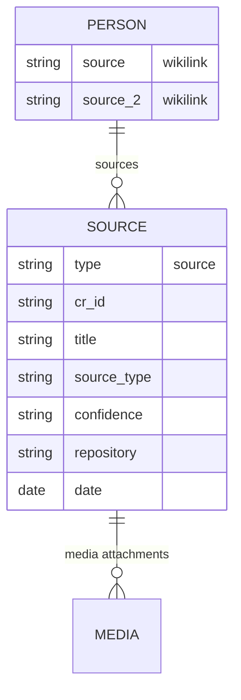

# Evidence & Source Management - Implementation Plan

## Overview

Evidence & Source Management brings professional genealogical research capabilities to Canvas Roots. This feature enables users to:

1. Create and manage **source notes** documenting evidence (census records, vital records, photos, etc.)
2. Link sources to person notes for proper citation
3. View sources in a **media gallery** with thumbnails and previews
4. Generate **formatted citations** in standard genealogical formats
5. Display **media nodes** on canvases alongside person nodes
6. (Future) Capture **timestamped quotes** from oral history recordings

---

## Design Decisions

### Source Notes vs Inline Arrays

**Decision: Source notes (`type: source`)** rather than inline arrays on person notes.

**Rationale:**
- **Reusability** - Same census image can link to multiple family members
- **Rich metadata** - Repository, URL, transcription, notes all belong on source note
- **Bases integration** - Source inventory views, cross-referencing
- **GEDCOM alignment** - Maps to GEDCOM SOUR records for better import/export
- **Person notes stay clean** - Just wikilinks in `sources` array

### Source Types

Based on genealogical standards and common research materials:

| Type | Description | Icon |
|------|-------------|------|
| `census` | Population census records | `users` |
| `vital_record` | Birth, death, marriage certificates | `file-text` |
| `church_record` | Baptism, marriage, burial records | `church` |
| `photo` | Photographs and portraits | `image` |
| `correspondence` | Letters, emails, postcards | `mail` |
| `newspaper` | Newspaper articles, obituaries | `newspaper` |
| `military` | Service records, draft cards, pensions | `shield` |
| `immigration` | Ship manifests, naturalization, passports | `ship` |
| `court_record` | Legal proceedings, divorces | `gavel` |
| `land_deed` | Property records, deeds | `map` |
| `probate` | Wills, estate inventories | `scroll` |
| `obituary` | Death notices, memorial articles | `bookmark` |
| `oral_history` | Interviews, recordings | `mic` |
| `custom` | User-defined source type | `file` |

### Citation Formats

Four standard formats covering academic and genealogical needs:

1. **Chicago** - Chicago Manual of Style (notes-bibliography)
2. **Evidence Explained** - Elizabeth Shown Mills' genealogical standard
3. **MLA** - Modern Language Association
4. **Turabian** - Academic variant of Chicago

### Tab Placement

New tab order in Control Center:
Status → Guide → Import/Export → People → Places → Maps → **Sources** → Schemas → Organizations → Relationships → Collections → Data Quality → Tree Output → Canvas Settings

### Settings

New settings in plugin configuration:

| Setting | Type | Default | Description |
|---------|------|---------|-------------|
| `sourcesFolder` | string | `'Canvas Roots/Sources'` | Folder for source notes |
| `defaultCitationFormat` | enum | `'evidence_explained'` | Default citation format |
| `showSourceThumbnails` | boolean | `true` | Show media previews in gallery |
| `thumbnailSize` | enum | `'medium'` | Thumbnail size (small/medium/large) |

---

## Phase 1: Source Notes Infrastructure (v0.8.0)

### Source Note Schema

Following our standard of **flat frontmatter properties** (Obsidian best practice):

```yaml
---
type: source
cr_id: source-1900-census-smith
title: "1900 US Federal Census - Smith Family"
source_type: census
date: 1900-06-01
date_accessed: 2024-03-15
repository: "Ancestry.com"
repository_url: "https://www.ancestry.com/..."
collection: "1900 United States Federal Census"
location: "New York, Kings County, Brooklyn"
media: "[[attachments/Census 1900 Smith p1.jpg]]"
media_2: "[[attachments/Census 1900 Smith p2.jpg]]"
confidence: high
---

# 1900 US Federal Census - Smith Family

## Transcription

Line 42: John Smith, Head, Male, White, Age 35, Married, Born May 1865, New York...

## Research Notes

This census confirms John's occupation as "carpenter" and lists 4 children in household.
```

**Note on media fields:** For sources with multiple media files, we use numbered suffixes (`media`, `media_2`, `media_3`, etc.) rather than arrays. This maintains flat frontmatter while supporting multiple attachments. The service layer aggregates these into a list when reading.

### Frontmatter Properties

All properties are **flat** (no nested objects):

| Property | Type | Required | Description |
|----------|------|----------|-------------|
| `type` | string | Yes | Always `"source"` |
| `cr_id` | string | Yes | Unique identifier (auto-generated) |
| `title` | string | Yes | Descriptive title |
| `source_type` | enum | Yes | One of the defined source types |
| `date` | date | No | Date of the original document |
| `date_accessed` | date | No | When source was accessed/obtained |
| `repository` | string | No | Where source is held (archive, website) |
| `repository_url` | string | No | URL to online source |
| `collection` | string | No | Collection or record group name |
| `location` | string | No | Geographic location of record |
| `media` | wikilink | No | Primary media file |
| `media_2`, `media_3`, etc. | wikilink | No | Additional media files |
| `confidence` | enum | No | `high`, `medium`, `low`, `unknown` |
| `citation_override` | string | No | Manual citation text (overrides generator) |

### Person Note Integration

Person notes link to sources using numbered flat properties (same pattern as media fields):

```yaml
---
type: person
cr_id: person-john-smith
first_name: John
last_name: Smith
born: 1865-05-15
source: "[[1900 Census Smith Family]]"
source_2: "[[Birth Certificate John Smith]]"
source_3: "[[Marriage License Smith-Jones 1890]]"
---
```

The service layer aggregates `source`, `source_2`, `source_3`, etc. into a list when reading.

### Settings Implementation

Add to `CanvasRootsSettings` interface:

```typescript
// Source management
sourcesFolder: string;
defaultCitationFormat: 'chicago' | 'evidence_explained' | 'mla' | 'turabian';
showSourceThumbnails: boolean;
thumbnailSize: 'small' | 'medium' | 'large';
customSourceTypes: SourceTypeDefinition[];
showBuiltInSourceTypes: boolean;
```

Default values:

```typescript
sourcesFolder: 'Canvas Roots/Sources',
defaultCitationFormat: 'evidence_explained',
showSourceThumbnails: true,
thumbnailSize: 'medium',
customSourceTypes: [],
showBuiltInSourceTypes: true,
```

### Sources Tab in Control Center

**Card 1: Source Overview**
- Total sources count
- Sources by type breakdown (bar chart or list)
- Recently added sources (last 5)

**Card 2: Browse Sources**
- Dropdown filter by source type
- Search box for title/repository
- Sortable list (date, title, type)
- Click to open source note

**Card 3: Source Types**
- Table of source types with icons and colors
- Toggle to show/hide built-in types
- Add custom source type button
- Edit/delete custom types

**Card 4: Quick Actions**
- "Create source note" button → opens modal
- "View all sources" → opens Bases view (if template exists)
- "Generate missing sources report"

### Create Source Modal

Fields:
1. **Title** (required) - text input
2. **Source type** (required) - dropdown grouped by category
3. **Date** - date picker
4. **Repository** - text input with suggestions from existing sources
5. **Repository URL** - URL input
6. **Collection** - text input
7. **Location** - text input (could integrate with places)
8. **Media** - file picker for attachments
9. **Confidence** - dropdown (high/medium/low/unknown)
10. **Initial transcription** - textarea

Creates note in `sourcesFolder` with slugified filename.

### Commands

- `canvas-roots:create-source-note` - Open Create Source modal
- `canvas-roots:open-sources-tab` - Open Control Center to Sources tab
- `canvas-roots:add-source-to-person` - Add source link to current person note

### Context Menu

On person notes:
- "Add source..." → opens source picker modal, adds to `sources` array

On source notes:
- "Copy citation" → submenu with format options
- "View linked people" → shows people with this source
- "Open media" → opens first media file

---

## Phase 2: Source Media Gallery (v0.8.1)

### Gallery View in Sources Tab

New card or expanded view showing source media as thumbnail grid:

**Features:**
- Thumbnail previews for images (JPG, PNG, WebP)
- PDF icon/first-page preview for PDFs
- Audio waveform icon for audio files
- Video thumbnail for video files
- Hover: show source title, date, type badge
- Click: open source note OR open media file (configurable)

**Filtering:**
- By source type (dropdown)
- By date range (date pickers)
- By repository (dropdown)
- By confidence level
- Full-text search

**Sorting:**
- By date (document date)
- By date added (accessed date)
- By title (alphabetical)
- By type

### Thumbnail Sizes

| Size | Dimensions | Use Case |
|------|------------|----------|
| `small` | 100×75px | Dense overview, many sources |
| `medium` | 150×112px | Balanced (default) |
| `large` | 200×150px | Detailed browsing |

### Citation Generator

Generate formatted citations from source metadata.

**Interface:**
```typescript
interface CitationOptions {
  format: 'chicago' | 'evidence_explained' | 'mla' | 'turabian';
  includeAccessDate: boolean;
  includeUrl: boolean;
}

function generateCitation(source: SourceNote, options: CitationOptions): string;
```

**Example outputs for a census record:**

**Evidence Explained:**
> 1900 U.S. census, Kings County, New York, population schedule, Brooklyn, enumeration district 123, sheet 4A, dwelling 42, family 45, John Smith; digital image, Ancestry.com (https://www.ancestry.com/...: accessed 15 March 2024); citing NARA microfilm publication T623.

**Chicago:**
> "1900 United States Federal Census," Ancestry.com, accessed March 15, 2024, https://www.ancestry.com/...

**MLA:**
> "1900 United States Federal Census - Smith Family." Ancestry.com, 1 June 1900, www.ancestry.com/...

**Turabian:**
> Ancestry.com. "1900 United States Federal Census." Accessed March 15, 2024. https://www.ancestry.com/...

### Missing Sources Report

Data quality report identifying people lacking source citations:

**Report Contents:**
- People with no sources linked
- People with only low-confidence sources
- Key facts without source support:
  - Birth date but no vital record or census
  - Death date but no vital record or obituary
  - Marriage but no marriage record
  - Parents but no supporting documentation

**Output:**
- Modal with sortable table
- Export to CSV
- Click person name to open note

---

## Phase 3: Canvas Media Nodes (v0.8.2)

### Media Node Types

| Type | Purpose | Placement Strategy |
|------|---------|-------------------|
| `avatar` | Primary photo/portrait | Adjacent to person node |
| `source` | Documentary evidence | Source cluster zone |
| `document` | Full document scans | Grouped by type |
| `artifact` | Physical objects | Edge of canvas |

### Canvas JSON Extension

```json
{
  "type": "file",
  "file": "attachments/census-1900-smith.jpg",
  "x": 500,
  "y": 200,
  "width": 200,
  "height": 150,
  "cr_media_type": "source",
  "cr_linked_source": "[[1900 Census Smith Family]]",
  "cr_linked_person": "person-john-smith"
}
```

### Layout Integration

When generating/updating canvas trees:

1. **Avatar placement**: If person has `avatar` field, place image node to left of person card
2. **Source cluster**: If "include sources" option enabled, create source zone with thumbnails
3. **Edges**: Draw edges from source thumbnails to relevant person nodes

### Visibility Controls

Toolbar buttons in canvas view:
- Toggle avatars on/off
- Toggle source thumbnails on/off
- Toggle document nodes on/off

### Media Coverage Report

Shows which people have:
- Avatar photo assigned
- At least one source with media
- Multiple media attachments

---

## Phase 4: Transcript Nodes (v0.9.0 or Deferred)

### Oral History Support

For audio/video interviews with timestamped facts.

**Schema extension on source notes (flat properties):**

```yaml
---
type: source
source_type: oral_history
title: "Interview with Grandmother - March 2024"
media: "[[recordings/grandma-interview-2024.mp3]]"
# Timestamped facts use numbered flat properties
fact_1_timestamp: "00:05:32"
fact_1_quote: "Grandpa worked at the steel mill starting in 1945"
fact_1_speaker: "Grandmother"
fact_1_confidence: high
fact_2_timestamp: "00:12:15"
fact_2_quote: "The family moved from Poland in 1920"
fact_2_speaker: "Grandmother"
fact_2_confidence: medium
---
```

**Features:**
- Click timestamp to open media at that point (if supported)
- Link facts to person notes
- Extract quotes for canvas display

**Deferral rationale:** Niche use case, complex implementation. Implement only if requested.

---

## File Structure

```
src/
├── sources/
│   ├── types/
│   │   └── source-types.ts          # Source type definitions
│   ├── services/
│   │   ├── source-service.ts        # CRUD operations for sources
│   │   ├── citation-service.ts      # Citation generation
│   │   └── source-media-service.ts  # Thumbnail generation, media handling
│   └── index.ts
├── ui/
│   ├── sources-tab.ts               # Control Center tab (Phase 1)
│   ├── create-source-modal.ts       # Create/edit source modal (Phase 1)
│   ├── source-picker-modal.ts       # Pick source to link (Phase 1)
│   ├── source-gallery.ts            # Media gallery component (Phase 2)
│   ├── citation-modal.ts            # Copy citation dialog (Phase 2)
│   └── missing-sources-modal.ts     # Report modal (Phase 2)
└── canvas/
    └── media-nodes.ts               # Canvas media integration (Phase 3)
```

---

## Bases Integration

### Sources Base Template

Pre-configured views:

1. **All Sources** - Complete inventory
2. **By Type** - Grouped by source_type
3. **By Repository** - Grouped by repository
4. **Recent** - Sorted by date_accessed desc
5. **Census Records** - Filtered to census type
6. **Vital Records** - Filtered to vital_record type
7. **Photos** - Filtered to photo type
8. **Low Confidence** - confidence = low or unknown
9. **No Media** - media array empty
10. **By Person** - Grouped by linked people

---

## GEDCOM Integration

### Import Enhancements

Map GEDCOM SOUR records to source notes:
- `TITL` → `title`
- `AUTH` → could add `author` field
- `PUBL` → `repository` + `collection`
- `REPO` → `repository`
- `NOTE` → Note body transcription

### Export Enhancements

Generate GEDCOM SOUR records from source notes:
- Include OBJE references for media files
- Link via SOUR pointers in INDI records

---

## Testing Checklist

### Phase 1
- [ ] Source notes create correctly with all fields
- [ ] Sources folder setting respected
- [ ] Sources tab displays source inventory
- [ ] Create Source modal validates required fields
- [ ] Person notes can link to sources
- [ ] Context menu "Add source" works
- [ ] Commands registered and functional

### Phase 2
- [ ] Gallery displays thumbnails for images
- [ ] PDF preview/icon displays
- [ ] Filtering by type, repository, date works
- [ ] Sorting options work
- [ ] Citation generator produces valid output for all 4 formats
- [ ] Copy citation works
- [ ] Missing sources report accurate

### Phase 3
- [ ] Media nodes render on canvas
- [ ] Visibility toggles work
- [ ] Edges connect media to people
- [ ] Layout doesn't break with media nodes

---

## Migration Notes

No migration needed - new feature with new note type. Existing vaults unaffected until user creates source notes.

---

## Dependencies

- No new npm packages required
- Uses existing Obsidian APIs for file operations
- Thumbnail generation uses canvas API (already available)

---

## Phase 1.5: Source Templates & Custom Types

### Source Type Templates

When creating a source note, the note body is pre-populated with a type-specific markdown template. Templates help users capture the right information for each source type.

**Implementation:**

1. Add `template` field to `SourceTypeDefinition`:

```typescript
interface SourceTypeDefinition {
  id: string;
  name: string;
  category: SourceCategory;
  icon: string;
  color: string;
  description: string;
  isBuiltIn: boolean;
  template?: string;  // Markdown template for note body
}
```

2. Built-in templates for common source types:

**Census template:**
```markdown
## Transcription

**Enumeration District:**
**Sheet:**
**Dwelling:**
**Family:**

| Name | Relation | Age | Birthplace | Occupation |
|------|----------|-----|------------|------------|
|      |          |     |            |            |

## Research Notes

```

**Vital Record template:**
```markdown
## Document Details

**Certificate Number:**
**Filed:**
**Registrar:**

## Transcription

## Research Notes

```

**Photograph template:**
```markdown
## Description

**People shown:**
**Location:**
**Approximate date:**
**Photographer:**

## Notes

```

3. Template insertion in `CreateSourceModal`:
   - After creating the note with frontmatter, append the template body
   - Only insert template if note body would otherwise be empty

4. User-configurable via Templater integration (optional):
   - Setting: `sourceTypeTemplatePath` - folder containing type-specific templates
   - Naming convention: `census.md`, `vital_record.md`, etc.
   - If template file exists, use it instead of built-in

### Custom Source Types UI

Add UI to create/edit/delete custom source types, matching the pattern used for custom relationship types.

**Location:** Sources tab → Source Types card → "Add custom type" button

**Modal fields:**
1. **ID** (required) - Snake case identifier (e.g., `land_grant`)
2. **Name** (required) - Display name (e.g., "Land Grant")
3. **Category** - Dropdown of existing categories
4. **Icon** - Icon picker (Lucide icons)
5. **Color** - Color picker
6. **Description** - Short description
7. **Template** - Textarea for markdown template

**Settings storage:**
Already defined in plan: `customSourceTypes: SourceTypeDefinition[]`

**UI patterns:**
- List of custom types in Source Types card
- Edit button → reopens modal with existing values
- Delete button → confirmation dialog
- Custom types shown with "custom" badge (vs "built-in")

### Documentation Updates

Update `docs/Frontmatter-Reference.md` with:

1. **Source Note Properties** - Full table of source frontmatter fields
2. **Source Type Values** - List of built-in source types with descriptions
3. **Person-Source Linking** - How `source`, `source_2`, etc. work on person notes
4. **Mermaid Diagram** - Entity relationship showing:
   - Source note → Person note (via `source` property on person)
   - Source note → Media files (via `media` properties)
   - Source types and confidence levels

Example diagram to add:



### Prioritization

This phase should be implemented **after Phase 1 core features** and **before Phase 2 Media Gallery**:

1. ~~Phase 1 core~~ (complete): Source notes, Sources tab, Create modal, essential properties
2. **Phase 1 remaining**: Link sources to person notes
3. **Phase 1.5**: Source templates, Custom source types UI, Documentation updates
4. Phase 2: Media Gallery, Citation generator, Missing sources report

**Rationale:**
- Templates improve UX immediately with minimal effort
- Custom types complete the source type system before adding gallery/citations
- Documentation ensures users can discover and use the feature correctly
- All are prerequisites for users who want to customize before building large source collections

---

## Phase 3: Bulk Import from Media (Future)

### Overview

For users with existing collections of source images (census records, vital records, photographs), provide a workflow to bulk-create source notes from a folder of media files.

### Workflow

1. User selects folder containing media files (or multi-selects files)
2. Plugin scans for image/PDF files
3. Modal shows preview of files to import
4. User selects source type to apply (or "detect from filename")
5. Plugin creates one source note per file (or per group if configured)
6. Source notes link to original media files

### Filename Parsing (Optional)

If filenames follow conventions, extract metadata:
- `1900-census-smith-brooklyn.jpg` → year: 1900, type: census, title hint: "smith brooklyn"
- `birth-cert-john-smith-1865.pdf` → type: vital_record, title hint: "john smith 1865"

### Grouping Options

- **One note per file** (default) - Each image gets its own source note
- **Group by prefix** - Files sharing a prefix become one source with multiple media
  - `1900-census-smith-p1.jpg`, `1900-census-smith-p2.jpg` → single source with `media` and `media_2`

---

## Transcription Guidance

Canvas Roots does not include built-in OCR or AI transcription, but users may want to transcribe source documents. The documentation should guide users toward external tools.

### Best Practices for Census Transcription

1. **Citation first** - Always document the source location before transcribing
2. **Full vs partial transcription**:
   - Full: Copy every column exactly as written (preserves original spelling, abbreviations)
   - Partial: Extract only facts relevant to your research
3. **One source per household** - Link the same source note to all family members on that census page
4. **Keep original images** - Transcriptions can have errors; the image is the primary evidence

### External Transcription Tools

Include in user documentation:

| Tool | Type | Notes |
|------|------|-------|
| [Transkribus](https://transkribus.eu/) | AI/HTR | Free tier available, specialized for historical documents |
| [FamilySearch Indexing](https://www.familysearch.org/indexing/) | Crowdsourced | Many records already indexed and searchable |
| [Google Cloud Vision](https://cloud.google.com/vision) | OCR API | Good for typed documents, requires API key |
| [Claude/GPT-4](https://claude.ai) | AI chat | Can transcribe images via chat interface |
| Manual | — | Most accurate for difficult handwriting |

### Workflow Suggestion

1. Create source note with metadata and media link
2. Open image in external tool or AI chat
3. Paste transcription into source note body
4. Add research notes interpreting the transcription

---

## Source Indicators on Generated Trees

### Overview

When enabled, generated family trees display source count indicators on person nodes, showing at a glance how many source notes link to each person. This provides research quality visibility without cluttering the tree.

### How It Works

1. **Source Detection**: During cache loading, the plugin scans all source notes (notes with `type: source` frontmatter) and counts how many link to each person note using Obsidian's `resolvedLinks` metadata.

2. **PersonNode Interface**: Added optional `sourceCount?: number` property to track linked sources.

3. **Canvas Generation**: When `showSourceIndicators` is enabled, small text nodes are added near person nodes:
   - Only shown for people with at least 1 source
   - Positioned at top-right of person node
   - Displays paperclip emoji with count (e.g., "📎 3")
   - Color-coded: green for well-sourced (3+), yellow for some sources (1-2)

### Setting

| Setting | Type | Default | Description |
|---------|------|---------|-------------|
| `showSourceIndicators` | boolean | `false` | Display source count badges on person nodes in generated trees |

Located in: Settings → Canvas Roots → Canvas Generation → "Show source indicators"

### Usage

1. Go to Settings → Canvas Roots → Canvas Generation
2. Enable "Show source indicators"
3. Generate or regenerate a family tree canvas
4. Source count badges will appear on person nodes that have linked sources

### Design Rationale

**Why badges instead of embedded counts?**
- Canvas file nodes cannot be modified to show custom content
- Text nodes provide a clean, non-intrusive indicator
- Users can delete individual badges if desired

**Why default to OFF?**
- Keeps generated canvases clean for users who don't need this feature
- Avoids adding nodes that might confuse new users
- Users opt-in when they want research quality visibility

### Related Files

- `src/core/family-graph.ts` - Source counting in `countSourceBacklinks()`
- `src/core/canvas-generator.ts` - Indicator node generation in `addSourceIndicatorNodes()`
- `src/settings.ts` - `showSourceIndicators` setting

---

## Open Questions

1. **Repository suggestions** - Should we maintain a list of common repositories (Ancestry, FamilySearch, FindMyPast) for autocomplete?

2. **Media file organization** - Should source media be co-located with source notes, or in a separate attachments folder?
