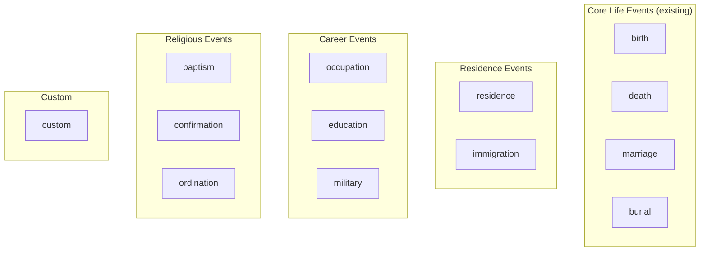
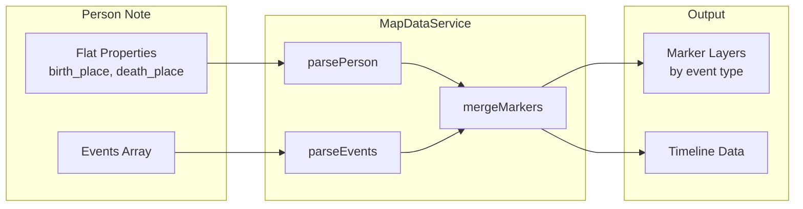

# Leaflet Maps Implementation Plan

> **Status:** Implementation Complete (v1 + v2)
> **Target Version:** v0.6.0
> **Branch:** feature/leaflet-maps

This document details the implementation plan for Phase 4 Geographic Features: interactive maps using Leaflet.js.

---

## Table of Contents

- [Overview](#overview)
- [Scope](#scope)
- [Architecture](#architecture)
- [Dependencies](#dependencies)
- [Implementation Phases](#implementation-phases)
- [Data Flow](#data-flow)
- [UI Components](#ui-components)
- [Settings](#settings)
- [Export Options](#export-options)
- [Testing Strategy](#testing-strategy)

---

## Overview

Add interactive map visualization to Canvas Roots, enabling users to:
- View birth/death locations as pins on real-world maps
- Visualize migration patterns with directional path lines
- See geographic clustering with heat maps
- Use custom image maps for fictional worlds

---

## Scope

### v1 (v0.6.0) - Core Map Features

| Feature | Description | Plugin/Approach | Status |
|---------|-------------|-----------------|--------|
| **Map View** | Dedicated leaf view (like Family Chart View) | Obsidian ItemView | ✅ Complete |
| **OpenStreetMap tiles** | Real-world base maps | Leaflet + OSM | ✅ Complete |
| **Pin markers** | Birth (green), death (red), marriage, burial, events | Core Leaflet | ✅ Complete |
| **Additional markers** | Residence, occupation, education, military, immigration, religious, custom | Events array parsing | ✅ Complete |
| **Marker clustering** | Collapse dense marker areas | Leaflet.markercluster | ✅ Complete |
| **Migration paths** | Lines connecting birth → death | Core Leaflet polylines | ✅ Complete |
| **Path text labels** | Person names along migration paths | Leaflet.TextPath | ✅ Complete |
| **Direction arrows** | Show migration direction on paths | Leaflet.PolylineDecorator | ✅ Complete |
| **Heat maps** | Geographic concentration visualization | Leaflet.heat | ✅ Complete |
| **Fullscreen mode** | Expand map to full screen | Leaflet.fullscreen | ✅ Complete |
| **Mini-map** | Overview inset for context | Leaflet.Control.MiniMap | ✅ Complete |
| **Custom image maps** | User-provided map images for fictional worlds | Leaflet L.imageOverlay | ✅ Complete |
| **Filtering** | By collection, time period, place category | Custom controls | ✅ Complete |
| **GeoJSON export** | Export markers/paths for GIS tools | Native JSON serialization | ✅ Complete |
| **SVG overlay export** | Export markers/paths as SVG for note embedding | Custom SVG generation | ✅ Complete |

### v2 (v0.6.0) - Advanced Features

| Feature | Description | Status |
|---------|-------------|--------|
| Time slider animation | Animate across generations | ✅ Complete |
| Image export | PNG/SVG of current map view | ⏸ Deferred (CORS challenges) |
| Search places on map | Find and zoom to places | ✅ Complete |
| Multiple map instances | Side-by-side comparison | ✅ Complete |
| Image alignment (Edit Mode) | Interactive corner dragging with Leaflet.DistortableImage | ✅ Complete |
| Pixel coordinate system | L.CRS.Simple for custom image maps | ✅ Complete |
| Journey paths | Connect all life events chronologically | ✅ Complete |

---

## Architecture

### File Structure

```
src/
├── maps/
│   ├── map-view.ts           # Obsidian ItemView implementation
│   ├── map-controller.ts     # Leaflet map initialization and control
│   ├── map-data-service.ts   # Data preparation from person/place notes
│   ├── map-layers.ts         # Layer management (markers, paths, heat)
│   ├── map-controls.ts       # Custom Leaflet controls (filters, legend)
│   ├── map-export.ts         # GeoJSON export functionality
│   └── image-map-manager.ts  # Custom image map handling
├── maps/types/
│   └── map-types.ts          # TypeScript interfaces for map data
```

### View Registration

```typescript
// In main.ts
this.registerView(
  MAP_VIEW_TYPE,
  (leaf) => new MapView(leaf, this)
);

// Command to open map view
this.addCommand({
  id: 'open-map-view',
  name: 'Open map view',
  callback: () => this.activateMapView()
});
```

### Layer Architecture

```
Map Container
├── Tile Layer (OpenStreetMap) OR Image Overlay (custom maps)
├── Heat Layer (toggle-able)
├── Cluster Layers
│   ├── Birth Cluster (green markers)
│   ├── Death Cluster (red markers)
│   ├── Marriage Cluster (purple markers)
│   ├── Burial Cluster (gray markers)
│   └── Events Cluster (all other event types)
│       ├── Residence (blue)
│       ├── Occupation (orange)
│       ├── Education (teal)
│       ├── Military (brown)
│       ├── Immigration (cyan)
│       ├── Religious (light purple - baptism, confirmation, ordination)
│       └── Custom (pink)
├── Path Layer
│   └── Migration Polylines with arrow decorations
└── Controls
    ├── Zoom
    ├── Fullscreen
    ├── Mini-map
    ├── Layer Toggle (per marker type)
    ├── Filter Panel
    └── Legend
```

---

## Dependencies

### NPM Packages (bundled)

| Package | Version | Size | Purpose |
|---------|---------|------|---------|
| leaflet | ^1.9.4 | ~40KB | Core map library |
| leaflet.markercluster | ^1.5.3 | ~35KB | Marker clustering |
| leaflet-polylinedecorator | ^1.6.0 | ~8KB | Arrow decorations |
| leaflet.heat | ^0.2.0 | ~5KB | Heat map layer |
| leaflet.fullscreen | ^3.0.0 | ~3KB | Fullscreen control |
| leaflet-minimap | ^3.6.1 | ~8KB | Overview mini-map |

**Total additional bundle size:** ~99KB (gzipped: ~35KB)

### Type Definitions

```bash
npm install --save-dev @types/leaflet @types/leaflet.markercluster
```

Note: Some plugins may need manual type declarations in `src/maps/types/`.

### External Services

| Service | Purpose | Requirements |
|---------|---------|--------------|
| OpenStreetMap | Tile images | Attribution required, rate limits apply |

**Attribution (required):**
```
© OpenStreetMap contributors
```

---

## Implementation Phases

### Phase 4.1: Foundation (~2-3 sessions)

1. **Package setup**
   - Install Leaflet and plugins via npm
   - Configure esbuild to bundle Leaflet CSS
   - Add Leaflet CSS to styles.css or load dynamically

2. **MapView class**
   - Extend Obsidian's ItemView
   - Register view type in main.ts
   - Basic container setup with Leaflet initialization
   - Command palette entry to open view

3. **Basic map display**
   - OpenStreetMap tile layer
   - Zoom and pan controls
   - Attribution

4. **Data service**
   - Query person notes for coordinates (via linked place notes)
   - Build marker data structures
   - Handle missing/invalid coordinates gracefully

### Phase 4.2: Markers and Clustering (~2 sessions)

1. **Marker layer**
   - Birth markers (green) from birth_place coordinates
   - Death markers (red) from death_place coordinates
   - Custom marker icons with Canvas Roots styling

2. **Marker clustering**
   - Configure markercluster for each marker type
   - Cluster click to zoom behavior
   - Cluster styling (counts, colors)

3. **Marker popups**
   - Person name and dates
   - Click to open person note
   - Show place name and coordinates

### Phase 4.3: Migration Paths (~1-2 sessions)

1. **Path calculation**
   - Connect birth_place → death_place for each person
   - Filter out invalid paths (missing coordinates)
   - Aggregate duplicate paths (same origin/destination)

2. **Polyline rendering**
   - Curved paths (great circle or bezier)
   - Color coding options (by generation, collection)
   - Line weight based on count (optional)

3. **Arrow decorations**
   - Direction indicators using PolylineDecorator
   - Positioned at midpoint or destination

### Phase 4.4: Heat Maps and Controls (~1-2 sessions)

1. **Heat layer**
   - Birth location intensity
   - Death location intensity
   - Combined mode
   - Toggle in layer controls

2. **Filter panel**
   - Collection dropdown
   - Date range (year inputs)
   - Place category checkboxes
   - Apply/reset buttons

3. **Legend**
   - Marker type legend
   - Heat map gradient (when active)

### Phase 4.5: Custom Image Maps (~1-2 sessions)

1. **Image overlay support**
   - User selects image from vault
   - Define coordinate bounds (corners or center + scale)
   - Replace tile layer with image

2. **Universe/collection filtering**
   - Detect fictional places by category
   - Switch to appropriate custom map
   - Map selection dropdown

3. **Coordinate system**
   - Support custom_coordinates from place notes
   - Transform custom coords to image pixels

### Phase 4.6: Polish and Export (~1 session)

1. **Fullscreen mode**
   - Leaflet.fullscreen integration
   - Escape key handling

2. **Mini-map**
   - Overview inset in corner
   - Click to pan main map

3. **GeoJSON export**
   - Export current markers as GeoJSON FeatureCollection
   - Export paths as LineString features
   - Include person metadata in properties

4. **SVG overlay export**
   - Generate standalone SVG of markers and paths
   - Include legend and bounding box coordinates
   - Save to vault as `.svg` file for embedding in notes
   - Full image export available for custom image maps (no CORS)
   - For real-world maps: overlay only (no basemap tiles)

---

## Data Flow

```
┌─────────────────┐     ┌──────────────────┐     ┌─────────────────┐
│  Person Notes   │────▶│  MapDataService  │────▶│  MapController  │
│  (frontmatter)  │     │                  │     │                 │
└─────────────────┘     │  - Resolve place │     │  - Create       │
                        │    links         │     │    markers      │
┌─────────────────┐     │  - Get coords    │     │  - Draw paths   │
│  Place Notes    │────▶│  - Build marker  │     │  - Update heat  │
│  (coordinates)  │     │    data          │     │    layer        │
└─────────────────┘     │  - Calc paths    │     │                 │
                        └──────────────────┘     └─────────────────┘
                                                          │
                                                          ▼
                                                 ┌─────────────────┐
                                                 │   Leaflet Map   │
                                                 │   (in ItemView) │
                                                 └─────────────────┘
```

### Marker Data Structure

```typescript
interface MapMarker {
  personId: string;        // cr_id of person
  personName: string;
  type: MarkerType;        // See MarkerType union below
  lat: number;
  lng: number;
  pixelX?: number;         // For pixel coordinate system
  pixelY?: number;         // For pixel coordinate system
  placeName: string;
  placeId?: string;        // cr_id of place note
  date?: string;           // ISO date string
  year?: number;           // Extracted for filtering
  dateTo?: string;         // End date for duration events
  yearTo?: number;         // End year for filtering
  description?: string;    // Event description
  collection?: string;
  universe?: string;       // For fictional places
}

type MarkerType =
  | 'birth' | 'death' | 'marriage' | 'burial'
  | 'residence' | 'occupation' | 'education' | 'military'
  | 'immigration' | 'baptism' | 'confirmation' | 'ordination' | 'custom';

interface MigrationPath {
  personId: string;
  personName: string;
  origin: { lat: number; lng: number; name: string };
  destination: { lat: number; lng: number; name: string };
  birthYear?: number;
  deathYear?: number;
  collection?: string;
}
```

---

## UI Components

### Map View Layout

```
┌────────────────────────────────────────────────────────────┐
│ Map View                                            [×]    │
├────────────────────────────────────────────────────────────┤
│ ┌──────────────────────────────────────────────────────┐   │
│ │                                                      │   │
│ │                                                      │   │
│ │                    MAP AREA                          │   │
│ │                                                      │   │
│ │  [+]                                                 │   │
│ │  [-]                                    ┌─────────┐  │   │
│ │  [⛶]                                   │ MiniMap │  │   │
│ │                                         └─────────┘  │   │
│ │                                                      │   │
│ └──────────────────────────────────────────────────────┘   │
│                                                            │
│ ┌─────────────┐ ┌─────────────┐ ┌─────────────────────┐   │
│ │ Layers ▾    │ │ Filters ▾   │ │ Export ▾            │   │
│ │ ☑ Births    │ │ Collection: │ │ • GeoJSON           │   │
│ │ ☑ Deaths    │ │ [All     ▾] │ │ • (Screenshot hint) │   │
│ │ ☑ Paths     │ │ Years:      │ └─────────────────────┘   │
│ │ ☐ Heat map  │ │ [1800]-[2000]                           │
│ └─────────────┘ └─────────────┘                           │
│                                                            │
│ Legend: 🟢 Birth  🔴 Death  ➡️ Migration                   │
│ © OpenStreetMap contributors                               │
└────────────────────────────────────────────────────────────┘
```

### Marker Popup

```
┌─────────────────────────┐
│ John Smith              │
│ Born: 1888-05-15        │
│ London, England         │
│                         │
│ [Open Note]             │
└─────────────────────────┘
```

---

## Settings

New settings for Map View (in plugin settings):

```typescript
// In settings.ts
interface MapSettings {
  // Tile provider
  tileProvider: 'openstreetmap' | 'custom';
  customTileUrl?: string;

  // Default view
  defaultCenter: { lat: number; lng: number };
  defaultZoom: number;

  // Markers
  birthMarkerColor: string;      // default: '#22c55e' (green)
  deathMarkerColor: string;      // default: '#ef4444' (red)
  otherMarkerColor: string;      // default: '#3b82f6' (blue)

  // Paths
  showMigrationPaths: boolean;   // default: true
  pathColor: string;             // default: '#6366f1' (indigo)
  pathWeight: number;            // default: 2

  // Heat map
  heatMapRadius: number;         // default: 25
  heatMapBlur: number;           // default: 15

  // Custom maps
  customMapsFolder: string;      // default: 'assets/maps'
}
```

---

## Export Options

### v1: GeoJSON Export

Export markers and paths as standard GeoJSON for use in external tools (Google Earth, QGIS, etc.):

### v1: SVG Overlay Export

Export markers and migration paths as a standalone SVG file for embedding in notes.

**Use cases:**
- Embed migration visualizations in family history narratives
- Share geographic patterns with family members
- Create portable documentation that works outside Obsidian

**What's included:**
- Marker circles (color-coded by type)
- Migration path lines with direction arrows
- Person name labels (optional, toggle-able)
- Legend showing marker types
- Bounding box with coordinate labels
- Title and timestamp

**What's NOT included (for real-world maps):**
- Basemap tiles (CORS restrictions)
- Users can layer the SVG over their own downloaded map image if needed

**Custom image maps:** Full export including the basemap image is possible since we control the source.

**Embedding in notes:**
```markdown
![[migration-map-2024-01-15.svg]]
```

**GeoJSON example:**

```json
{
  "type": "FeatureCollection",
  "features": [
    {
      "type": "Feature",
      "geometry": {
        "type": "Point",
        "coordinates": [-0.1278, 51.5074]
      },
      "properties": {
        "personId": "abc-123",
        "personName": "John Smith",
        "markerType": "birth",
        "date": "1888-05-15",
        "placeName": "London, England"
      }
    },
    {
      "type": "Feature",
      "geometry": {
        "type": "LineString",
        "coordinates": [
          [-0.1278, 51.5074],
          [-74.006, 40.7128]
        ]
      },
      "properties": {
        "personId": "abc-123",
        "personName": "John Smith",
        "pathType": "migration",
        "origin": "London, England",
        "destination": "New York, USA"
      }
    }
  ]
}
```

**SVG export example:**

```svg
<svg xmlns="http://www.w3.org/2000/svg" viewBox="0 0 800 600">
  <title>Smith Family Migration (1850-1920)</title>

  <!-- Bounding box with coordinates -->
  <rect x="50" y="50" width="700" height="450" fill="none" stroke="#ccc"/>
  <text x="50" y="45" font-size="10">51.5°N, 0.1°W</text>
  <text x="700" y="515" font-size="10">40.7°N, 74.0°W</text>

  <!-- Migration path with arrow -->
  <path d="M 150,200 Q 400,100 650,350" stroke="#6366f1" stroke-width="2" fill="none"/>
  <polygon points="645,345 655,355 660,340" fill="#6366f1"/>

  <!-- Birth marker -->
  <circle cx="150" cy="200" r="8" fill="#22c55e"/>
  <text x="160" y="195" font-size="11">London</text>

  <!-- Death marker -->
  <circle cx="650" cy="350" r="8" fill="#ef4444"/>
  <text x="660" y="345" font-size="11">New York</text>

  <!-- Legend -->
  <g transform="translate(550, 480)">
    <circle cx="10" cy="10" r="6" fill="#22c55e"/><text x="22" y="14" font-size="10">Birth</text>
    <circle cx="80" cy="10" r="6" fill="#ef4444"/><text x="92" y="14" font-size="10">Death</text>
    <line x1="140" y1="10" x2="160" y2="10" stroke="#6366f1" stroke-width="2"/>
    <text x="165" y="14" font-size="10">Migration</text>
  </g>
</svg>
```

---

## Testing Strategy

### Manual Testing Checklist

- [ ] Map loads with OpenStreetMap tiles
- [ ] Markers appear at correct locations
- [ ] Markers cluster when zoomed out
- [ ] Cluster click zooms to show individual markers
- [ ] Marker popup shows person info
- [ ] "Open Note" link works in popup
- [ ] Migration paths connect birth → death
- [ ] Path arrows show correct direction
- [ ] Heat map toggles on/off
- [ ] Heat map reflects marker density
- [ ] Collection filter limits displayed data
- [ ] Year range filter works
- [ ] Fullscreen mode enters/exits cleanly
- [ ] Mini-map updates with main map
- [ ] GeoJSON export produces valid file
- [ ] SVG export saves to vault
- [ ] SVG embeds correctly in markdown notes
- [ ] SVG includes legend and coordinate labels
- [ ] Custom image map loads and displays
- [ ] Custom image map exports with basemap included
- [ ] Custom coordinates map to image correctly

### Edge Cases

- Person with birth_place but no death_place (no path)
- Place note with no coordinates (skip marker)
- Large dataset performance (1000+ people)
- Empty filters (show "no data" message)
- Invalid coordinate values (graceful handling)

---

## Related Documentation

- [geographic-features-plan.md](geographic-features-plan.md) - Overall geographic features design
- [roadmap.md](../roadmap.md) - Project roadmap
- [Family Chart View implementation](../development.md#family-chart-view) - Similar ItemView pattern

---

## Design Decisions

### Offline Tile Caching

**Decision:** Defer to v2+.

**Rationale:**
- Obsidian is offline-first, but tile caching adds significant complexity (~20-40KB additional plugins, storage management UI, expiration logic)
- Custom image maps already work fully offline for fictional worlds
- Users needing offline real-world maps can screenshot/export regions of interest
- Will revisit once real usage patterns are understood

**Challenges identified:**
- Storage location unclear (IndexedDB has 50-500MB limits, vault storage would bloat sync)
- OSM Terms of Service discourage bulk tile downloading; on-demand caching is acceptable
- Mobile has different storage constraints than desktop
- Cached tiles should not sync across devices

**v1 approach:** Document clearly that real-world maps require internet connection.

### Tiled Image Maps (Zoomify/DeepZoom)

**Decision:** Defer to v2+.

**Rationale:**
- Niche use case: only affects users with extremely large images (10,000+ pixels)
- Current `L.imageOverlay` handles images up to ~4000px well
- All tiling solutions require external pre-processing tools (VIPS, ImageMagick)
- Significant UX friction: users must learn tiling workflow before using feature
- Vault clutter: tiled images create hundreds/thousands of small files

**Challenges identified:**
- No in-browser tiling solution viable for large images (too slow, memory issues)
- Multiple competing formats (Zoomify, DeepZoom/DZI, IIIF) with different toolchains
- Configuration complexity: tile path, format, dimensions, zoom levels
- Documentation burden: explaining external tooling workflow

**v1 approach:** Users with large maps can pre-scale images or crop to regions of interest.

### Mobile Testing Strategy

**Decision:** Use both DevTools simulation and real device testing.

| Method | Use For |
|--------|---------|
| DevTools simulation | Rapid iteration, responsive layout, touch event simulation, network throttling |
| Real device testing | Actual performance validation, gesture handling, memory pressure, Leaflet mobile quirks |

**Testing checkpoints:**
- After Phase 4.2 (markers/clustering): Phone test - clustering is the key performance concern
- After Phase 4.4 (full feature set): Tablet test - larger touch targets, different interaction patterns

**Key concern:** 1000+ markers on mobile may lag without proper clustering thresholds.

### Universe/Map Switching

**Decision:** Filter-driven auto-switching with manual override.

**Behavior:**
1. When user selects a collection or applies place category filter:
   - If all visible places are `fictional`/`mythological`/`legendary` with the same `universe` value, auto-switch to that universe's custom map
   - If places are mixed or all `real`/`historical`, show OpenStreetMap
2. Manual override dropdown available for edge cases

**UX flow:**
- User selects "House Stark" collection → map auto-switches to Westeros
- User clears filter to "All people" → map returns to OpenStreetMap
- User can manually select different map from dropdown if auto-detection is wrong

**Implementation:** Hooks into existing filter panel; universe detection reads `universe` field from place notes.

---

## Future Considerations (v2+)

### Offline Tile Caching
- Cache OpenStreetMap tiles locally for offline use
- Leaflet-offline or localForage-based solutions
- Storage management UI (clear cache, view size)
- Tile expiration/refresh logic
- Per-region download capability (e.g., "Download tiles for Europe")
- Use cases:
  - Users without reliable internet
  - Faster map loading for frequently-viewed regions
  - Privacy-conscious users who want to minimize external requests

### Additional Marker Types ✅ Implemented

Expanded beyond birth/death/marriage/burial markers to support life events.

**Event Type Hierarchy:**



**Schema Design (Hybrid Approach):**

Existing flat properties (`birth_place`, `death_place`, etc.) remain unchanged. New `events` array handles additional life events:

```yaml
# Person note frontmatter
birth_place: "[[Boston]]"
death_place: "[[Miami]]"

# Events array for additional life events
events:
  - event_type: residence
    place: "[[New York]]"
    date_from: "1920"
    date_to: "1935"
    description: "Family home on 5th Ave"
  - event_type: occupation
    place: "[[Chicago]]"
    date_from: "1935"
    date_to: "1942"
    description: "Steel mill foreman"
  - event_type: military
    place: "[[Normandy]]"
    date_from: "1944-06-06"
    date_to: "1944-08-25"
    description: "D-Day invasion"
  - event_type: education
    place: "[[Harvard University]]"
    date_from: "1915"
    date_to: "1919"
    description: "BA in History"
```

**Event Properties:**

| Property | Type | Required | Description |
|----------|------|----------|-------------|
| `event_type` | string | Yes | Event category (see types above) |
| `place` | wikilink | Yes | Location of event |
| `date_from` | string | No | Start date (YYYY, YYYY-MM, or YYYY-MM-DD) |
| `date_to` | string | No | End date (for duration events) |
| `description` | string | No | Brief description |

**Data Flow:**



**Marker Colors:**

| Event Type | Color | Hex |
|------------|-------|-----|
| birth | Green | #22c55e |
| death | Red | #ef4444 |
| marriage | Purple | #a855f7 |
| burial | Gray | #6b7280 |
| residence | Blue | #3b82f6 |
| occupation | Orange | #f97316 |
| education | Teal | #14b8a6 |
| military | Brown | #78716c |
| immigration | Cyan | #06b6d4 |
| baptism | Light Purple | #c084fc |
| confirmation | Light Purple | #c084fc |
| ordination | Light Purple | #c084fc |
| custom | Pink | #ec4899 |

**Implementation Tasks:**

1. Update `map-types.ts` - Add new event types to `MarkerType`
2. Update `map-data-service.ts` - Parse `events` array from person notes
3. Update `map-controller.ts` - Add layer groups for each event type
4. Update `map-view.ts` - Add layer toggle checkboxes in Layers dropdown
5. Update `frontmatter-schema.md` - Document events array schema
6. Update export modules - Include events in GEDCOM/GEDCOM X/Gramps exports

**Export Compatibility:**

| Format | Support | Notes |
|--------|---------|-------|
| GEDCOM | ✅ | Maps to RESI, OCCU, EDUC, MILI, etc. |
| GEDCOM X | ✅ | Maps to `facts` array |
| Gramps XML | ✅ | Native event support |
| CSV | ✅ | Separate events.csv or flattened columns |

### Route/Journey Visualization ✅ Implemented

Show a person's movements through life by connecting all known locations in chronological order.

**Features:**
- Connects all life events (birth, residence, occupation, education, military, immigration, marriage, death, burial) in date order
- Dashed violet polylines distinguish journeys from migration paths (birth→death)
- Arrow decorations show direction of movement
- Person name labels along path (optional)
- Popup shows all waypoints with event types and dates
- Layer toggle in Layers menu ("Journey paths (all events)")
- Off by default to avoid visual clutter

**Use cases:**
- Track immigration journeys (multiple stops)
- Visualize military campaigns or tours of duty
- Show career moves across cities
- Map pilgrimage or travel routes

**Technical details:**
- `JourneyPath` and `JourneyWaypoint` types in `map-types.ts`
- `buildJourneyPaths()` method in `MapDataService`
- Journey layer rendered with dashed lines and arrow decorators
- Waypoints sorted chronologically (birth first, death/burial last)
- Consecutive duplicate locations filtered out

### Image Export
Options explored (deferred due to CORS complexity):

| Approach | Pros | Cons |
|----------|------|------|
| leaflet-image | Full map capture | CORS issues with external tiles |
| leaflet-easyPrint | Print dialog | Same CORS limitations |
| SVG overlay only | No CORS issues | No basemap in export |
| html2canvas | General solution | Unreliable with map tiles |

**Workaround:** Document screenshot approach for users who need image export.

### Interactive Image Overlay Manipulation (Leaflet.DistortableImage) ✅ Implemented
- Enable users to interactively scale, rotate, and distort custom map images
- Supports corner-dragging for perspective warping (rubber-sheet georeferencing)
- Use cases:
  - Align historical maps to modern coordinates
  - Fit hand-drawn fictional world maps to a coordinate system
  - Adjust scanned maps that aren't perfectly rectangular
- Library: [Leaflet.DistortableImage](https://github.com/publiclab/Leaflet.DistortableImage) + leaflet-toolbar

**Implementation Details:**

| Component | Description |
|-----------|-------------|
| `ImageMapManager.createDistortableOverlay()` | Creates distortable image overlay with `suppressToolbar: true` |
| `ImageMapManager.saveCorners()` | Saves corner positions to map note frontmatter |
| `ImageMapManager.clearCorners()` | Removes corner properties to reset alignment |
| `MapController.enableEditMode()` | Loads DistortableImage library, creates overlay, shows handles |
| `MapController.disableEditMode()` | Removes distortable overlay, restores regular overlay |
| `MapController.resetAlignment()` | Clears saved corners and reloads map with default bounds |
| `MapView.showEditBanner()` | Displays edit controls (Save/Undo/Reset/Cancel) |

**Edit Banner Controls:**
- **Save alignment** - Persist corner positions to frontmatter
- **Undo changes** - Revert to last saved position (calls `overlay.restore()`)
- **Reset to default** - Clear all corners from frontmatter, return to rectangular bounds
- **Cancel** - Exit edit mode without saving

**Frontmatter Storage:**
Corner positions stored as flat properties for Obsidian Properties view compatibility:
```yaml
corner_nw_lat: 48.5
corner_nw_lng: -95.2
corner_ne_lat: 49.1
corner_ne_lng: -58.3
corner_sw_lat: -45.8
corner_sw_lng: -98.1
corner_se_lat: -44.2
corner_se_lng: -55.7
```

**Technical Notes:**
- Library loaded dynamically via `require()` (dynamic `import()` not supported in Obsidian runtime)
- `leaflet-toolbar` must load before `leaflet-distortableimage`
- Default toolbar suppressed (`suppressToolbar: true`) to avoid initialization errors
- Corners pre-set on overlay before `addTo(map)` to prevent undefined access
- CSS styles in `styles/map-view.css` (search marker invisible, edit banner styling)

### Pixel-Based Coordinate System (L.CRS.Simple) ✅ Implemented

Leaflet's Simple CRS is now supported for direct pixel-to-coordinate mapping.

**How it works:**
- Set `coordinate_system: pixel` in the map config frontmatter
- Place notes use flat `pixel_x` and `pixel_y` properties
- Image dimensions can be specified or auto-detected from the image
- The map automatically switches CRS when loading a pixel-based custom map

**Map configuration example:**
```yaml
---
type: map
map_id: westeros
name: Westeros
universe: got
image: assets/maps/westeros.png
coordinate_system: pixel
image_width: 2048
image_height: 3072
center_x: 1024
center_y: 1536
default_zoom: 0
---
```

**Place note example:**
```yaml
---
type: place
cr_id: winterfell
name: Winterfell
universe: got
pixel_x: 1200
pixel_y: 2400
---
```

**Use cases:**
- Worldbuilders who want to place markers directly on their map image
- Game maps, dungeon layouts, floor plans
- Any image where real-world coordinates don't apply

**Benefits:**
- More intuitive for non-geographic maps (users think in pixels)
- No need to define arbitrary lat/lng bounds for fictional worlds
- Coordinates directly correspond to image editor positions
- Flat properties work well with Obsidian's Properties view

### Tiled Image Maps (Zoomify/DeepZoom)

Replace `L.imageOverlay` with tiled image loading for massive custom maps. Only loads visible tiles at current zoom level, enabling smooth performance with huge images.

**Use cases:**
- Extremely detailed fantasy world maps (10,000+ pixels)
- High-resolution historical maps
- Large hand-drawn or commissioned artwork

**Library options:**

| Library | Format | Pros | Cons |
|---------|--------|------|------|
| Leaflet.Zoomify | Zoomify tiles | Well-established, good docs | Older format |
| Leaflet.DeepZoom | DZI (Microsoft) | Modern format, good tooling | Less Leaflet ecosystem support |
| leaflet-iiif | IIIF Image API | Academic standard, rich metadata | Complex spec, overkill for most users |

**External tooling required:**
- **VIPS** (`vips dzsave`) - Fast, command-line, cross-platform
- **ImageMagick** - Widely available but slower for large images
- **Online converters** - Easiest but may have size limits, privacy concerns

**If implemented, would need:**
- Map config frontmatter: `tile_format: zoomify`, `tile_path: tiles/westeros/`
- Auto-detection of tile directories
- Documentation with step-by-step tiling instructions
- Fallback to `L.imageOverlay` for non-tiled images

**Current v1 approach:** `L.imageOverlay` works well for reasonably-sized images (~4000px); users with larger maps can pre-scale or crop regions of interest
