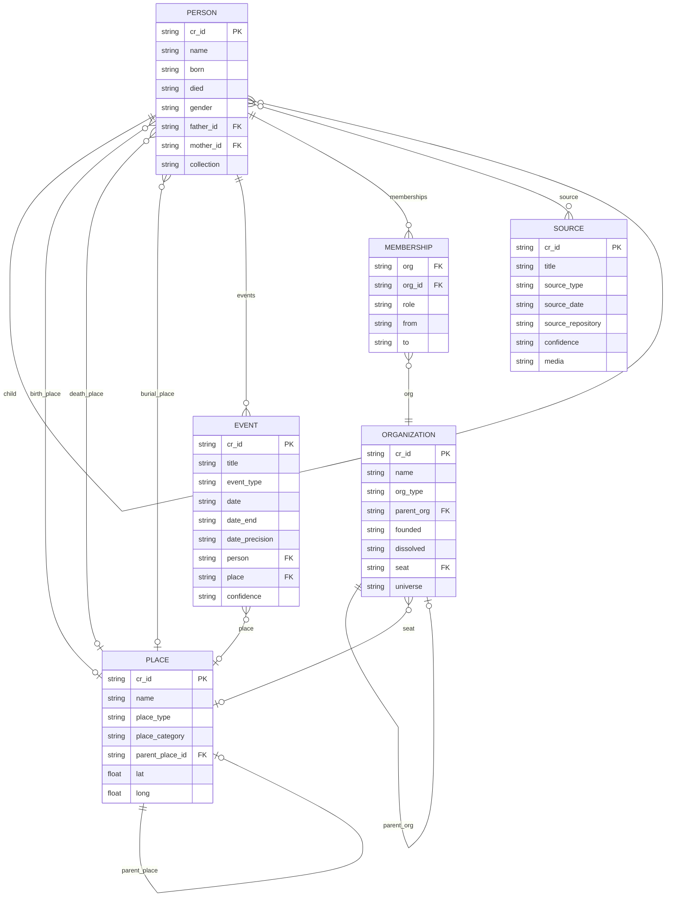
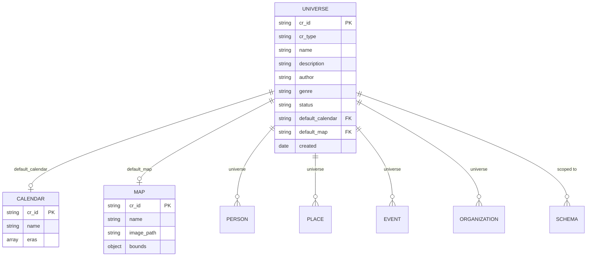

# Frontmatter Reference

This document defines all frontmatter properties recognized by Canvas Roots for person notes, place notes, source notes, organization notes, and map notes.

---

## Table of Contents

- [Note Type Detection](#note-type-detection)
- [Data Model Overview](#data-model-overview)
- [Person Note Properties](#person-note-properties)
- [Place Note Properties](#place-note-properties)
- [Event Note Properties](#event-note-properties)
- [Source Note Properties](#source-note-properties)
- [Organization Note Properties](#organization-note-properties)
- [Map Note Properties](#map-note-properties)
- [Universe Note Properties](#universe-note-properties)
- [See Also](#see-also)

---

## Note Type Detection

Canvas Roots uses multiple methods to identify note types, checked in this order:

1. **`cr_type` property** (default for new installations) - Namespaced to avoid conflicts with other plugins
2. **`type` property** (legacy) - Supported for backwards compatibility
3. **Tags** - Optional fallback via tags like `#person`, `#place`, `#event`

**Recommended:** Use `cr_type` for new notes to avoid conflicts with Templater, Dataview, and other plugins that use `type`.

```yaml
cr_type: person   # Recommended (new standard)
type: person      # Also supported (legacy)
```

See [Flexible Note Type Detection](Release-History#flexible-note-type-detection-v0102) for configuration options.

---

## Data Model Overview

The following diagram shows how the main entity types relate to each other:



**Key relationships:**
- **Person → Person**: Family relationships (father, mother, spouse, child) with dual wikilink + `_id` storage
- **Person → Place**: Geographic links for life events (birth, death, burial, marriage locations)
- **Person → Event → Place**: Life events (residence, occupation, education, military, etc.) with locations
- **Person → Source**: Documentary evidence linked to person notes (census, vital records, photos, etc.)
- **Person → Membership → Organization**: Organization affiliations with roles and dates
- **Organization → Organization**: Hierarchical structure (sub-organizations under parent)
- **Organization → Place**: Seat location linking to place notes
- **Place → Place**: Hierarchical structure (city → state → country)
- **Collection**: Shared grouping property across entity types

---

## Person Note Properties

### Identity (Required)

| Property | Type | Description | Example |
|----------|------|-------------|---------|
| `cr_id` | `string` | Unique identifier (UUID). **Required** for all person notes. | `"a1b2c3d4-e5f6-7890-abcd-ef1234567890"` |
| `cr_type` | `string` | Note type identifier. Must be `"person"`. | `"person"` |

### Basic Information

| Property | Type | Description | Example |
|----------|------|-------------|---------|
| `name` | `string` | Display name of the person | `"John Robert Smith"` |
| `born` | `string` | Birth date (YYYY, YYYY-MM, or YYYY-MM-DD) | `"1888-05-15"` |
| `died` | `string` | Death date (YYYY, YYYY-MM, or YYYY-MM-DD) | `"1952-08-20"` |
| `birth_place` | `string` | Location of birth | `"London, England"` |
| `death_place` | `string` | Location of death | `"New York, USA"` |
| `sex` | `string` | Biological sex (for GEDCOM, historical records) | `"male"`, `"female"`, `"nonbinary"`, `"unknown"` |
| `gender` | `string` | Gender (backwards compatibility - prefer `sex` or `gender_identity`) | `"Male"`, `"Female"` |
| `gender_identity` | `string` | Gender identity (distinct from biological sex) | `"male"`, `"female"`, `"nonbinary"`, `"genderfluid"` |
| `occupation` | `string` | Primary occupation | `"Farmer"` |

### Parent Relationships

Canvas Roots supports dual storage: wikilinks for Obsidian graph visibility, plus `_id` fields for reliable programmatic resolution.

| Property | Type | Description | Example |
|----------|------|-------------|---------|
| `father` | `string` | Wikilink to father's note | `"[[John Smith Sr]]"` |
| `father_id` | `string` | Father's `cr_id` | `"f1234567-..."` |
| `mother` | `string` | Wikilink to mother's note | `"[[Mary Jones]]"` |
| `mother_id` | `string` | Mother's `cr_id` | `"m7654321-..."` |

### Spouse Relationships

#### Simple Format (Single or Multiple Spouses)

| Property | Type | Description | Example |
|----------|------|-------------|---------|
| `spouse` | `string \| string[]` | Wikilink(s) to spouse note(s) | `"[[Jane Doe]]"` or `["[[Jane Doe]]", "[[Mary Smith]]"]` |
| `spouse_id` | `string \| string[]` | Spouse's `cr_id`(s) | `"s1234567-..."` or `["s1234567-...", "s7654321-..."]` |

#### Enhanced Format (Indexed Spouse with Metadata)

For complex marital histories, use indexed properties:

| Property | Type | Description | Example |
|----------|------|-------------|---------|
| `spouse1` | `string` | Wikilink to first spouse | `"[[Jane Doe]]"` |
| `spouse1_id` | `string` | First spouse's `cr_id` | `"s1234567-..."` |
| `spouse1_marriage_date` | `string` | Date of first marriage | `"1910-06-15"` |
| `spouse1_marriage_location` | `string` | Location of first marriage | `"St. Mary's Church, London"` |
| `spouse1_marriage_status` | `string` | Status: `current`, `divorced`, `widowed`, `separated`, `annulled` | `"widowed"` |
| `spouse2` | `string` | Wikilink to second spouse | `"[[Mary Smith]]"` |
| `spouse2_id` | `string` | Second spouse's `cr_id` | `"s7654321-..."` |
| `spouse2_marriage_date` | `string` | Date of second marriage | `"1925-03-20"` |
| ... | ... | Continue pattern for spouse3, spouse4, etc. | ... |

#### Legacy Format (Structured Spouses Array)

```yaml
spouses:
  - person: "[[Jane Doe]]"
    person_id: "s1234567-..."
    marriage_date: "1910-06-15"
    marriage_location: "London"
    status: "widowed"
  - person: "[[Mary Smith]]"
    person_id: "s7654321-..."
    marriage_date: "1925-03-20"
```

### Child Relationships

| Property | Type | Description | Example |
|----------|------|-------------|---------|
| `child` | `string \| string[]` | Wikilink(s) to children's notes | `["[[John Jr]]", "[[Mary]]"]` |
| `children_id` | `string \| string[]` | Children's `cr_id`(s) | `["c1234567-...", "c7654321-..."]` |

### Canvas Roots Metadata

| Property | Type | Description | Example |
|----------|------|-------------|---------|
| `cr_root` | `boolean` | Designates this person as root of a tree | `true` |
| `collection` | `string` | User-defined grouping/collection name | `"Smith Family"` |

### Media Files

Person notes can link to media files (photos, portraits, documents) in the vault:

| Property | Type | Description | Example |
|----------|------|-------------|---------|
| `media` | `string \| string[]` | Wikilink(s) to media files | `"[[portrait.jpg]]"` or `["[[portrait.jpg]]", "[[family-photo.jpg]]"]` |

**Note:** The first media item serves as the thumbnail, displayed on Family Chart person cards.

### Life Events

Beyond birth, death, and marriage (which use flat properties above), additional life events can be recorded in an `events` array. These events appear as markers on the Map View.

| Property | Type | Description | Example |
|----------|------|-------------|---------|
| `events` | `array` | Array of life event objects | See below |

**Event Object Properties:**

| Property | Type | Required | Description | Example |
|----------|------|----------|-------------|---------|
| `event_type` | `string` | Yes | Type of event | `"residence"` |
| `place` | `string` | Yes | Wikilink to place note | `"[[New York]]"` |
| `date_from` | `string` | No | Start date | `"1920"` or `"1920-05-15"` |
| `date_to` | `string` | No | End date (for duration events) | `"1935"` |
| `description` | `string` | No | Brief description | `"Family home"` |

**Supported Event Types:**

| Category | Event Types |
|----------|-------------|
| Residence | `residence`, `immigration` |
| Career | `occupation`, `education`, `military` |
| Religious | `baptism`, `confirmation`, `ordination` |
| Other | `custom` |

**Example:**

```yaml
events:
  - event_type: residence
    place: "[[New York]]"
    date_from: "1920"
    date_to: "1935"
    description: "Family home on 5th Ave"
  - event_type: military
    place: "[[Normandy]]"
    date_from: "1944-06-06"
    date_to: "1944-08-25"
    description: "D-Day invasion"
  - event_type: education
    place: "[[Harvard University]]"
    date_from: "1915"
    date_to: "1919"
    description: "BA in History"
```

### Fact-Level Source Tracking (Research Tools)

When the "Enable fact-level source tracking" setting is enabled, person notes can include detailed source citations for specific facts. This aligns with the Genealogical Proof Standard (GPS) methodology.

| Property | Type | Description | Example |
|----------|------|-------------|---------|
| `sourced_facts` | `object` | Maps fact types to their source citations | See below |

**Structure:**

```yaml
sourced_facts:
  birth_date:
    sources:
      - "[[1900 Census - Smith Family]]"
      - "[[Birth Certificate - John Smith]]"
  birth_place:
    sources:
      - "[[Birth Certificate - John Smith]]"
  death_date:
    sources:
      - "[[Obituary - John Smith 1952]]"
  parents:
    sources:
      - "[[1900 Census - Smith Family]]"
```

**Supported Fact Keys:**

| Fact Key | Description |
|----------|-------------|
| `birth_date` | Date of birth |
| `birth_place` | Location of birth |
| `death_date` | Date of death |
| `death_place` | Location of death |
| `parents` | Parent relationships |
| `marriage_date` | Date of marriage |
| `marriage_place` | Location of marriage |
| `spouse` | Spouse relationships |
| `occupation` | Occupation |
| `residence` | Residence locations |

**Notes:**
- Each fact key maps to an object containing a `sources` array of wikilinks
- Missing keys are treated as "not yet tracked" (different from "unsourced")
- An empty `sources` array means the fact is explicitly marked as unsourced
- The Control Center's Data Quality tab shows research coverage statistics when this feature is enabled

### Reference Numbering Systems

Canvas Roots can generate genealogical reference numbers:

| Property | Type | Description | Example |
|----------|------|-------------|---------|
| `ahnentafel` | `number` | Ahnentafel (Sosa-Stradonitz) number | `1`, `2`, `3`, ... |
| `henry` | `string` | Henry system number | `"1"`, `"11"`, `"112"` |
| `dangelo` | `string` | d'Aboville system number | `"1"`, `"1.1"`, `"1.1.2"` |
| `degroot` | `string` | de Villiers/Pama system number | `"b1"`, `"b1c2"` |
| `meurgey` | `string` | Meurgey de Tupigny system | `"I"`, `"I-1"`, `"I-1-a"` |

---

## Place Note Properties

> **Status:** Complete. See [Geographic Features](Geographic-Features) for full documentation.

### Identity

| Property | Type | Description | Example |
|----------|------|-------------|---------|
| `cr_type` | `string` | Must be `"place"` (recommended) | `"place"` |
| `type` | `string` | Must be `"place"` (legacy, also supported) | `"place"` |
| `cr_id` | `string` | Unique identifier for the place | `"place_abc123"` |

### Basic Information

| Property | Type | Description | Example |
|----------|------|-------------|---------|
| `name` | `string` | Primary name of the place | `"London"` |
| `aliases` | `string[]` | Alternative names | `["City of London", "Londinium"]` |
| `place_type` | `string` | Type of place | `"city"`, `"village"`, `"country"`, `"castle"`, `"region"` |

### Classification

| Property | Type | Description | Example |
|----------|------|-------------|---------|
| `place_category` | `string` | Category of place | `"real"`, `"historical"`, `"disputed"`, `"legendary"`, `"mythological"`, `"fictional"` |
| `universe` | `string` | Fictional universe (for non-real places) | `"A Song of Ice and Fire"`, `"Middle-earth"` |

**Place Categories Explained:**

| Category | Description | Examples |
|----------|-------------|----------|
| `real` | Verified real-world location (default) | London, New York, Tokyo |
| `historical` | Real place that no longer exists or changed significantly | Babylon, Constantinople |
| `disputed` | Location debated by historians/archaeologists | Troy, King Solomon's Mines |
| `legendary` | May have historical basis but heavily fictionalized | Camelot, El Dorado |
| `mythological` | Place from mythology/religion | Asgard, Mount Olympus |
| `fictional` | Invented for a story/world | Winterfell, Mordor |

### Hierarchy

| Property | Type | Description | Example |
|----------|------|-------------|---------|
| `parent_place` | `string` | Wikilink to parent place | `"[[England]]"` |
| `parent_place_id` | `string` | Parent place's `cr_id` | `"place_xyz789"` |

### Coordinates

#### Geographic Coordinates (Real-World Maps)

| Property | Type | Description | Example |
|----------|------|-------------|---------|
| `coordinates.lat` | `number` | Latitude (real-world) | `51.5074` |
| `coordinates.long` | `number` | Longitude (real-world) | `-0.1278` |

#### Pixel Coordinates (Custom Image Maps)

For places on pixel-based custom maps (using L.CRS.Simple):

| Property | Type | Description | Example |
|----------|------|-------------|---------|
| `pixel_x` | `number` | X position in pixels (0 = left edge) | `1200` |
| `pixel_y` | `number` | Y position in pixels (0 = bottom edge) | `2400` |

> **Note:** Flat properties (`pixel_x`, `pixel_y`) are preferred over nested formats for better compatibility with Obsidian's Properties view.

### Historical Names

```yaml
historical_names:
  - name: "Londinium"
    period: "Roman"
  - name: "Lundenwic"
    period: "Anglo-Saxon"
```

### Grouping

| Property | Type | Description | Example |
|----------|------|-------------|---------|
| `collection` | `string` | User-defined grouping (shared with person notes) | `"Smith Family"` |

The `collection` property allows places to be grouped with related person notes. For example, a "Smith Family" collection could include both the Smith family members and the places associated with them.

### Media Files

Place notes can link to media files (location photos, historical maps, floor plans):

| Property | Type | Description | Example |
|----------|------|-------------|---------|
| `media` | `string \| string[]` | Wikilink(s) to media files | `"[[castle-photo.jpg]]"` |

---

## Source Note Properties

> **Status:** Complete. See [Evidence & Sources](Evidence-And-Sources) for full documentation.

Source notes document evidence and citations for genealogical research. Each source can be linked to person notes to provide documentary evidence for facts in the family tree.

### Identity

| Property | Type | Description | Example |
|----------|------|-------------|---------|
| `cr_type` | `string` | Must be `"source"` (recommended) | `"source"` |
| `type` | `string` | Must be `"source"` (legacy, also supported) | `"source"` |
| `cr_id` | `string` | Unique identifier for the source | `"src_abc123"` |

### Basic Information

| Property | Type | Description | Example |
|----------|------|-------------|---------|
| `title` | `string` | Descriptive title of the source | `"1900 US Census - Smith Family"` |
| `source_type` | `string` | Type of source (see types below) | `"census"` |
| `author` | `string` | Author or creator of the source | `"State Archives"` |
| `source_date` | `string` | Date of the original document | `"1900-06-01"` |
| `source_date_accessed` | `string` | When the source was accessed | `"2024-03-15"` |

### Source Types

Canvas Roots includes built-in source types organized by category. Custom types can also be created in the Control Center.

| Category | Source Types |
|----------|--------------|
| Vital records | `vital_record`, `obituary` |
| Census | `census` |
| Church records | `church_record` |
| Legal & property | `court_record`, `land_deed`, `probate` |
| Military | `military` |
| Other | `immigration` |
| Media & correspondence | `photo`, `correspondence`, `newspaper`, `oral_history` |
| Custom | `custom` (or user-defined types) |

### Repository Information

| Property | Type | Description | Example |
|----------|------|-------------|---------|
| `repository` | `string` | Archive or website where source is held (short form) | `"Ancestry.com"` |
| `source_repository` | `string` | Archive or website where source is held (long form, also supported) | `"Ancestry.com"` |
| `source_repository_url` | `string` | Direct URL to the online source | `"https://..."` |
| `collection` | `string` | Record group or collection name | `"1900 United States Federal Census"` |
| `location` | `string` | Geographic location of the record | `"New York, Kings County, Brooklyn"` |

### Confidence Level

| Property | Type | Description | Example |
|----------|------|-------------|---------|
| `confidence` | `string` | How reliable is this source | `"high"`, `"medium"`, `"low"`, `"unknown"` |

**Confidence Levels Explained:**

| Level | Description |
|-------|-------------|
| `high` | Primary source with direct evidence (e.g., original certificate, firsthand account) |
| `medium` | Secondary source or indirect evidence (e.g., derivative, transcription) |
| `low` | Unverified or questionable source |
| `unknown` | Not yet assessed |

### Source Quality (GPS Methodology)

For users following the Genealogical Proof Standard, sources can be classified by their quality per Elizabeth Shown Mills' methodology:

| Property | Type | Description | Example |
|----------|------|-------------|---------|
| `source_quality` | `string` | GPS quality classification | `"primary"`, `"secondary"`, `"derivative"` |

**Source Quality Classifications:**

| Quality | Description | Examples |
|---------|-------------|----------|
| `primary` | Created at or near the time of the event by a participant or witness | Original vital records, census enumeration, contemporary letters |
| `secondary` | Created later from memory or hearsay | Family bibles with later entries, obituaries, oral histories |
| `derivative` | Copies, transcriptions, or abstracts of other sources | Database transcriptions, published abstracts, photocopies |

**Default Quality by Source Type:**

If `source_quality` is not explicitly set, Canvas Roots infers quality from the source type:

| Source Type | Default Quality |
|-------------|-----------------|
| `census`, `vital_record`, `church_record`, `military`, `court_record`, `land_deed`, `probate`, `photo`, `correspondence`, `immigration` | `primary` |
| `newspaper`, `obituary`, `oral_history`, `custom` | `secondary` |

**Note:** Users should override the default when appropriate. For example, a census transcription from Ancestry.com should be marked as `derivative` rather than accepting the default `primary` quality.

### Media Files

Sources can link to media files (images, scans, documents) in the vault:

| Property | Type | Description | Example |
|----------|------|-------------|---------|
| `media` | `string` | Wikilink to first media file | `"[[census-1900-smith.jpg]]"` |
| `media_2` | `string` | Wikilink to second media file | `"[[census-1900-smith-p2.jpg]]"` |
| `media_3` | `string` | Continue pattern for additional files | ... |

### Citation Override

| Property | Type | Description | Example |
|----------|------|-------------|---------|
| `citation_override` | `string` | Manual citation text (overrides auto-generated) | See example below |

---

## Linking Sources to Person Notes

Sources are linked to person notes using the `source` property (with indexed properties for multiple sources):

| Property | Type | Description | Example |
|----------|------|-------------|---------|
| `source` | `string` | Wikilink to first source | `"[[1900 US Census - Smith Family]]"` |
| `source_2` | `string` | Wikilink to second source | `"[[1910 US Census - Smith Family]]"` |
| `source_3` | `string` | Continue pattern for additional sources | ... |

---

## Example Source Note (Census)

```yaml
---
cr_type: source
cr_id: "src_1900_census_smith"
title: "1900 US Census - Smith Family"
source_type: census
source_date: "1900-06-01"
source_date_accessed: "2024-03-15"
source_repository: "Ancestry.com"
collection: "1900 United States Federal Census"
location: "New York, Kings County, Brooklyn"
confidence: high
source_quality: derivative
media: "[[census-1900-smith.jpg]]"
---

# 1900 US Census - Smith Family

## Census Information

| Field | Value |
|-------|-------|
| Census year | 1900 |
| State/country | New York |
| County | Kings |
| Township/city | Brooklyn |
| Enumeration district | 123 |
| Sheet/page | 5A |

## Household Members

| Name | Relation | Age | Birthplace | Occupation |
|------|----------|-----|------------|------------|
| John Smith | Head | 45 | New York | Merchant |
| Mary Smith | Wife | 42 | Ireland | |
| John Jr. | Son | 18 | New York | Clerk |

## Transcription

[Full transcription of census entries...]

## Research Notes

Confirms John Smith's age and occupation...
```

---

## Example Source Note (Vital Record)

```yaml
---
cr_type: source
cr_id: "src_birth_john_smith"
title: "Birth Certificate - John Robert Smith"
source_type: vital_record
source_date: "1855-03-15"
source_repository: "New York City Municipal Archives"
location: "New York, NY"
confidence: high
---

# Birth Certificate - John Robert Smith

## Document Information

| Field | Value |
|-------|-------|
| Event type | Birth |
| Event date | 1855-03-15 |
| Event place | New York, NY |
| Certificate number | 12345 |

## People Named

- John Robert Smith (subject)
- John Smith Sr. (father)
- Mary Jones (mother)

## Transcription

[Transcription of birth certificate...]
```

---

## Map Note Properties

Map notes define custom image maps for fictional worlds or historical maps.

### Identity

| Property | Type | Description | Example |
|----------|------|-------------|---------|
| `cr_type` | `string` | Must be `"map"` (recommended) | `"map"` |
| `type` | `string` | Must be `"map"` (legacy, also supported) | `"map"` |
| `map_id` | `string` | Unique identifier for the map | `"middle-earth"` |

### Basic Information

| Property | Type | Description | Example |
|----------|------|-------------|---------|
| `name` | `string` | Display name of the map | `"Middle-earth"` |
| `universe` | `string` | Fictional universe for filtering | `"tolkien"` |
| `image` | `string` | Path to map image in vault | `"assets/maps/middle-earth.jpg"` |

### Coordinate System

| Property | Type | Description | Example |
|----------|------|-------------|---------|
| `coordinate_system` | `string` | `"geographic"` (default) or `"pixel"` | `"pixel"` |

### Geographic Mode Properties

For maps with arbitrary lat/lng-style coordinates:

| Property | Type | Description | Example |
|----------|------|-------------|---------|
| `bounds_north` | `number` | North bound | `50` |
| `bounds_south` | `number` | South bound | `-50` |
| `bounds_east` | `number` | East bound | `100` |
| `bounds_west` | `number` | West bound | `-100` |
| `center_lat` | `number` | Initial center latitude | `0` |
| `center_lng` | `number` | Initial center longitude | `0` |

### Pixel Mode Properties

For maps where coordinates match pixel positions:

| Property | Type | Description | Example |
|----------|------|-------------|---------|
| `image_width` | `number` | Image width in pixels (auto-detected if omitted) | `2048` |
| `image_height` | `number` | Image height in pixels (auto-detected if omitted) | `3072` |
| `center_x` | `number` | Initial center X coordinate | `1024` |
| `center_y` | `number` | Initial center Y coordinate | `1536` |

### Zoom Settings

| Property | Type | Description | Example |
|----------|------|-------------|---------|
| `default_zoom` | `number` | Initial zoom level | `2` |
| `min_zoom` | `number` | Minimum zoom level | `-2` |
| `max_zoom` | `number` | Maximum zoom level | `4` |

### Distortable Image Corners (Advanced)

For interactive image alignment and georeferencing, you can define corner positions. When corners are set, the map enters "distortable mode" where you can drag, rotate, scale, and distort the image to align it with your coordinate system.

| Property | Type | Description | Example |
|----------|------|-------------|---------|
| `corner_nw_lat` | `number` | Northwest corner latitude | `45.5` |
| `corner_nw_lng` | `number` | Northwest corner longitude | `-90.0` |
| `corner_ne_lat` | `number` | Northeast corner latitude | `45.5` |
| `corner_ne_lng` | `number` | Northeast corner longitude | `-60.0` |
| `corner_sw_lat` | `number` | Southwest corner latitude | `25.0` |
| `corner_sw_lng` | `number` | Southwest corner longitude | `-90.0` |
| `corner_se_lat` | `number` | Southeast corner latitude | `25.0` |
| `corner_se_lng` | `number` | Southeast corner longitude | `-60.0` |

**Use cases:**
- Align historical maps to modern coordinates
- Fit hand-drawn fictional world maps to a coordinate system
- Adjust scanned maps that aren't perfectly rectangular

**Note:** Corner positions are saved automatically when you use the "Save Alignment" button in edit mode.

---

## Schema Note Properties

Schema notes define validation rules for person notes. See [Schema Validation](Schema-Validation) for complete documentation.

### Identity

| Property | Type | Description | Example |
|----------|------|-------------|---------|
| `cr_type` | `string` | Must be `"schema"` (recommended) | `"schema"` |
| `type` | `string` | Must be `"schema"` (legacy, also supported) | `"schema"` |
| `cr_id` | `string` | Unique identifier for the schema | `"schema-house-stark"` |

### Basic Information

| Property | Type | Description | Example |
|----------|------|-------------|---------|
| `name` | `string` | Display name of the schema | `"House Stark Schema"` |
| `description` | `string` | Optional description | `"Validation rules for House Stark"` |

### Scope

| Property | Type | Description | Example |
|----------|------|-------------|---------|
| `applies_to_type` | `string` | Scope type: `collection`, `folder`, `universe`, or `all` | `"collection"` |
| `applies_to_value` | `string` | Value for the scope (not needed for `all`) | `"House Stark"` |

### Schema Definition (JSON Code Block)

The validation rules are defined in a `json schema` code block in the note body:

```json
{
  "requiredProperties": ["name", "allegiance"],
  "properties": {
    "gender": {
      "type": "enum",
      "values": ["Male", "Female"]
    },
    "birth_place": {
      "type": "wikilink",
      "targetType": "place"
    }
  },
  "constraints": [
    {
      "rule": "!died || born",
      "message": "Cannot have death date without birth date"
    }
  ]
}
```

**Property Definition Options:**

| Option | Description | Applies To |
|--------|-------------|------------|
| `type` | Property type: `string`, `number`, `date`, `boolean`, `enum`, `wikilink`, `array`, `sourced_facts` | All |
| `values` | Allowed values | `enum` |
| `min`, `max` | Value range | `number` |
| `targetType` | Required note type for link target | `wikilink` |
| `requiredIf` | Conditional requirement | All |
| `default` | Default value if missing | All |

**Property Types:**

| Type | Description |
|------|-------------|
| `string` | Plain text value |
| `number` | Numeric value |
| `date` | Date string (various formats supported) |
| `boolean` | true/false value |
| `enum` | One of a predefined set of values (use `values` to define) |
| `wikilink` | Link to another note `[[Target]]` or `[[Target\|Display]]` |
| `array` | Array of values |
| `sourced_facts` | Fact-level source tracking structure (validates GPS research citations) |

**The `sourced_facts` Type:**

When validating `sourced_facts`, the schema system checks that:
- The value is an object (not array or primitive)
- Each key is a valid fact key (`birth_date`, `birth_place`, `death_date`, etc.)
- Each fact entry has a `sources` array
- Each source in the array is a valid wikilink format (`[[Source Name]]`)

---

## Property Naming Conventions

Canvas Roots follows these conventions:

| Convention | Examples |
|------------|----------|
| **Snake_case** for all properties | `birth_place`, `father_id`, `cr_id` |
| **Singular** for single values | `father`, `mother`, `spouse` |
| **Plural** for arrays (legacy) | `spouses` (structured array) |
| **`_id` suffix** for cr_id references | `father_id`, `spouse_id`, `children_id` |
| **Indexed properties** for ordered multiples | `spouse1`, `spouse2`, `spouse1_marriage_date` |

---

## Property Aliases

If your vault uses different property names than Canvas Roots defaults, you can create **property aliases** to map your custom names to the canonical Canvas Roots fields. This allows Canvas Roots to work with existing vaults without requiring you to rename your frontmatter properties.

### Configuring Aliases

Go to **Control Center → Preferences → Property Aliases** to add, edit, or remove aliases. You can also configure them in Obsidian's plugin settings.

### How Aliases Work

| Scenario | Behavior |
|----------|----------|
| **Reading notes** | Canvas Roots checks for the canonical property first, then falls back to your alias |
| **Creating/importing notes** | New notes use your aliased property name instead of the canonical name |
| **Both properties exist** | The canonical property takes precedence |

### Example

If your vault uses `birthdate` instead of `born`:

1. Add an alias: `birthdate` → `born`
2. Canvas Roots will now read `birthdate` as the birth date
3. When importing GEDCOM files, notes will be created with `birthdate` instead of `born`

### Supported Properties

All person note properties can be aliased:

| Category | Properties |
|----------|------------|
| Identity | `name`, `cr_id`, `sex`, `gender`, `gender_identity`, `nickname`, `maiden_name` |
| Dates | `born`, `died` |
| Places | `birth_place`, `death_place` |
| Relationships | `father`, `father_id`, `mother`, `mother_id`, `spouse`, `spouse_id`, `child`, `children_id` |
| Other | `occupation`, `universe`, `image`, `sourced_facts`, `relationships` |

### Tips

- Aliases are case-sensitive: `Birthdate` and `birthdate` are different
- Only one alias per canonical property is supported
- The Essential Properties card in Getting Started shows your aliased names when configured

---

## Value Aliases

In addition to property name aliases, you can create **value aliases** to map custom property **values** to Canvas Roots' canonical values. This is useful when your vault uses different terminology for enumerated fields like event types, sex values, place categories, or note types.

### Configuring Value Aliases

Go to **Control Center → Preferences → Aliases** to add, edit, or remove value aliases. The Aliases card has two sections:
- **Property names**: Maps your property names to Canvas Roots fields (e.g., `birthdate` → `born`)
- **Property values**: Maps your values to canonical values (e.g., `nameday` → `birth`)

### Supported Fields

| Field | Canonical Values |
|-------|------------------|
| **Event type** | `birth`, `death`, `marriage`, `burial`, `residence`, `occupation`, `education`, `military`, `immigration`, `baptism`, `confirmation`, `ordination`, `custom` |
| **Sex** | `male`, `female`, `nonbinary`, `unknown` |
| **Place category** | `real`, `historical`, `disputed`, `legendary`, `mythological`, `fictional` |

### How Value Aliases Work

| Scenario | Behavior |
|----------|----------|
| **Reading notes** | Canvas Roots checks for canonical values first, then resolves aliases |
| **Unknown event types** | Resolve to `custom` (graceful degradation) |
| **Unknown sex/place category/note type** | Pass through unchanged (may trigger validation warning) |
| **Creating/importing notes** | Uses your aliased values when writing |

### Example

If your worldbuilding vault uses `nameday` instead of `birth` for event types:

1. Add a value alias: `nameday` → `birth` (Event type)
2. Canvas Roots will recognize `event_type: nameday` as a birth event
3. Events with `nameday` will appear with the birth icon on maps and timelines
4. When importing GEDCOM files, birth events will be written as `nameday`

### Use Cases

| Use Case | Example Aliases |
|----------|-----------------|
| **Worldbuilding** | `nameday` → `birth`, `coronation` → `custom` |
| **Sex abbreviations** | `m` → `male`, `f` → `female`, `nb` → `nonbinary` |
| **Fantasy settings** | `canon` → `fictional`, `apocryphal` → `disputed` |

---

## Essential Properties

When using "Add essential properties" in Data Quality tools, these properties are added if missing:

- `cr_id` (generated UUID)
- `name` (empty string)
- `born` (empty string)
- `died` (empty string)
- `father` (empty string)
- `mother` (empty string)
- `spouses` (empty array)

---

## Example Person Note

```yaml
---
cr_id: "a1b2c3d4-e5f6-7890-abcd-ef1234567890"
cr_type: "person"
name: "John Robert Smith"
born: "1888-05-15"
died: "1952-08-20"
birth_place: "London, England"
death_place: "New York, USA"
sex: "male"
occupation: "Merchant"
father: "[[John Smith Sr]]"
father_id: "f1234567-..."
mother: "[[Mary Jones]]"
mother_id: "m7654321-..."
spouse1: "[[Jane Doe]]"
spouse1_id: "s1111111-..."
spouse1_marriage_date: "1910-06-15"
spouse1_marriage_location: "St. Mary's Church, London"
spouse1_marriage_status: "widowed"
spouse2: "[[Margaret Brown]]"
spouse2_id: "s2222222-..."
spouse2_marriage_date: "1935-09-01"
child:
  - "[[John Smith Jr]]"
  - "[[Mary Elizabeth Smith]]"
children_id:
  - "c1111111-..."
  - "c2222222-..."
cr_root: true
collection: "Smith Family"
ahnentafel: 1
media:
  - "[[john-smith-portrait.jpg]]"
  - "[[smith-family-photo-1920.jpg]]"
sourced_facts:
  birth_date:
    sources:
      - "[[Birth Certificate - John Robert Smith]]"
  birth_place:
    sources:
      - "[[Birth Certificate - John Robert Smith]]"
  parents:
    sources:
      - "[[1900 US Census - Smith Family]]"
---

# John Robert Smith

Notes about this person...
```

---

## Example Place Note

```yaml
---
cr_type: place
cr_id: "place_london_001"
name: "London"
aliases:
  - "City of London"
  - "Londinium"
place_category: real
place_type: city
parent_place: "[[England]]"
coordinates:
  lat: 51.5074
  long: -0.1278
historical_names:
  - name: "Londinium"
    period: "Roman (43-410 AD)"
  - name: "Lundenwic"
    period: "Anglo-Saxon (600-886 AD)"
---

# London

Capital city of England and the United Kingdom...
```

---

## Example Place Note (Pixel Coordinates)

```yaml
---
cr_type: place
cr_id: "place_winterfell_001"
name: "Winterfell"
place_category: fictional
place_type: castle
universe: "A Song of Ice and Fire"
pixel_x: 1200
pixel_y: 2400
---

# Winterfell

Seat of House Stark in the North...
```

---

## Example Map Note (Geographic Mode)

```yaml
---
cr_type: map
map_id: middle-earth
name: Middle-earth
universe: tolkien
image: assets/maps/middle-earth.jpg
coordinate_system: geographic
bounds_north: 50
bounds_south: -50
bounds_west: -100
bounds_east: 100
center_lat: 0
center_lng: 0
default_zoom: 3
---

# Middle-earth Map

Map of J.R.R. Tolkien's Middle-earth...
```

---

## Example Map Note (Pixel Mode)

```yaml
---
cr_type: map
map_id: westeros
name: Westeros
universe: got
image: assets/maps/westeros.png
coordinate_system: pixel
image_width: 2048
image_height: 3072
center_x: 1024
center_y: 1536
default_zoom: 0
min_zoom: -2
max_zoom: 3
---

# Westeros Map

Map of Westeros from A Song of Ice and Fire...
```

---

## Example Map Note (Distortable with Corners)

```yaml
---
cr_type: map
map_id: historical-europe
name: Historical Europe 1850
universe: real
image: assets/maps/europe-1850.jpg
coordinate_system: geographic
bounds_north: 72
bounds_south: 35
bounds_west: -15
bounds_east: 45
default_zoom: 4
corner_nw_lat: 71.5
corner_nw_lng: -14.5
corner_ne_lat: 71.8
corner_ne_lng: 44.5
corner_sw_lat: 35.2
corner_sw_lng: -14.8
corner_se_lat: 35.0
corner_se_lng: 44.8
---

# Historical Europe 1850

A historical map of Europe circa 1850, aligned to modern coordinates
for comparison with contemporary maps...
```

---

## Example Schema Note

````
---
cr_type: schema
cr_id: schema-date-validation
name: Date Validation
description: Ensures date fields are logically consistent
applies_to_type: all
---

# Date Validation Schema

This schema validates that all person notes have logically consistent dates.

```json schema
{
  "requiredProperties": [],
  "properties": {
    "born": {
      "type": "date"
    },
    "died": {
      "type": "date"
    }
  },
  "constraints": [
    {
      "rule": "!died || born",
      "message": "Cannot have death date without birth date"
    },
    {
      "rule": "!died || !born || new Date(died) >= new Date(born)",
      "message": "Death date must be on or after birth date"
    }
  ]
}
```
````

---

## Event Note Properties

Event notes document life events, story events, and timeline entries as standalone notes. See [Events And Timelines](Events-And-Timelines) for complete documentation.

### Identity

| Property | Type | Description | Example |
|----------|------|-------------|---------|
| `cr_type` | `string` | Must be `"event"` (recommended) | `"event"` |
| `type` | `string` | Must be `"event"` (legacy, also supported) | `"event"` |
| `cr_id` | `string` | Unique identifier | `"evt_birth_john_1850"` |

### Basic Information

| Property | Type | Description | Example |
|----------|------|-------------|---------|
| `title` | `string` | Display title of the event | `"Birth of John Smith"` |
| `event_type` | `string` | Type of event (see types below) | `"birth"` |
| `description` | `string` | Additional details about the event | `"Born at the family homestead"` |

### Event Types

Canvas Roots includes built-in event types organized by category. Custom types can also be created in the Control Center.

| Category | Event Types |
|----------|-------------|
| Core (vital) | `birth`, `death`, `marriage`, `divorce` |
| Extended (life) | `residence`, `occupation`, `military`, `immigration`, `education`, `burial`, `baptism`, `confirmation`, `ordination` |
| Narrative | `anecdote`, `lore_event`, `plot_point`, `flashback`, `foreshadowing`, `backstory`, `climax`, `resolution` |
| Custom | `custom` (or user-defined types) |

### Date Information

| Property | Type | Description | Example |
|----------|------|-------------|---------|
| `date` | `string` | Event date (ISO format or fictional calendar) | `"1850-03-15"` |
| `date_end` | `string` | End date for range events | `"1855-06-20"` |
| `date_precision` | `string` | How precise the date is | `"exact"`, `"month"`, `"year"`, `"decade"`, `"estimated"`, `"range"`, `"unknown"` |
| `date_system` | `string` | Fictional date system ID | `"westeros"` |

**Date Precision Values:**

| Precision | Description | Example |
|-----------|-------------|---------|
| `exact` | Known to the day | `"1850-03-15"` |
| `month` | Known to the month | `"1850-03"` |
| `year` | Known to the year | `"1850"` |
| `decade` | Known to the decade | `"1850s"` |
| `estimated` | Approximate | `"circa 1850"` |
| `range` | Between two dates | Use `date` + `date_end` |
| `unknown` | Date unknown | Use relative ordering |

### Person and Place Links

| Property | Type | Description | Example |
|----------|------|-------------|---------|
| `person` | `string` | Primary person involved (wikilink) | `"[[John Smith]]"` |
| `persons` | `string[]` | Multiple people involved | `["[[John Smith]]", "[[Jane Doe]]"]` |
| `place` | `string` | Where the event occurred (wikilink) | `"[[London]]"` |

### Sources and Confidence

| Property | Type | Description | Example |
|----------|------|-------------|---------|
| `sources` | `string[]` | Sources documenting this event | `["[[1850 Census]]", "[[Family Bible]]"]` |
| `confidence` | `string` | How reliable is this event | `"high"`, `"medium"`, `"low"`, `"unknown"` |

**Confidence Levels:**

| Level | Description |
|-------|-------------|
| `high` | Well-documented with primary sources |
| `medium` | Some supporting evidence |
| `low` | Unverified or questionable |
| `unknown` | Not yet assessed |

### Media Files

Event notes can link to media files (ceremony photos, certificates, illustrations):

| Property | Type | Description | Example |
|----------|------|-------------|---------|
| `media` | `string \| string[]` | Wikilink(s) to media files | `"[[wedding-photo.jpg]]"` |

### Relative Ordering

For events without precise dates, use relative ordering to establish sequence:

| Property | Type | Description | Example |
|----------|------|-------------|---------|
| `before` | `string[]` | Events that happen after this one | `["[[Marriage of John and Jane]]"]` |
| `after` | `string[]` | Events that happen before this one | `["[[Birth of John Smith]]"]` |
| `sort_order` | `number` | Computed sort value for ordering | `10`, `20`, `30` |

> **Tip:** Use the "Compute sort order" button in the Events tab to automatically calculate `sort_order` values from your `before`/`after` relationships using topological sort. Values are assigned in increments of 10 to allow manual insertion between computed values.

### Timeline and Worldbuilding

| Property | Type | Description | Example |
|----------|------|-------------|---------|
| `timeline` | `string` | Parent timeline note | `"[[Smith Family Timeline]]"` |
| `is_canonical` | `boolean` | Authoritative truth for worldbuilders | `true` |
| `universe` | `string` | Fictional universe | `"westeros"` |
| `groups` | `string[]` | Groups/factions involved in this event | `["Rohan", "Isengard"]` |

The `groups` property enables filtering in timeline exports by nation, faction, or organization. Useful for:
- Worldbuilding: organize events by nation, guild, or power structure
- Genealogy: tag events by family branch or immigrant group

---

## Example Event Note

```yaml
---
cr_type: event
cr_id: evt_birth_john_1850
title: Birth of John Smith
event_type: birth
date: "1850-03-15"
date_precision: exact
person: "[[John Smith]]"
place: "[[London]]"
sources:
  - "[[Birth Certificate - John Smith]]"
  - "[[Family Bible]]"
confidence: high
description: Born at the family homestead on Elm Street
---

# Birth of John Smith

John Robert Smith was born on March 15, 1850 in London...
```

---

## Example Narrative Event Note

```yaml
---
cr_type: event
cr_id: evt_red_wedding
title: The Red Wedding
event_type: lore_event
date: "299 AC"
date_precision: exact
date_system: westeros
persons:
  - "[[Robb Stark]]"
  - "[[Catelyn Stark]]"
place: "[[The Twins]]"
is_canonical: true
universe: westeros
confidence: high
after:
  - "[[Battle of the Blackwater]]"
before:
  - "[[Purple Wedding]]"
groups:
  - "House Stark"
  - "House Frey"
  - "House Bolton"
description: The massacre at the wedding feast
---

# The Red Wedding

A pivotal event in the War of the Five Kings...
```

---

## Organization Note Properties

Organization notes define non-genealogical hierarchies such as noble houses, guilds, and corporations. See [Organization Notes](Organization-Notes) for complete documentation.

### Identity

| Property | Type | Description | Example |
|----------|------|-------------|---------|
| `cr_type` | `string` | Must be `"organization"` (recommended) | `"organization"` |
| `type` | `string` | Must be `"organization"` (legacy, also supported) | `"organization"` |
| `cr_id` | `string` | Unique identifier | `"org-house-stark"` |

### Basic Information

| Property | Type | Description | Example |
|----------|------|-------------|---------|
| `name` | `string` | Display name of the organization | `"House Stark"` |
| `org_type` | `string` | Organization type (see below) | `"noble_house"` |
| `motto` | `string` | Organization motto or slogan | `"Winter is Coming"` |
| `universe` | `string` | Fictional universe for filtering | `"westeros"` |

### Organization Types

| Type ID | Description |
|---------|-------------|
| `noble_house` | Feudal houses, dynasties |
| `guild` | Trade guilds, craftsmen |
| `corporation` | Modern companies |
| `military` | Armies, regiments, navies |
| `religious` | Churches, monasteries |
| `political` | Kingdoms, republics |
| `educational` | Schools, universities |
| `custom` | User-defined |

### Hierarchy

| Property | Type | Description | Example |
|----------|------|-------------|---------|
| `parent_org` | `string` | Wikilink to parent organization | `"[[The North]]"` |

### Dates

| Property | Type | Description | Example |
|----------|------|-------------|---------|
| `founded` | `string` | Founding date (supports fictional dates) | `"Age of Heroes"` |
| `dissolved` | `string` | Dissolution date | `"298 AC"` |

### Location

| Property | Type | Description | Example |
|----------|------|-------------|---------|
| `seat` | `string` | Wikilink to primary location (place note) | `"[[Winterfell]]"` |

### Media Files

Organization notes can link to media files (logos, group photos, heraldry):

| Property | Type | Description | Example |
|----------|------|-------------|---------|
| `media` | `string \| string[]` | Wikilink(s) to media files | `"[[house-sigil.png]]"` |

---

## Person Membership Properties

Person notes can include an array of organization memberships.

### Membership Array

```yaml
memberships:
  - org: "[[House Stark]]"
    org_id: org-house-stark
    role: Lord of Winterfell
    from: "283 AC"
    to: "298 AC"
  - org: "[[Small Council]]"
    org_id: org-small-council
    role: Hand of the King
    from: "298 AC"
    to: "298 AC"
```

### Membership Properties

| Property | Type | Required | Description | Example |
|----------|------|----------|-------------|---------|
| `org` | `string` | Yes | Wikilink to organization note | `"[[House Stark]]"` |
| `org_id` | `string` | No | Organization's `cr_id` for robust linking | `"org-house-stark"` |
| `role` | `string` | No | Role or position within organization | `"Lord of Winterfell"` |
| `from` | `string` | No | Start date of membership | `"283 AC"` |
| `to` | `string` | No | End date (leave empty if current) | `"298 AC"` |
| `notes` | `string` | No | Additional context | `"First to declare for Robert"` |

---

## Example Organization Note

```yaml
---
cr_type: organization
cr_id: org-house-stark
name: House Stark
org_type: noble_house
parent_org: "[[The North]]"
founded: "Age of Heroes"
motto: "Winter is Coming"
seat: "[[Winterfell]]"
universe: westeros
---

# House Stark

The principal house of the North...
```

---

## Universe Note Properties

Universe notes define fictional worlds as first-class entities. See [Universe Notes](Universe-Notes) for complete documentation.



**Key relationships:**
- **Universe → Calendar**: Default date system for events in this universe
- **Universe → Map**: Default custom map for geographic visualization
- **Universe → Entities**: People, places, events, and organizations can be scoped to a universe via the `universe` property
- **Universe → Schema**: Validation schemas can be scoped to enforce universe-specific rules

### Identity

| Property | Type | Description | Example |
|----------|------|-------------|---------|
| `cr_type` | `string` | Must be `"universe"` | `"universe"` |
| `cr_id` | `string` | Unique identifier | `"middle-earth"` |

### Basic Information

| Property | Type | Description | Example |
|----------|------|-------------|---------|
| `name` | `string` | Display name of the universe | `"Middle-earth"` |
| `description` | `string` | Brief description of the world | `"A fantasy world created by J.R.R. Tolkien"` |
| `author` | `string` | Creator of the fictional world | `"J.R.R. Tolkien"` |
| `genre` | `string` | Genre (fantasy, sci-fi, etc.) | `"fantasy"` |
| `status` | `string` | Status: `active`, `draft`, `archived` | `"active"` |

### Linked Configuration

| Property | Type | Description | Example |
|----------|------|-------------|---------|
| `default_calendar` | `string` | ID of default date system | `"shire-reckoning"` |
| `default_map` | `string` | ID of default custom map | `"middle-earth-map"` |

### Metadata

| Property | Type | Description | Example |
|----------|------|-------------|---------|
| `created` | `date` | Creation date of the universe note | `"2024-03-15"` |

---

## Example Universe Note

```yaml
---
cr_type: universe
cr_id: middle-earth
name: Middle-earth
description: A fantasy world created by J.R.R. Tolkien
author: J.R.R. Tolkien
genre: fantasy
status: active
default_calendar: shire-reckoning
default_map: middle-earth-map
---

# Middle-earth

Middle-earth is the setting for The Hobbit, The Lord of the Rings,
and The Silmarillion...
```

---

## See Also

- [Events And Timelines](Events-And-Timelines) - Complete event documentation
- [Evidence & Sources](Evidence-And-Sources) - Complete source documentation
- [Organization Notes](Organization-Notes) - Complete organization documentation
- [Universe Notes](Universe-Notes) - Complete universe documentation
- [Schema Validation](Schema-Validation) - Creating and using validation schemas
- [Geographic Features](Geographic-Features) - Place notes and map features
- [Data Management](Data-Management) - Managing your family data
