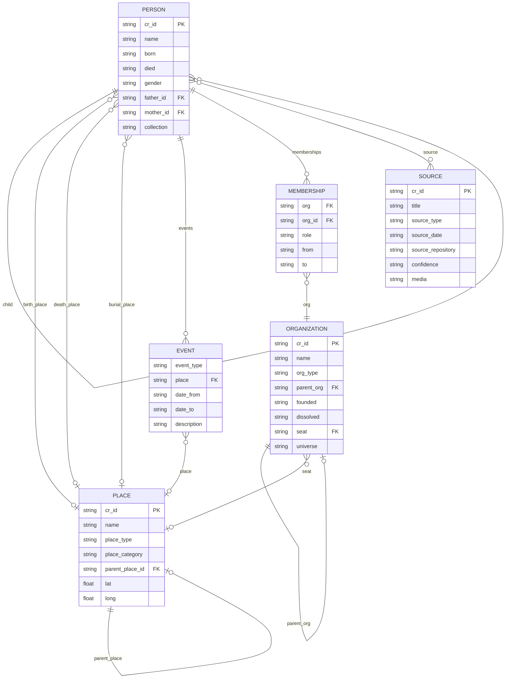

# Frontmatter Reference

This document defines all frontmatter properties recognized by Canvas Roots for person notes, place notes, source notes, organization notes, and map notes.

---

## Data Model Overview

The following diagram shows how the main entity types relate to each other:



**Key relationships:**
- **Person → Person**: Family relationships (father, mother, spouse, child) with dual wikilink + `_id` storage
- **Person → Place**: Geographic links for life events (birth, death, burial, marriage locations)
- **Person → Event → Place**: Life events (residence, occupation, education, military, etc.) with locations
- **Person → Source**: Documentary evidence linked to person notes (census, vital records, photos, etc.)
- **Person → Membership → Organization**: Organization affiliations with roles and dates
- **Organization → Organization**: Hierarchical structure (sub-organizations under parent)
- **Organization → Place**: Seat location linking to place notes
- **Place → Place**: Hierarchical structure (city → state → country)
- **Collection**: Shared grouping property across entity types

---

## Person Note Properties

### Identity (Required)

| Property | Type | Description | Example |
|----------|------|-------------|---------|
| `cr_id` | `string` | Unique identifier (UUID). **Required** for all person notes. | `"a1b2c3d4-e5f6-7890-abcd-ef1234567890"` |

### Basic Information

| Property | Type | Description | Example |
|----------|------|-------------|---------|
| `name` | `string` | Display name of the person | `"John Robert Smith"` |
| `born` | `string` | Birth date (YYYY, YYYY-MM, or YYYY-MM-DD) | `"1888-05-15"` |
| `died` | `string` | Death date (YYYY, YYYY-MM, or YYYY-MM-DD) | `"1952-08-20"` |
| `birth_place` | `string` | Location of birth | `"London, England"` |
| `death_place` | `string` | Location of death | `"New York, USA"` |
| `gender` | `string` | Gender of the person | `"Male"`, `"Female"` |
| `occupation` | `string` | Primary occupation | `"Farmer"` |

### Parent Relationships

Canvas Roots supports dual storage: wikilinks for Obsidian graph visibility, plus `_id` fields for reliable programmatic resolution.

| Property | Type | Description | Example |
|----------|------|-------------|---------|
| `father` | `string` | Wikilink to father's note | `"[[John Smith Sr]]"` |
| `father_id` | `string` | Father's `cr_id` | `"f1234567-..."` |
| `mother` | `string` | Wikilink to mother's note | `"[[Mary Jones]]"` |
| `mother_id` | `string` | Mother's `cr_id` | `"m7654321-..."` |

### Spouse Relationships

#### Simple Format (Single or Multiple Spouses)

| Property | Type | Description | Example |
|----------|------|-------------|---------|
| `spouse` | `string \| string[]` | Wikilink(s) to spouse note(s) | `"[[Jane Doe]]"` or `["[[Jane Doe]]", "[[Mary Smith]]"]` |
| `spouse_id` | `string \| string[]` | Spouse's `cr_id`(s) | `"s1234567-..."` or `["s1234567-...", "s7654321-..."]` |

#### Enhanced Format (Indexed Spouse with Metadata)

For complex marital histories, use indexed properties:

| Property | Type | Description | Example |
|----------|------|-------------|---------|
| `spouse1` | `string` | Wikilink to first spouse | `"[[Jane Doe]]"` |
| `spouse1_id` | `string` | First spouse's `cr_id` | `"s1234567-..."` |
| `spouse1_marriage_date` | `string` | Date of first marriage | `"1910-06-15"` |
| `spouse1_marriage_location` | `string` | Location of first marriage | `"St. Mary's Church, London"` |
| `spouse1_marriage_status` | `string` | Status: `current`, `divorced`, `widowed`, `separated`, `annulled` | `"widowed"` |
| `spouse2` | `string` | Wikilink to second spouse | `"[[Mary Smith]]"` |
| `spouse2_id` | `string` | Second spouse's `cr_id` | `"s7654321-..."` |
| `spouse2_marriage_date` | `string` | Date of second marriage | `"1925-03-20"` |
| ... | ... | Continue pattern for spouse3, spouse4, etc. | ... |

#### Legacy Format (Structured Spouses Array)

```yaml
spouses:
  - person: "[[Jane Doe]]"
    person_id: "s1234567-..."
    marriage_date: "1910-06-15"
    marriage_location: "London"
    status: "widowed"
  - person: "[[Mary Smith]]"
    person_id: "s7654321-..."
    marriage_date: "1925-03-20"
```

### Child Relationships

| Property | Type | Description | Example |
|----------|------|-------------|---------|
| `child` | `string \| string[]` | Wikilink(s) to children's notes | `["[[John Jr]]", "[[Mary]]"]` |
| `children_id` | `string \| string[]` | Children's `cr_id`(s) | `["c1234567-...", "c7654321-..."]` |

### Canvas Roots Metadata

| Property | Type | Description | Example |
|----------|------|-------------|---------|
| `cr_root` | `boolean` | Designates this person as root of a tree | `true` |
| `collection` | `string` | User-defined grouping/collection name | `"Smith Family"` |

### Life Events

Beyond birth, death, and marriage (which use flat properties above), additional life events can be recorded in an `events` array. These events appear as markers on the Map View.

| Property | Type | Description | Example |
|----------|------|-------------|---------|
| `events` | `array` | Array of life event objects | See below |

**Event Object Properties:**

| Property | Type | Required | Description | Example |
|----------|------|----------|-------------|---------|
| `event_type` | `string` | Yes | Type of event | `"residence"` |
| `place` | `string` | Yes | Wikilink to place note | `"[[New York]]"` |
| `date_from` | `string` | No | Start date | `"1920"` or `"1920-05-15"` |
| `date_to` | `string` | No | End date (for duration events) | `"1935"` |
| `description` | `string` | No | Brief description | `"Family home"` |

**Supported Event Types:**

| Category | Event Types |
|----------|-------------|
| Residence | `residence`, `immigration` |
| Career | `occupation`, `education`, `military` |
| Religious | `baptism`, `confirmation`, `ordination` |
| Other | `custom` |

**Example:**

```yaml
events:
  - event_type: residence
    place: "[[New York]]"
    date_from: "1920"
    date_to: "1935"
    description: "Family home on 5th Ave"
  - event_type: military
    place: "[[Normandy]]"
    date_from: "1944-06-06"
    date_to: "1944-08-25"
    description: "D-Day invasion"
  - event_type: education
    place: "[[Harvard University]]"
    date_from: "1915"
    date_to: "1919"
    description: "BA in History"
```

### Reference Numbering Systems

Canvas Roots can generate genealogical reference numbers:

| Property | Type | Description | Example |
|----------|------|-------------|---------|
| `ahnentafel` | `number` | Ahnentafel (Sosa-Stradonitz) number | `1`, `2`, `3`, ... |
| `henry` | `string` | Henry system number | `"1"`, `"11"`, `"112"` |
| `dangelo` | `string` | d'Aboville system number | `"1"`, `"1.1"`, `"1.1.2"` |
| `degroot` | `string` | de Villiers/Pama system number | `"b1"`, `"b1c2"` |
| `meurgey` | `string` | Meurgey de Tupigny system | `"I"`, `"I-1"`, `"I-1-a"` |

---

## Place Note Properties

> **Status:** Phase 1 implemented. See [geographic-features-plan.md](../docs/planning/geographic-features-plan.md) for future enhancements.

### Identity

| Property | Type | Description | Example |
|----------|------|-------------|---------|
| `type` | `string` | Must be `"place"` | `"place"` |
| `cr_id` | `string` | Unique identifier for the place | `"place_abc123"` |

### Basic Information

| Property | Type | Description | Example |
|----------|------|-------------|---------|
| `name` | `string` | Primary name of the place | `"London"` |
| `aliases` | `string[]` | Alternative names | `["City of London", "Londinium"]` |
| `place_type` | `string` | Type of place | `"city"`, `"village"`, `"country"`, `"castle"`, `"region"` |

### Classification

| Property | Type | Description | Example |
|----------|------|-------------|---------|
| `place_category` | `string` | Category of place | `"real"`, `"historical"`, `"disputed"`, `"legendary"`, `"mythological"`, `"fictional"` |
| `universe` | `string` | Fictional universe (for non-real places) | `"A Song of Ice and Fire"`, `"Middle-earth"` |

**Place Categories Explained:**

| Category | Description | Examples |
|----------|-------------|----------|
| `real` | Verified real-world location (default) | London, New York, Tokyo |
| `historical` | Real place that no longer exists or changed significantly | Babylon, Constantinople |
| `disputed` | Location debated by historians/archaeologists | Troy, King Solomon's Mines |
| `legendary` | May have historical basis but heavily fictionalized | Camelot, El Dorado |
| `mythological` | Place from mythology/religion | Asgard, Mount Olympus |
| `fictional` | Invented for a story/world | Winterfell, Mordor |

### Hierarchy

| Property | Type | Description | Example |
|----------|------|-------------|---------|
| `parent_place` | `string` | Wikilink to parent place | `"[[England]]"` |
| `parent_place_id` | `string` | Parent place's `cr_id` | `"place_xyz789"` |

### Coordinates

#### Geographic Coordinates (Real-World Maps)

| Property | Type | Description | Example |
|----------|------|-------------|---------|
| `coordinates.lat` | `number` | Latitude (real-world) | `51.5074` |
| `coordinates.long` | `number` | Longitude (real-world) | `-0.1278` |

#### Pixel Coordinates (Custom Image Maps)

For places on pixel-based custom maps (using L.CRS.Simple):

| Property | Type | Description | Example |
|----------|------|-------------|---------|
| `pixel_x` | `number` | X position in pixels (0 = left edge) | `1200` |
| `pixel_y` | `number` | Y position in pixels (0 = bottom edge) | `2400` |

> **Note:** Flat properties (`pixel_x`, `pixel_y`) are preferred over nested formats for better compatibility with Obsidian's Properties view.

### Historical Names

```yaml
historical_names:
  - name: "Londinium"
    period: "Roman"
  - name: "Lundenwic"
    period: "Anglo-Saxon"
```

### Grouping

| Property | Type | Description | Example |
|----------|------|-------------|---------|
| `collection` | `string` | User-defined grouping (shared with person notes) | `"Smith Family"` |

The `collection` property allows places to be grouped with related person notes. For example, a "Smith Family" collection could include both the Smith family members and the places associated with them.

---

## Source Note Properties

Source notes document evidence and citations for genealogical research. Each source can be linked to person notes to provide documentary evidence for facts in the family tree.

### Identity

| Property | Type | Description | Example |
|----------|------|-------------|---------|
| `type` | `string` | Must be `"source"` | `"source"` |
| `cr_id` | `string` | Unique identifier for the source | `"src_abc123"` |

### Basic Information

| Property | Type | Description | Example |
|----------|------|-------------|---------|
| `title` | `string` | Descriptive title of the source | `"1900 US Census - Smith Family"` |
| `source_type` | `string` | Type of source (see types below) | `"census"` |
| `source_date` | `string` | Date of the original document | `"1900-06-01"` |
| `source_date_accessed` | `string` | When the source was accessed | `"2024-03-15"` |

### Source Types

Canvas Roots includes built-in source types organized by category. Custom types can also be created in the Control Center.

| Category | Source Types |
|----------|--------------|
| Vital records | `vital_record`, `obituary` |
| Census | `census` |
| Church records | `church_record` |
| Legal & property | `court_record`, `land_deed`, `probate` |
| Military | `military` |
| Other | `immigration` |
| Media & correspondence | `photo`, `correspondence`, `newspaper`, `oral_history` |
| Custom | `custom` (or user-defined types) |

### Repository Information

| Property | Type | Description | Example |
|----------|------|-------------|---------|
| `source_repository` | `string` | Archive or website where source is held | `"Ancestry.com"` |
| `source_repository_url` | `string` | Direct URL to the online source | `"https://..."` |
| `collection` | `string` | Record group or collection name | `"1900 United States Federal Census"` |
| `location` | `string` | Geographic location of the record | `"New York, Kings County, Brooklyn"` |

### Confidence Level

| Property | Type | Description | Example |
|----------|------|-------------|---------|
| `confidence` | `string` | How reliable is this source | `"high"`, `"medium"`, `"low"`, `"unknown"` |

**Confidence Levels Explained:**

| Level | Description |
|-------|-------------|
| `high` | Primary source with direct evidence (e.g., original certificate, firsthand account) |
| `medium` | Secondary source or indirect evidence (e.g., derivative, transcription) |
| `low` | Unverified or questionable source |
| `unknown` | Not yet assessed |

### Media Files

Sources can link to media files (images, scans, documents) in the vault:

| Property | Type | Description | Example |
|----------|------|-------------|---------|
| `media` | `string` | Wikilink to first media file | `"[[census-1900-smith.jpg]]"` |
| `media_2` | `string` | Wikilink to second media file | `"[[census-1900-smith-p2.jpg]]"` |
| `media_3` | `string` | Continue pattern for additional files | ... |

### Citation Override

| Property | Type | Description | Example |
|----------|------|-------------|---------|
| `citation_override` | `string` | Manual citation text (overrides auto-generated) | See example below |

---

## Linking Sources to Person Notes

Sources are linked to person notes using the `source` property (with indexed properties for multiple sources):

| Property | Type | Description | Example |
|----------|------|-------------|---------|
| `source` | `string` | Wikilink to first source | `"[[1900 US Census - Smith Family]]"` |
| `source_2` | `string` | Wikilink to second source | `"[[1910 US Census - Smith Family]]"` |
| `source_3` | `string` | Continue pattern for additional sources | ... |

---

## Example Source Note (Census)

```yaml
---
type: source
cr_id: "src_1900_census_smith"
title: "1900 US Census - Smith Family"
source_type: census
source_date: "1900-06-01"
source_date_accessed: "2024-03-15"
source_repository: "Ancestry.com"
collection: "1900 United States Federal Census"
location: "New York, Kings County, Brooklyn"
confidence: high
media: "[[census-1900-smith.jpg]]"
---

# 1900 US Census - Smith Family

## Census Information

| Field | Value |
|-------|-------|
| Census year | 1900 |
| State/country | New York |
| County | Kings |
| Township/city | Brooklyn |
| Enumeration district | 123 |
| Sheet/page | 5A |

## Household Members

| Name | Relation | Age | Birthplace | Occupation |
|------|----------|-----|------------|------------|
| John Smith | Head | 45 | New York | Merchant |
| Mary Smith | Wife | 42 | Ireland | |
| John Jr. | Son | 18 | New York | Clerk |

## Transcription

[Full transcription of census entries...]

## Research Notes

Confirms John Smith's age and occupation...
```

---

## Example Source Note (Vital Record)

```yaml
---
type: source
cr_id: "src_birth_john_smith"
title: "Birth Certificate - John Robert Smith"
source_type: vital_record
source_date: "1855-03-15"
source_repository: "New York City Municipal Archives"
location: "New York, NY"
confidence: high
---

# Birth Certificate - John Robert Smith

## Document Information

| Field | Value |
|-------|-------|
| Event type | Birth |
| Event date | 1855-03-15 |
| Event place | New York, NY |
| Certificate number | 12345 |

## People Named

- John Robert Smith (subject)
- John Smith Sr. (father)
- Mary Jones (mother)

## Transcription

[Transcription of birth certificate...]
```

---

## Map Note Properties

Map notes define custom image maps for fictional worlds or historical maps.

### Identity

| Property | Type | Description | Example |
|----------|------|-------------|---------|
| `type` | `string` | Must be `"map"` | `"map"` |
| `map_id` | `string` | Unique identifier for the map | `"middle-earth"` |

### Basic Information

| Property | Type | Description | Example |
|----------|------|-------------|---------|
| `name` | `string` | Display name of the map | `"Middle-earth"` |
| `universe` | `string` | Fictional universe for filtering | `"tolkien"` |
| `image` | `string` | Path to map image in vault | `"assets/maps/middle-earth.jpg"` |

### Coordinate System

| Property | Type | Description | Example |
|----------|------|-------------|---------|
| `coordinate_system` | `string` | `"geographic"` (default) or `"pixel"` | `"pixel"` |

### Geographic Mode Properties

For maps with arbitrary lat/lng-style coordinates:

| Property | Type | Description | Example |
|----------|------|-------------|---------|
| `bounds_north` | `number` | North bound | `50` |
| `bounds_south` | `number` | South bound | `-50` |
| `bounds_east` | `number` | East bound | `100` |
| `bounds_west` | `number` | West bound | `-100` |
| `center_lat` | `number` | Initial center latitude | `0` |
| `center_lng` | `number` | Initial center longitude | `0` |

### Pixel Mode Properties

For maps where coordinates match pixel positions:

| Property | Type | Description | Example |
|----------|------|-------------|---------|
| `image_width` | `number` | Image width in pixels (auto-detected if omitted) | `2048` |
| `image_height` | `number` | Image height in pixels (auto-detected if omitted) | `3072` |
| `center_x` | `number` | Initial center X coordinate | `1024` |
| `center_y` | `number` | Initial center Y coordinate | `1536` |

### Zoom Settings

| Property | Type | Description | Example |
|----------|------|-------------|---------|
| `default_zoom` | `number` | Initial zoom level | `2` |
| `min_zoom` | `number` | Minimum zoom level | `-2` |
| `max_zoom` | `number` | Maximum zoom level | `4` |

### Distortable Image Corners (Advanced)

For interactive image alignment and georeferencing, you can define corner positions. When corners are set, the map enters "distortable mode" where you can drag, rotate, scale, and distort the image to align it with your coordinate system.

| Property | Type | Description | Example |
|----------|------|-------------|---------|
| `corner_nw_lat` | `number` | Northwest corner latitude | `45.5` |
| `corner_nw_lng` | `number` | Northwest corner longitude | `-90.0` |
| `corner_ne_lat` | `number` | Northeast corner latitude | `45.5` |
| `corner_ne_lng` | `number` | Northeast corner longitude | `-60.0` |
| `corner_sw_lat` | `number` | Southwest corner latitude | `25.0` |
| `corner_sw_lng` | `number` | Southwest corner longitude | `-90.0` |
| `corner_se_lat` | `number` | Southeast corner latitude | `25.0` |
| `corner_se_lng` | `number` | Southeast corner longitude | `-60.0` |

**Use cases:**
- Align historical maps to modern coordinates
- Fit hand-drawn fictional world maps to a coordinate system
- Adjust scanned maps that aren't perfectly rectangular

**Note:** Corner positions are saved automatically when you use the "Save Alignment" button in edit mode.

---

## Schema Note Properties

Schema notes define validation rules for person notes. See [Schema Validation](Schema-Validation) for complete documentation.

### Identity

| Property | Type | Description | Example |
|----------|------|-------------|---------|
| `type` | `string` | Must be `"schema"` | `"schema"` |
| `cr_id` | `string` | Unique identifier for the schema | `"schema-house-stark"` |

### Basic Information

| Property | Type | Description | Example |
|----------|------|-------------|---------|
| `name` | `string` | Display name of the schema | `"House Stark Schema"` |
| `description` | `string` | Optional description | `"Validation rules for House Stark"` |

### Scope

| Property | Type | Description | Example |
|----------|------|-------------|---------|
| `applies_to_type` | `string` | Scope type: `collection`, `folder`, `universe`, or `all` | `"collection"` |
| `applies_to_value` | `string` | Value for the scope (not needed for `all`) | `"House Stark"` |

### Schema Definition (JSON Code Block)

The validation rules are defined in a `json schema` code block in the note body:

```json
{
  "requiredProperties": ["name", "allegiance"],
  "properties": {
    "gender": {
      "type": "enum",
      "values": ["Male", "Female"]
    },
    "birth_place": {
      "type": "wikilink",
      "targetType": "place"
    }
  },
  "constraints": [
    {
      "rule": "!died || born",
      "message": "Cannot have death date without birth date"
    }
  ]
}
```

**Property Definition Options:**

| Option | Description | Applies To |
|--------|-------------|------------|
| `type` | Property type: `string`, `number`, `date`, `boolean`, `enum`, `wikilink`, `array` | All |
| `values` | Allowed values | `enum` |
| `min`, `max` | Value range | `number` |
| `targetType` | Required note type for link target | `wikilink` |
| `requiredIf` | Conditional requirement | All |
| `default` | Default value if missing | All |

---

## Property Naming Conventions

Canvas Roots follows these conventions:

| Convention | Examples |
|------------|----------|
| **Snake_case** for all properties | `birth_place`, `father_id`, `cr_id` |
| **Singular** for single values | `father`, `mother`, `spouse` |
| **Plural** for arrays (legacy) | `spouses` (structured array) |
| **`_id` suffix** for cr_id references | `father_id`, `spouse_id`, `children_id` |
| **Indexed properties** for ordered multiples | `spouse1`, `spouse2`, `spouse1_marriage_date` |

---

## Essential Properties

When using "Add essential properties" in Data Quality tools, these properties are added if missing:

- `cr_id` (generated UUID)
- `name` (empty string)
- `born` (empty string)
- `died` (empty string)
- `father` (empty string)
- `mother` (empty string)
- `spouses` (empty array)

---

## Example Person Note

```yaml
---
cr_id: "a1b2c3d4-e5f6-7890-abcd-ef1234567890"
name: "John Robert Smith"
born: "1888-05-15"
died: "1952-08-20"
birth_place: "London, England"
death_place: "New York, USA"
gender: "Male"
occupation: "Merchant"
father: "[[John Smith Sr]]"
father_id: "f1234567-..."
mother: "[[Mary Jones]]"
mother_id: "m7654321-..."
spouse1: "[[Jane Doe]]"
spouse1_id: "s1111111-..."
spouse1_marriage_date: "1910-06-15"
spouse1_marriage_location: "St. Mary's Church, London"
spouse1_marriage_status: "widowed"
spouse2: "[[Margaret Brown]]"
spouse2_id: "s2222222-..."
spouse2_marriage_date: "1935-09-01"
child:
  - "[[John Smith Jr]]"
  - "[[Mary Elizabeth Smith]]"
children_id:
  - "c1111111-..."
  - "c2222222-..."
cr_root: true
collection: "Smith Family"
ahnentafel: 1
---

# John Robert Smith

Notes about this person...
```

---

## Example Place Note

```yaml
---
type: place
cr_id: "place_london_001"
name: "London"
aliases:
  - "City of London"
  - "Londinium"
place_category: real
place_type: city
parent_place: "[[England]]"
coordinates:
  lat: 51.5074
  long: -0.1278
historical_names:
  - name: "Londinium"
    period: "Roman (43-410 AD)"
  - name: "Lundenwic"
    period: "Anglo-Saxon (600-886 AD)"
---

# London

Capital city of England and the United Kingdom...
```

---

## Example Place Note (Pixel Coordinates)

```yaml
---
type: place
cr_id: "place_winterfell_001"
name: "Winterfell"
place_category: fictional
place_type: castle
universe: "A Song of Ice and Fire"
pixel_x: 1200
pixel_y: 2400
---

# Winterfell

Seat of House Stark in the North...
```

---

## Example Map Note (Geographic Mode)

```yaml
---
type: map
map_id: middle-earth
name: Middle-earth
universe: tolkien
image: assets/maps/middle-earth.jpg
coordinate_system: geographic
bounds_north: 50
bounds_south: -50
bounds_west: -100
bounds_east: 100
center_lat: 0
center_lng: 0
default_zoom: 3
---

# Middle-earth Map

Map of J.R.R. Tolkien's Middle-earth...
```

---

## Example Map Note (Pixel Mode)

```yaml
---
type: map
map_id: westeros
name: Westeros
universe: got
image: assets/maps/westeros.png
coordinate_system: pixel
image_width: 2048
image_height: 3072
center_x: 1024
center_y: 1536
default_zoom: 0
min_zoom: -2
max_zoom: 3
---

# Westeros Map

Map of Westeros from A Song of Ice and Fire...
```

---

## Example Map Note (Distortable with Corners)

```yaml
---
type: map
map_id: historical-europe
name: Historical Europe 1850
universe: real
image: assets/maps/europe-1850.jpg
coordinate_system: geographic
bounds_north: 72
bounds_south: 35
bounds_west: -15
bounds_east: 45
default_zoom: 4
corner_nw_lat: 71.5
corner_nw_lng: -14.5
corner_ne_lat: 71.8
corner_ne_lng: 44.5
corner_sw_lat: 35.2
corner_sw_lng: -14.8
corner_se_lat: 35.0
corner_se_lng: 44.8
---

# Historical Europe 1850

A historical map of Europe circa 1850, aligned to modern coordinates
for comparison with contemporary maps...
```

---

## Example Schema Note

````
---
type: schema
cr_id: schema-date-validation
name: Date Validation
description: Ensures date fields are logically consistent
applies_to_type: all
---

# Date Validation Schema

This schema validates that all person notes have logically consistent dates.

```json schema
{
  "requiredProperties": [],
  "properties": {
    "born": {
      "type": "date"
    },
    "died": {
      "type": "date"
    }
  },
  "constraints": [
    {
      "rule": "!died || born",
      "message": "Cannot have death date without birth date"
    },
    {
      "rule": "!died || !born || new Date(died) >= new Date(born)",
      "message": "Death date must be on or after birth date"
    }
  ]
}
```
````

---

## Organization Note Properties

Organization notes define non-genealogical hierarchies such as noble houses, guilds, and corporations. See [Organization Notes](Organization-Notes) for complete documentation.

### Identity

| Property | Type | Description | Example |
|----------|------|-------------|---------|
| `type` | `string` | Must be `"organization"` | `"organization"` |
| `cr_id` | `string` | Unique identifier | `"org-house-stark"` |

### Basic Information

| Property | Type | Description | Example |
|----------|------|-------------|---------|
| `name` | `string` | Display name of the organization | `"House Stark"` |
| `org_type` | `string` | Organization type (see below) | `"noble_house"` |
| `motto` | `string` | Organization motto or slogan | `"Winter is Coming"` |
| `universe` | `string` | Fictional universe for filtering | `"westeros"` |

### Organization Types

| Type ID | Description |
|---------|-------------|
| `noble_house` | Feudal houses, dynasties |
| `guild` | Trade guilds, craftsmen |
| `corporation` | Modern companies |
| `military` | Armies, regiments, navies |
| `religious` | Churches, monasteries |
| `political` | Kingdoms, republics |
| `educational` | Schools, universities |
| `custom` | User-defined |

### Hierarchy

| Property | Type | Description | Example |
|----------|------|-------------|---------|
| `parent_org` | `string` | Wikilink to parent organization | `"[[The North]]"` |

### Dates

| Property | Type | Description | Example |
|----------|------|-------------|---------|
| `founded` | `string` | Founding date (supports fictional dates) | `"Age of Heroes"` |
| `dissolved` | `string` | Dissolution date | `"298 AC"` |

### Location

| Property | Type | Description | Example |
|----------|------|-------------|---------|
| `seat` | `string` | Wikilink to primary location (place note) | `"[[Winterfell]]"` |

---

## Person Membership Properties

Person notes can include an array of organization memberships.

### Membership Array

```yaml
memberships:
  - org: "[[House Stark]]"
    org_id: org-house-stark
    role: Lord of Winterfell
    from: "283 AC"
    to: "298 AC"
  - org: "[[Small Council]]"
    org_id: org-small-council
    role: Hand of the King
    from: "298 AC"
    to: "298 AC"
```

### Membership Properties

| Property | Type | Required | Description | Example |
|----------|------|----------|-------------|---------|
| `org` | `string` | Yes | Wikilink to organization note | `"[[House Stark]]"` |
| `org_id` | `string` | No | Organization's `cr_id` for robust linking | `"org-house-stark"` |
| `role` | `string` | No | Role or position within organization | `"Lord of Winterfell"` |
| `from` | `string` | No | Start date of membership | `"283 AC"` |
| `to` | `string` | No | End date (leave empty if current) | `"298 AC"` |
| `notes` | `string` | No | Additional context | `"First to declare for Robert"` |

---

## Example Organization Note

```yaml
---
type: organization
cr_id: org-house-stark
name: House Stark
org_type: noble_house
parent_org: "[[The North]]"
founded: "Age of Heroes"
motto: "Winter is Coming"
seat: "[[Winterfell]]"
universe: westeros
---

# House Stark

The principal house of the North...
```

---

## See Also

- [Evidence & Sources](Evidence-And-Sources) - Complete source documentation
- [Organization Notes](Organization-Notes) - Complete organization documentation
- [Schema Validation](Schema-Validation) - Creating and using validation schemas
- [Geographic Features](Geographic-Features) - Place notes and map features
- [Data Management](Data-Management) - Managing your family data
