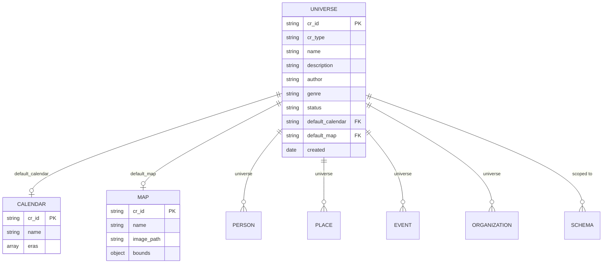

# Universe Notes

Universe Notes allow you to manage fictional worlds as first-class entities. Instead of using plain strings for the `universe` field, you can create dedicated universe notes that serve as a canonical registry for your fictional worlds (Middle-earth, Westeros, your own custom settings).

---

## Table of Contents

- [Overview](#overview)
- [Creating Universe Notes](#creating-universe-notes)
- [Universe Properties](#universe-properties)
- [Universes Tab](#universes-tab)
- [Create Universe Wizard](#create-universe-wizard)
- [Statistics Integration](#statistics-integration)
- [Universes Base Template](#universes-base-template)
- [Commands](#commands)
- [Context Menu Actions](#context-menu-actions)
- [Linking Entities to Universes](#linking-entities-to-universes)
- [Best Practices](#best-practices)
- [Integration with Other Features](#integration-with-other-features)

---

## Overview

Universe Notes solve several problems for worldbuilders:

| Problem | Solution |
|---------|----------|
| Typos create duplicate "universes" | Autocomplete from universe notes |
| No central overview | Universe notes + Universes tab |
| Can't store metadata | Universe note holds description, author, genre, etc. |
| No validation | Orphan detection for unlinked universe strings |
| No discoverability | Browse universe notes, Universes section in Statistics |

Universe Notes support:

- **Canonical registry**: One note per fictional world with metadata
- **Entity aggregation**: See all people, events, places, sources, and organizations in a universe
- **Guided setup**: Wizard to create universe with linked calendar, map, and schema
- **Always accessible**: Universes tab is always visible with helpful getting started tiles

---

## Creating Universe Notes

### Ways to Create a Universe

There are several entry points to create a new universe:

| Method | How |
|--------|-----|
| **Command palette** | `Ctrl/Cmd+P` → "Charted Roots: Create universe" |
| **Universes tab** | Open Control Center → Universes tab → "Create Universe" tile |
| **Statistics Dashboard** | Open Statistics Dashboard → Universes section → Create button |

### Using the Create Universe Wizard

The wizard guides you through creating:
- The universe note with metadata
- An optional custom calendar (date system)
- An optional custom map
- An optional validation schema scoped to the universe

**From the Universes tab:**

1. Open the Control Center (`Ctrl/Cmd+Shift+F` or command palette: "Open Control Center")
2. Navigate to the **Universes** tab
3. Click the **Create Universe** tile (if no universes exist) or the **Create universe** button in the Actions card
4. Follow the multi-step wizard

### Manual Creation

Create a note with the following frontmatter:

```yaml
---
cr_type: universe
cr_id: middle-earth
name: Middle-earth
description: A fantasy world created by J.R.R. Tolkien
author: J.R.R. Tolkien
genre: fantasy
status: active
default_calendar: shire-reckoning
default_map: middle-earth-map
---

## Overview

Middle-earth is the setting for The Hobbit and The Lord of the Rings...
```

---

## Universe Properties

See also the [Frontmatter Reference](Frontmatter-Reference#universe-note-properties) for complete property documentation.



**Key relationships:**
- **Universe → Calendar**: Default date system for events in this universe
- **Universe → Map**: Default custom map for geographic visualization
- **Universe → Entities**: People, places, events, and organizations can be scoped to a universe via the `universe` property
- **Universe → Schema**: Validation schemas can be scoped to enforce universe-specific rules

| Property | Type | Required | Description |
|----------|------|----------|-------------|
| `cr_type` | string | Yes | Must be `universe` |
| `cr_id` | string | Yes | Unique identifier (auto-generated or custom) |
| `name` | string | Yes | Universe display name |
| `description` | string | No | Brief description of the world |
| `author` | string | No | Creator of the fictional world |
| `genre` | string | No | Genre (fantasy, sci-fi, historical, etc.) |
| `status` | string | No | Status: `active`, `draft`, or `archived` |
| `default_calendar` | string | No | ID of the default date system for this universe |
| `default_map` | string | No | ID of the default custom map for this universe |
| `created` | date | No | Creation date of the universe note |

### Status Values

| Status | Description |
|--------|-------------|
| `active` | Currently being developed or in use |
| `draft` | Work in progress, not yet complete |
| `archived` | No longer actively maintained |

---

## Universes Tab

The Universes tab is always visible in the Control Center, providing easy access to universe management.

### Quick Actions Card

The first card provides quick access to universe-related features:

| Tile | Description |
|------|-------------|
| **Create Universe** | Opens the Create Universe wizard to set up a new fictional world |
| **Date Systems** | Links to the Events tab to learn about custom calendars |
| **Custom Maps** | Links to the Places tab to learn about custom geographic maps |

### Your Universes Card

The second card lists all universe notes with:
- Universe name and description
- Entity counts (people, events, places, sources, organizations)
- Click to open the universe note
- Hover for additional details

### Orphan Universe Strings Card

Shows entities that reference a `universe` value that doesn't match any universe note. This helps identify:
- Typos in universe names
- Missing universe notes that should be created
- Entities that need their universe field updated

Click an orphan string to see all entities using that value, then either:
- Create a universe note with that ID
- Update the entities to use an existing universe

---

## Create Universe Wizard

The wizard provides a guided setup for new fictional worlds:

### Step 1: Universe Details

Required information about your universe:
- **Name**: Display name (e.g., "Middle-earth")
- **ID**: Auto-generated from name, or customize
- **Description**: Brief overview of the world
- **Author**: Creator of the fictional world
- **Genre**: Fantasy, sci-fi, historical, etc.
- **Status**: Active, draft, or archived

### Step 2: Custom Calendar (Optional)

Create a date system for your universe:
- Skip if using standard dates or an existing calendar
- Define eras with names, abbreviations, and epochs
- Set year direction (forward or backward counting)
- The calendar is automatically linked to the universe

See [Fictional Date Systems](Fictional-Date-Systems) for details on calendar configuration.

### Step 3: Custom Map (Optional)

Create a map configuration for your universe:
- Skip if using real-world maps
- Select an image file for the map background
- Define coordinate bounds
- The map is automatically linked to the universe

See [Geographic Features](Geographic-Features) for details on custom maps.

### Step 4: Validation Schema (Optional)

Create a schema scoped to this universe:
- Skip if not using schema validation
- Define required properties for entities in this universe
- Set custom validation rules
- The schema is automatically scoped to the universe

See [Schema Validation](Schema-Validation) for details on schemas.

### Step 5: Summary

Review all created entities:
- Universe note with link to open
- Calendar (if created) with link
- Map (if created) with link
- Schema (if created) with link

---

## Statistics Integration

The Statistics dashboard includes a **Universes** section showing:

### Universe Overview
- Total universe count
- List of all universes with status badges

### Per-Universe Breakdown
For each universe, see entity counts:
- People in this universe
- Events in this universe
- Places in this universe
- Sources in this universe
- Organizations in this universe

### Drill-Down
Click a universe to see all its entities. Click "View full statistics →" to open the Statistics dashboard filtered to that universe.

---

## Universes Base Template

Charted Roots includes a pre-configured Bases template for universes with 12 views.

### Creating the Template

1. Open the Universes tab in Control Center
2. Click **Create universes base** in the Actions card

Or use the command palette: "Charted Roots: Create universes base template"

### Available Views

| View | Description |
|------|-------------|
| All Universes | Every universe sorted by name |
| By Status | Grouped by status (active, draft, archived) |
| Active Universes | Only active status |
| Draft Universes | Only draft status |
| Archived Universes | Only archived status |
| By Genre | Grouped by genre |
| By Author | Grouped by author |
| With Calendars | Universes with a default calendar |
| Without Calendars | Universes missing a calendar |
| With Maps | Universes with a default map |
| Without Maps | Universes missing a map |
| Recently Created | Sorted by creation date |

### Formulas

The template includes these formulas:
- `display_name`: Shows `name` or falls back to filename
- `is_active`: Shows "Yes" or "No" based on status
- `has_calendar`: Shows "Yes" or "No" based on default_calendar
- `has_map`: Shows "Yes" or "No" based on default_map

---

## Commands

| Command | Description |
|---------|-------------|
| Create universe | Opens the Create Universe wizard |
| Create universes base template | Creates the Bases template file |

---

## Context Menu Actions

### Universe Notes

Right-click a universe note to access:
- **Add essential universe properties**: Adds all standard universe frontmatter fields
- **Open in Universes tab**: Opens Control Center to the Universes tab

### Creating Related Entities

When creating new entities (people, events, places, etc.) from the context menu, if you have a universe note open or selected, the new entity will be pre-populated with that universe.

---

## Linking Entities to Universes

### Using Universe Notes (Recommended)

Link entities to universes using the universe's `cr_id`:

```yaml
---
cr_type: person
name: Bilbo Baggins
universe: middle-earth
---
```

Or use a wikilink to the universe note:

```yaml
---
cr_type: person
name: Bilbo Baggins
universe: "[[Middle-earth]]"
---
```

### Using Plain Strings (Legacy)

Plain string values continue to work for backward compatibility:

```yaml
---
cr_type: person
name: Bilbo Baggins
universe: Middle-earth
---
```

However, plain strings won't benefit from autocomplete, validation, or orphan detection.

### Autocomplete

When creating or editing entities, the universe field offers autocomplete suggestions from your existing universe notes.

---

## Best Practices

### Create Universe Notes First

Before adding characters, events, or places to a fictional world, create the universe note. This enables:
- Autocomplete when adding entities
- Proper entity aggregation
- Statistics tracking

### Use Consistent IDs

The `cr_id` field is used for linking. Use kebab-case IDs that match your universe name:
- `middle-earth` for Middle-earth
- `westeros` for Westeros
- `my-custom-world` for My Custom World

### Link Related Configuration

Use the Create Universe wizard to automatically link:
- Custom calendars via `default_calendar`
- Custom maps via `default_map`

This ensures entities in your universe use the correct date system and map.

### Use Status for Organization

- **Active**: Universes you're currently working on
- **Draft**: Universes in early development
- **Archived**: Completed projects or abandoned ideas

### Add Descriptive Metadata

Fill in the description, author, and genre fields to make your universes easier to identify and organize.

---

## Integration with Other Features

### Fictional Date Systems

Universes can have a default calendar system. When creating events in a universe, the date system dropdown will highlight the universe's default calendar.

See [Fictional Date Systems](Fictional-Date-Systems) for full documentation.

### Custom Maps

Universes can have a default custom map. When viewing geographic features for entities in a universe, the map view will use the universe's default map.

See [Geographic Features](Geographic-Features) for full documentation.

### Schema Validation

Create schemas scoped to specific universes to enforce different validation rules per world. For example, a sci-fi universe might require different properties than a fantasy universe.

See [Schema Validation](Schema-Validation) for full documentation.

### Organizations

Organizations can be scoped to universes. The Organizations tab respects universe filtering.

See [Organization Notes](Organization-Notes) for full documentation.

### Statistics

The Statistics dashboard provides per-universe breakdowns and supports filtering by universe.

See [Statistics & Reports](Statistics-And-Reports) for full documentation.

---

## Related Documentation

- [Fictional Date Systems](Fictional-Date-Systems) - Custom calendars for fictional worlds
- [Geographic Features](Geographic-Features) - Custom maps for fictional geography
- [Schema Validation](Schema-Validation) - Data validation rules
- [Organization Notes](Organization-Notes) - Hierarchical organizations
- [Statistics & Reports](Statistics-And-Reports) - Vault analytics
- [Frontmatter Reference](Frontmatter-Reference) - Full property documentation

---

**Questions?** Open an issue on [GitHub](https://github.com/banisterious/obsidian-charted-roots/issues).
